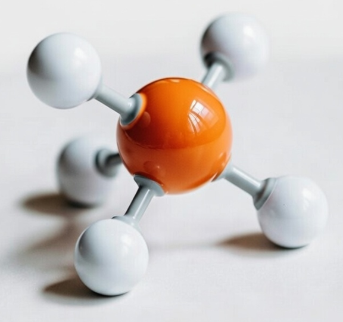
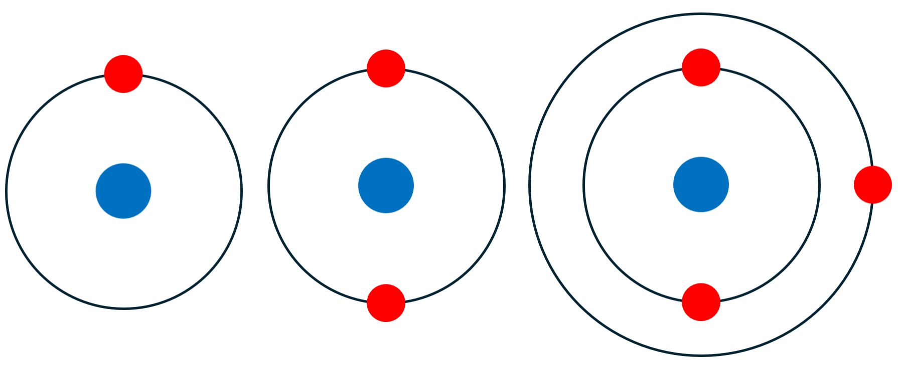
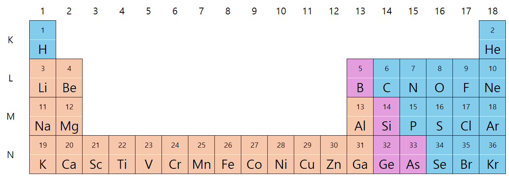
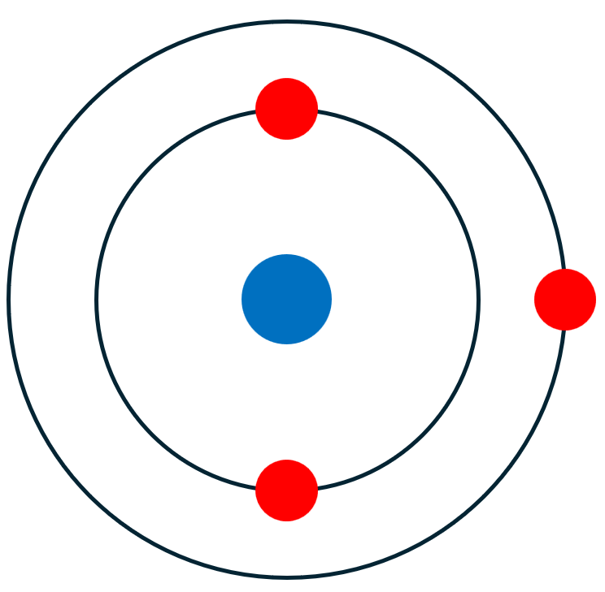
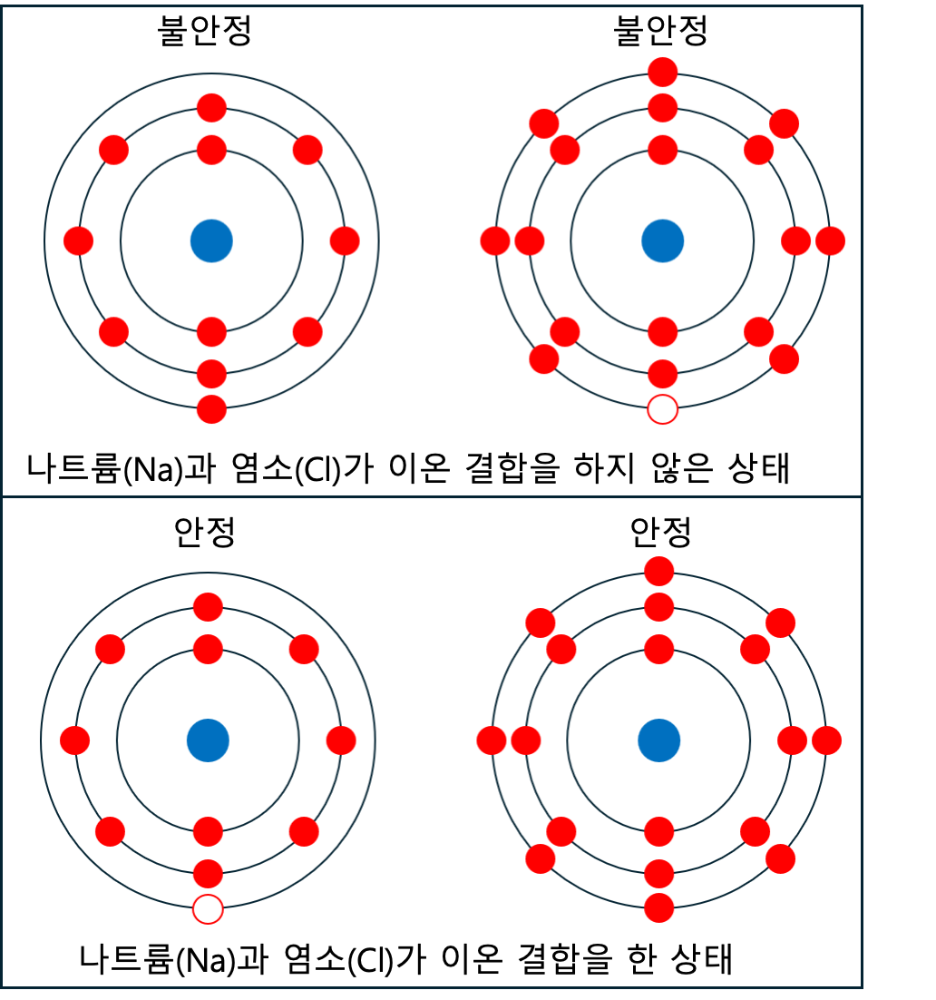
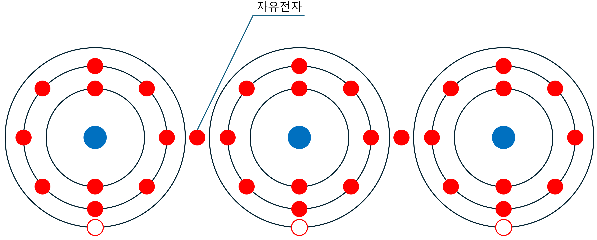
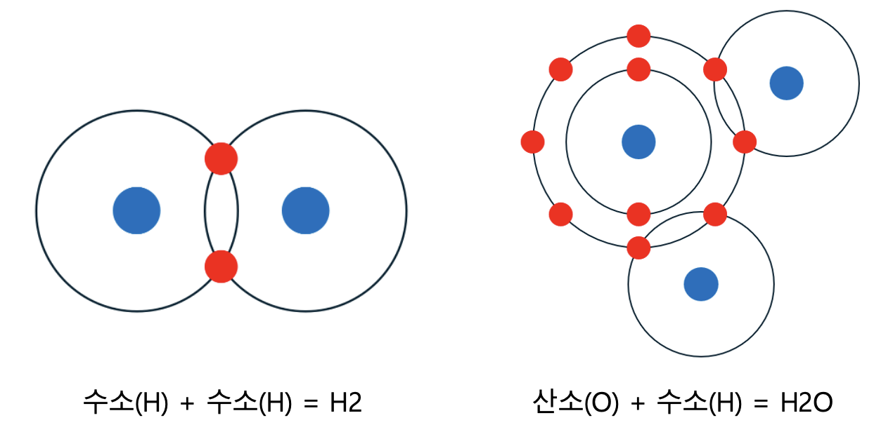

<!-- _class: title -->

# 01-02. 금속 자원과 화학 원소 기호 이해

## 핵심 개념과 실무 적용

---

# 금속 자원과 화학 원소 기호 이해

- 자동화에서 사용되는 기계 재료를 이해하기 위해 먼저 화학 원소라는 가장 기초적인 개념부터 살펴보겠습니다.
- 화학 원소에 대한 지식이 기계 설계를 위해 반드시 필요한 것은 아닙니다. 오히려 전기, 전자, 반도체의 원리를 이…
- 하지만 본 교육 과정에서는 기계뿐만 아니라 이후 전기, 전자, 반도체까지 학습하게 됩니다. 따라서 앞으로의 내용을…

<!--
발표자 노트 · 원문

# 금속 자원과 화학 원소 기호 이해

자동화에서 사용되는 기계 재료를 이해하기 위해 먼저 화학 원소라는 가장 기초적인 개념부터 살펴보겠습니다.

화학 원소에 대한 지식이 기계 설계를 위해 반드시 필요한 것은 아닙니다. 오히려 전기, 전자, 반도체의 원리를 이해할 때 더욱 중요하게 사용되는 기초 개념입니다.

하지만 본 교육 과정에서는 기계뿐만 아니라 이후 전기, 전자, 반도체까지 학습하게 됩니다. 따라서 앞으로의 내용을 이해하는 데 필요한 최소한의 화학적 배경 지식을 먼저 정리하고자 합니다.

학창 시절 우리는 흔히 다음과 같은 말을 배웠습니다.

> 세상의 모든 물질은 원자로 이루어져 있다.
> 

하지만 원자와 원소에 대한 내용을 실제 기술과 연결하여 다시 생각해 볼 기회는 많지 않습니다.

이 단원에서는 화학을 전문적으로 학습하는 것이 목적이 아닙니다.

원자가 무엇인지, 원소가 무엇인지, 그리고 원자들이 서로 결합하면서 어떻게 다양한 물질과 재료를 만들어 내는지 전체적인 흐름을 이해하는 것이 목적입니다.

조금 어렵게 느껴지더라도 모든 내용을 암기할 필요는 없습니다.

앞으로 배우게 될 기계 재료와 전기, 전자, 반도체를 이해하기 위한 기초 과정이라고 생각하면 충분합니다.
-->

---

# 원자와 원소

- 양성자(Proton) : + 전하
- 중성자(Neutron) : 전하 없음
- 전자(Electron) : - 전하

<!--
발표자 노트 · 원문

#### 원자와 원소

우리가 주변에서 볼 수 있는 철, 알루미늄, 구리, 플라스틱, 유리 등의 물질은 모두 원자로 이루어져 있습니다.

원자는 물질을 구성하는 기본적인 단위입니다.

원자의 중심에는 원자핵이 있으며, 원자핵 주변에는 전자가 존재합니다.

원자핵은 다시 양성자와 중성자로 구성됩니다.

- 양성자(Proton) : + 전하
- 중성자(Neutron) : 전하 없음
- 전자(Electron) : - 전하

여기에서 원소의 종류를 결정하는 가장 중요한 입자가 양성자입니다.

양성자의 개수가 달라지면 서로 다른 원소가 됩니다.

예를 들어 양성자가 1개이면 수소(H), 2개이면 헬륨(He), 6개이면 탄소(C), 26개이면 철(Fe)이 됩니다.

즉, 원소는 원자핵에 존재하는 양성자의 개수에 따라 구분됩니다.
-->

---

# 원자 번호

- 원자 번호 : 1
- 양성자 : 1개
- 전자 : 1개

<!--
발표자 노트 · 원문

#### 원자 번호

원자핵에 들어 있는 양성자의 개수를 원자 번호(Atomic Number)라고 합니다.

예를 들어 수소의 원자 번호는 1이고, 헬륨은 2, 리튬은 3입니다.

**수소(H)**

- 원자 번호 : 1
- 양성자 : 1개
- 전자 : 1개

**헬륨(He)**

- 원자 번호 : 2
- 양성자 : 2개
- 전자 : 2개

**리튬(Li)**

- 원자 번호 : 3
- 양성자 : 3개
- 전자 : 3개

일반적인 중성 상태의 원자는 양성자의 개수와 전자의 개수가 같습니다.

양성자는 + 전하를 가지고 전자는 - 전하를 가지므로 두 전하가 서로 상쇄되어 원자 전체는 전기적으로 중성이 됩니다.

예를 들어 철(Fe)의 원자 번호는 26입니다.

따라서 중성 상태의 철 원자는 26개의 양성자와 26개의 전자를 가지고 있습니다.

이러한 전자의 구조는 이후 전기와 전자에서 매우 중요하게 사용됩니다.
-->

---

# 주기율표의 의미

- Fe : 철
- Al : 알루미늄
- Cu : 구리

<!--
발표자 노트 · 원문

#### 주기율표의 의미

원소를 원자 번호 순서대로 나열하면 원소의 성질이 일정한 주기로 반복되는 것을 확인할 수 있습니다.

이러한 원소의 반복적인 성질을 기준으로 정리한 표가 주기율표(Periodic Table)입니다.

현재 알려진 원소는 원자 번호 118번까지 정리되어 있습니다.

하지만 자동화와 기계 설계에서 118개의 원소를 모두 알아야 할 필요는 없습니다.

실제로 자주 접하게 되는 원소는 그중 일부에 불과합니다.

예를 들어 다음과 같은 원소들이 있습니다.

- Fe : 철
- Al : 알루미늄
- Cu : 구리
- C : 탄소
- Cr : 크롬
- Ni : 니켈
- Si : 규소
- Zn : 아연

본 과정에서는 원자의 구조와 주기율표의 기본적인 원리를 이해하기 위해 원자 번호 36번 정도까지 살펴봅니다.

모든 원소를 암기하는 것이 목적은 아닙니다.

원자 번호와 전자의 배치에 따라 원소의 성질이 달라지고, 비슷한 성질을 가진 원소들이 주기율표에서 일정한 위치에 모여 있다는 정도를 이해하면 충분합니다.
-->

---

# 전자 껍질

- K 껍질
- L 껍질
- M 껍질

<!--
발표자 노트 · 원문

#### 전자 껍질

원자핵 주변의 전자는 모두 같은 상태로 존재하는 것이 아니라 서로 다른 에너지 준위에 존재합니다.

기초적인 원자 모형에서는 이를 원자핵 주변의 전자 껍질(Electron Shell)에 전자가 배치되어 있다고 표현합니다.

전자 껍질은 안쪽부터 다음과 같이 구분합니다.

- K 껍질
- L 껍질
- M 껍질
- N 껍질

예를 들어 리튬(Li)은 원자 번호가 3이므로 3개의 전자를 가지고 있습니다.

첫 번째 K 껍질에 2개의 전자가 들어가고, 다음 L 껍질에 1개의 전자가 들어갑니다.

따라서 간단하게 다음과 같이 나타낼 수 있습니다.

Li : 2, 1

마찬가지로 나트륨(Na)은 11개의 전자를 가지므로 다음과 같이 나타낼 수 있습니다.

Na : 2, 8, 1

이러한 전자의 배치는 원소의 화학적 성질을 결정하는 중요한 요소입니다.
-->

---

# 최외각 전자

- 원자에서 가장 바깥쪽 껍질에 존재하는 전자를 최외각 전자(Valence Electron)라고 합니다.
- 최외각 전자는 다른 원자와의 결합이나 전기적 성질에 큰 영향을 줍니다.
- 따라서 앞으로 전기, 전자, 반도체를 학습할 때 매우 중요하게 등장하는 개념입니다.

<!--
발표자 노트 · 원문

#### 최외각 전자

원자에서 가장 바깥쪽 껍질에 존재하는 전자를 최외각 전자(Valence Electron)라고 합니다.

최외각 전자는 다른 원자와의 결합이나 전기적 성질에 큰 영향을 줍니다.

따라서 앞으로 전기, 전자, 반도체를 학습할 때 매우 중요하게 등장하는 개념입니다.

기초 화학에서는 많은 원소가 가장 바깥쪽 전자 껍질이 안정된 전자 배치를 이루는 방향으로 결합한다고 설명합니다.

특히 많은 원소에서 최외각 전자가 8개인 상태가 안정적으로 나타나는데, 이를 옥텟 규칙(Octet Rule)이라고 합니다.

다만 옥텟 규칙은 모든 원자에 무조건 적용되는 절대적인 법칙은 아닙니다.

기초적인 화학 결합을 이해하기 위한 하나의 유용한 규칙으로 생각하면 됩니다.

수소(H)와 헬륨(He)의 경우 첫 번째 전자 껍질에는 최대 2개의 전자가 들어가기 때문에 2개의 전자를 가진 상태가 안정적입니다.
-->

---

# 안정한 원자

- He : 헬륨
- Ne : 네온
- Ar : 아르곤
- Kr : 크립톤

<!--
발표자 노트 · 원문

#### 안정한 원자

주기율표의 18족에 위치한 원소들은 가장 바깥쪽 전자 껍질이 안정된 상태를 이루고 있습니다.

대표적인 원소가 다음과 같습니다.

- He : 헬륨
- Ne : 네온
- Ar : 아르곤
- Kr : 크립톤

이러한 원소들을 비활성 기체 또는 희가스(Noble Gas)라고 합니다.

이들은 다른 원소에 비해 화학 반응성이 매우 낮습니다.

반면 다른 많은 원소들은 전자를 잃거나 얻거나 공유하면서 보다 안정적인 전자 배치를 형성할 수 있습니다.

이 과정에서 원자 사이의 화학 결합이 만들어집니다.
-->

---

# 원소의 분류

- 원소는 여러 가지 방법으로 분류할 수 있지만 여기에서는 이후의 기계, 전기, 전자 학습을 위해 크게 금속, 비금속…

<!--
발표자 노트 · 원문

#### 원소의 분류

원소는 여러 가지 방법으로 분류할 수 있지만 여기에서는 이후의 기계, 전기, 전자 학습을 위해 크게 금속, 비금속, 준금속으로 구분하여 살펴보겠습니다.
-->

---

# Fe : 철

- Al : 알루미늄
- Cu : 구리
- Cr : 크롬

<!--
발표자 노트 · 원문

**금속**

금속 원소는 일반적으로 전자를 비교적 쉽게 내놓는 특성을 가지고 있습니다.

또한 많은 금속에서 전자가 원자 하나에 강하게 묶여 있지 않고 비교적 자유롭게 이동할 수 있기 때문에 전기와 열을 잘 전달합니다.

대표적인 금속 원소는 다음과 같습니다.

- Fe : 철
- Al : 알루미늄
- Cu : 구리
- Cr : 크롬
- Ni : 니켈
- Zn : 아연

기계와 자동화에서는 구조물, 프레임, 축, 기어, 전선 등 매우 다양한 곳에 금속이 사용됩니다.
-->

---

# H : 수소

- C : 탄소
- N : 질소
- O : 산소

<!--
발표자 노트 · 원문

**비금속**

비금속 원소는 금속과 다른 전기적·화학적 특성을 가지고 있으며 다른 원자와 전자를 얻거나 공유하면서 결합하는 경우가 많습니다.

대표적으로 다음과 같은 원소가 있습니다.

- H : 수소
- C : 탄소
- N : 질소
- O : 산소
- Cl : 염소

탄소와 산소는 이후 철강 재료와 산화 현상을 이해할 때도 중요하게 등장합니다.
-->

---

# 준금속

- 준금속(Metalloid)은 금속과 비금속의 중간적인 특성을 나타내는 원소입니다.
- 대표적인 원소가 규소(Si)입니다.

<!--
발표자 노트 · 원문

**준금속**

준금속(Metalloid)은 금속과 비금속의 중간적인 특성을 나타내는 원소입니다.

대표적인 원소가 규소(Si)입니다.

규소는 반도체 산업에서 매우 중요한 원소입니다.

이후 반도체를 학습할 때 규소의 전자 구조와 전기적 특성을 다시 살펴보게 됩니다.
-->

---

# 원자 번호와 전자 껍질

- 다음 표는 원자 번호 1번부터 36번까지의 전자를 기초적인 전자 껍질 모형으로 나타낸 것입니다.
- 이 표에서 한 가지 특이한 부분을 확인할 수 있습니다.
- 원자 번호 20번인 칼슘(Ca)까지는 전자가 바깥쪽 껍질로 비교적 단순하게 증가하는 것처럼 보입니다.

<!--
발표자 노트 · 원문

#### 원자 번호와 전자 껍질

다음 표는 원자 번호 1번부터 36번까지의 전자를 기초적인 전자 껍질 모형으로 나타낸 것입니다.

| 원자번호 | 원소 | K | L | M | N | 전체 전자 | 구분 및 특징 |
| —- | —- | —- | —- | —- | —- | —- | —- |
| 1 | H | 1 | 0 | 0 | 0 | 1 | 비금속 |
| 2 | He | 2 | 0 | 0 | 0 | 2 | 안정된 전자 배치 |
| 3 | Li | 2 | 1 | 0 | 0 | 3 | 금속 |
| 4 | Be | 2 | 2 | 0 | 0 | 4 | 금속 |
| 5 | B | 2 | 3 | 0 | 0 | 5 | 준금속 |
| 6 | C | 2 | 4 | 0 | 0 | 6 | 비금속 |
| 7 | N | 2 | 5 | 0 | 0 | 7 | 비금속 |
| 8 | O | 2 | 6 | 0 | 0 | 8 | 비금속 |
| 9 | F | 2 | 7 | 0 | 0 | 9 | 비금속 |
| 10 | Ne | 2 | 8 | 0 | 0 | 10 | 안정된 전자 배치 |
| 11 | Na | 2 | 8 | 1 | 0 | 11 | 금속 |
| 12 | Mg | 2 | 8 | 2 | 0 | 12 | 금속 |
| 13 | Al | 2 | 8 | 3 | 0 | 13 | 금속 |
| 14 | Si | 2 | 8 | 4 | 0 | 14 | 준금속 |
| 15 | P | 2 | 8 | 5 | 0 | 15 | 비금속 |
| 16 | S | 2 | 8 | 6 | 0 | 16 | 비금속 |
| 17 | Cl | 2 | 8 | 7 | 0 | 17 | 비금속 |
| 18 | Ar | 2 | 8 | 8 | 0 | 18 | 안정된 전자 배치 |
| 19 | K | 2 | 8 | 8 | 1 | 19 | 금속 |
| 20 | Ca | 2 | 8 | 8 | 2 | 20 | 금속 |
| 21 | Sc | 2 | 8 | 9 | 2 | 21 | 금속 |
| 22 | Ti | 2 | 8 | 10 | 2 | 22 | 금속 |
| 23 | V | 2 | 8 | 11 | 2 | 23 | 금속 |
| 24 | Cr | 2 | 8 | 13 | 1 | 24 | 금속 |
| 25 | Mn | 2 | 8 | 13 | 2 | 25 | 금속 |
| 26 | Fe | 2 | 8 | 14 | 2 | 26 | 금속 |
| 27 | Co | 2 | 8 | 15 | 2 | 27 | 금속 |
| 28 | Ni | 2 | 8 | 16 | 2 | 28 | 금속 |
| 29 | Cu | 2 | 8 | 18 | 1 | 29 | 금속 |
| 30 | Zn | 2 | 8 | 18 | 2 | 30 | 금속 |
| 31 | Ga | 2 | 8 | 18 | 3 | 31 | 금속 |
| 32 | Ge | 2 | 8 | 18 | 4 | 32 | 준금속 |
| 33 | As | 2 | 8 | 18 | 5 | 33 | 준금속 |
| 34 | Se | 2 | 8 | 18 | 6 | 34 | 비금속 |
| 35 | Br | 2 | 8 | 18 | 7 | 35 | 비금속 |
| 36 | Kr | 2 | 8 | 18 | 8 | 36 | 안정된 전자 배치 |

이 표에서 한 가지 특이한 부분을 확인할 수 있습니다.

원자 번호 20번인 칼슘(Ca)까지는 전자가 바깥쪽 껍질로 비교적 단순하게 증가하는 것처럼 보입니다.

그러나 21번 스칸듐(Sc)부터는 N 껍질의 전자 수가 계속 증가하는 것이 아니라 M 껍질의 전자 수가 증가하기 시작합니다.

예를 들어 다음과 같습니다.

Ca : 2, 8, 8, 2

Sc : 2, 8, 9, 2

Ti : 2, 8, 10, 2

Fe : 2, 8, 14, 2

이는 실제 전자가 단순히 K → L → M → N 순서로만 채워지는 것이 아니라 각 껍질 내부에 존재하는 여러 에너지 준위에 따라 배치되기 때문입니다.

보다 정확하게 설명하려면 s, p, d, f 오비탈이라는 개념이 필요하지만 본 과정에서는 여기까지 다루지 않습니다.

여기에서는 원자 번호가 증가한다고 해서 가장 바깥쪽 껍질에만 전자가 하나씩 추가되는 것은 아니라는 정도만 이해하면 충분합니다.

특히 3족에서 12족 사이에는 이러한 특징을 가진 전이 금속이 많이 존재합니다.

철(Fe), 크롬(Cr), 니켈(Ni), 구리(Cu) 등 기계와 자동화에서 매우 중요한 금속들이 이 영역에 포함됩니다.
-->

---

# 화학 결합

- 이온 결합
- 금속 결합
- 공유 결합

<!--
발표자 노트 · 원문

#### 화학 결합

원자들은 서로 전자를 주고받거나 공유하면서 다양한 물질을 형성할 수 있습니다.

이러한 원자 사이의 결합을 화학 결합이라고 합니다.

화학 결합에는 여러 종류가 있지만 이 과정에서는 재료를 이해하기 위해 다음 세 가지를 중심으로 살펴보겠습니다.

- 이온 결합
- 금속 결합
- 공유 결합
-->

---

# 이온 결합

- 이온 결합은 전자를 주고받은 원자들이 서로 반대되는 전하를 가지게 되고, 그 전기적인 인력에 의해 결합하는 방식입…
- 대표적인 예가 나트륨(Na)과 염소(Cl)입니다.
- 나트륨의 전자 배치는 다음과 같습니다.

<!--
발표자 노트 · 원문

#### 이온 결합

이온 결합은 전자를 주고받은 원자들이 서로 반대되는 전하를 가지게 되고, 그 전기적인 인력에 의해 결합하는 방식입니다.

대표적인 예가 나트륨(Na)과 염소(Cl)입니다.

나트륨의 전자 배치는 다음과 같습니다.

Na : 2, 8, 1

나트륨은 가장 바깥쪽에 있는 전자 1개를 잃으면 안정적인 전자 배치를 가지게 됩니다.

반면 염소는 다음과 같습니다.

Cl : 2, 8, 7

염소는 전자 1개를 얻으면 바깥쪽 전자가 8개가 됩니다.

따라서 나트륨의 전자 하나가 염소로 이동할 수 있습니다.

Na → 전자 1개를 잃음 → Na⁺

Cl → 전자 1개를 얻음 → Cl⁻

나트륨은 + 전하를 가진 이온이 되고 염소는 - 전하를 가진 이온이 됩니다.

+와 -는 서로 끌어당기므로 두 이온 사이에 강한 전기적 인력이 발생합니다.

이러한 결합으로 만들어지는 대표적인 물질이 염화나트륨(NaCl), 즉 소금입니다.

이온 결합 물질은 일반적으로 단단하고 녹는점이 높은 경우가 많지만 충격이나 변형에 대해서는 취성적인 특성을 나타내는 경우가 많습니다.
-->

---

# 금속 결합

- 전기가 잘 통한다.
- 열이 잘 전달된다.
- 늘어나거나 펴지는 가공이 가능하다.

<!--
발표자 노트 · 원문

#### 금속 결합

기계 설계에서 특히 중요한 것이 금속 결합입니다.

금속에서는 일부 전자가 특정 원자 하나에만 강하게 묶여 있기보다 금속 전체에 걸쳐 이동할 수 있는 상태를 형성합니다.

이러한 전자를 자유 전자 또는 전도 전자로 이해할 수 있습니다.

금속 내부에서는 양전하를 띠는 원자핵과 내부 전자들로 이루어진 부분과 이동 가능한 전자 사이의 전기적 인력에 의해 전체 구조가 결합됩니다.

이러한 금속 결합의 특성 때문에 많은 금속은 다음과 같은 특징을 나타냅니다.

- 전기가 잘 통한다.
- 열이 잘 전달된다.
- 늘어나거나 펴지는 가공이 가능하다.
- 충격을 받아도 바로 깨지지 않고 변형될 수 있다.

구리(Cu)가 전선에 많이 사용되는 것도 전자가 쉽게 이동할 수 있어 전기 전도성이 매우 높기 때문입니다.

철과 알루미늄을 절삭하거나 절곡하여 다양한 기계 부품으로 제작할 수 있는 것 역시 금속의 구조와 밀접한 관련이 있습니다.
-->

---

# 공유 결합

- 공유 결합은 원자들이 전자를 서로 주고받는 대신 함께 공유하여 안정적인 상태를 형성하는 결합입니다.
- 대표적으로 수소(H₂), 산소(O₂), 물(H₂O), 이산화탄소(CO₂) 등 많은 물질에서 공유 결합을 확인할 수…
- 공유 결합은 단순한 분자뿐만 아니라 매우 큰 구조를 형성하기도 합니다.

<!--
발표자 노트 · 원문

#### 공유 결합

공유 결합은 원자들이 전자를 서로 주고받는 대신 함께 공유하여 안정적인 상태를 형성하는 결합입니다.

대표적으로 수소(H₂), 산소(O₂), 물(H₂O), 이산화탄소(CO₂) 등 많은 물질에서 공유 결합을 확인할 수 있습니다.

공유 결합은 단순한 분자뿐만 아니라 매우 큰 구조를 형성하기도 합니다.

특히 탄소(C)는 다른 원자와 다양한 형태의 공유 결합을 만들 수 있습니다.

이러한 특성 때문에 탄소는 플라스틱과 같은 고분자 재료뿐만 아니라 매우 다양한 물질을 구성하는 핵심 원소가 됩니다.

또한 규소(Si)의 공유 결합 구조는 이후 반도체의 원리를 이해할 때 매우 중요하게 사용됩니다.

따라서 공유 결합에 대해서는 이후 전자와 반도체 과정에서 다시 살펴보겠습니다.
-->

---

# 화학 결합과 재료의 성질

- 여기에서 중요한 것은 화학 결합 자체를 암기하는 것이 아닙니다.
- 원자를 구성하는 전자의 상태와 원자들이 서로 결합하는 방식에 따라 물질의 성질이 달라진다는 점이 중요합니다.
- 예를 들어 금속에서는 전자가 비교적 자유롭게 이동할 수 있기 때문에 전기가 잘 통합니다.

<!--
발표자 노트 · 원문

#### 화학 결합과 재료의 성질

여기에서 중요한 것은 화학 결합 자체를 암기하는 것이 아닙니다.

원자를 구성하는 전자의 상태와 원자들이 서로 결합하는 방식에 따라 물질의 성질이 달라진다는 점이 중요합니다.

예를 들어 금속에서는 전자가 비교적 자유롭게 이동할 수 있기 때문에 전기가 잘 통합니다.

반면 많은 플라스틱 재료에서는 전자가 자유롭게 이동하기 어렵기 때문에 전기가 잘 통하지 않습니다.

이러한 차이 때문에 구리는 전선의 도체로 사용하고 플라스틱은 전선을 감싸는 절연체로 사용할 수 있습니다.

즉, 우리가 기계와 전기에서 사용하는 재료의 특성은 원자 수준의 구조와 연결되어 있습니다.
-->

---

# 원소와 기계 재료

- 실제 산업에서 사용하는 기계 재료는 하나의 원소만으로 만들어지는 경우보다 여러 원소를 조합하여 사용하는 경우가 많…
- 대표적인 것이 합금(Alloy)입니다.
- 예를 들어 철(Fe)에 탄소(C)를 적절하게 포함시키면 철의 기계적 성질을 크게 변화시킬 수 있습니다.

<!--
발표자 노트 · 원문

#### 원소와 기계 재료

실제 산업에서 사용하는 기계 재료는 하나의 원소만으로 만들어지는 경우보다 여러 원소를 조합하여 사용하는 경우가 많습니다.

대표적인 것이 합금(Alloy)입니다.

예를 들어 철(Fe)에 탄소(C)를 적절하게 포함시키면 철의 기계적 성질을 크게 변화시킬 수 있습니다.

또한 철에 크롬(Cr), 니켈(Ni) 등의 원소를 첨가하면 부식에 강한 스테인리스강을 만들 수 있습니다.

알루미늄 역시 순수한 알루미늄만 사용하는 것이 아니라 구리, 마그네슘, 실리콘 등의 원소를 첨가하여 필요한 강도와 가공성을 얻는 경우가 많습니다.

따라서 실제 기계 설계에서는 단순히 철, 알루미늄이라고만 생각하기보다 어떤 원소가 포함되어 있고 그 조합에 따라 어떤 특성이 나타나는지를 이해하는 것이 중요합니다.

이러한 내용은 이후 철, 알루미늄, 스테인리스강 등의 기계 재료를 학습하면서 다시 살펴보겠습니다.
-->

---

# 이 단원에서 기억해야 할 핵심

- 지금까지 원자, 원소, 전자, 주기율표, 화학 결합에 대해 간단히 살펴보았습니다.
- 모든 내용을 완벽하게 이해하거나 원소의 전자 배치를 암기할 필요는 없습니다.
- 이 단원에서 기억해야 할 핵심적인 흐름은 다음과 같습니다.

<!--
발표자 노트 · 원문

#### 이 단원에서 기억해야 할 핵심

지금까지 원자, 원소, 전자, 주기율표, 화학 결합에 대해 간단히 살펴보았습니다.

모든 내용을 완벽하게 이해하거나 원소의 전자 배치를 암기할 필요는 없습니다.

이 단원에서 기억해야 할 핵심적인 흐름은 다음과 같습니다.

원자 → 원소 → 전자 구조 → 원자 간 결합 → 물질 → 재료

세상의 물질은 원자로 이루어져 있고, 양성자의 개수에 따라 원소의 종류가 결정됩니다.

각 원소는 서로 다른 전자 구조를 가지고 있으며, 이러한 전자의 특성에 따라 다른 원자와 결합하는 방법과 물질의 성질이 달라집니다.

그리고 실제 산업에서는 이러한 원소들을 조합하여 필요한 특성을 가진 재료를 만들어 사용합니다.

예를 들어 순수한 금속만을 사용하는 것보다 다른 원소를 첨가하여 합금으로 만들면 강도, 내식성, 가공성 등의 특성을 변화시킬 수 있습니다.

앞으로 학습하게 될 철, 알루미늄, 스테인리스강 역시 이러한 원리를 이용하여 만들어진 다양한 재료 중 하나입니다.

또한 여기에서 살펴본 전자와 최외각 전자의 개념은 이후 전기, 전자, 반도체를 이해하는 기초가 됩니다.

지금 단계에서는 화학을 깊이 있게 이해하는 것보다 재료의 성질에는 원자 수준의 이유가 있다는 점을 이해하는 것으로 충분합니다.

[기계 재료의 종류와 특성 ](01-03-mechanical-materials.md)
-->
