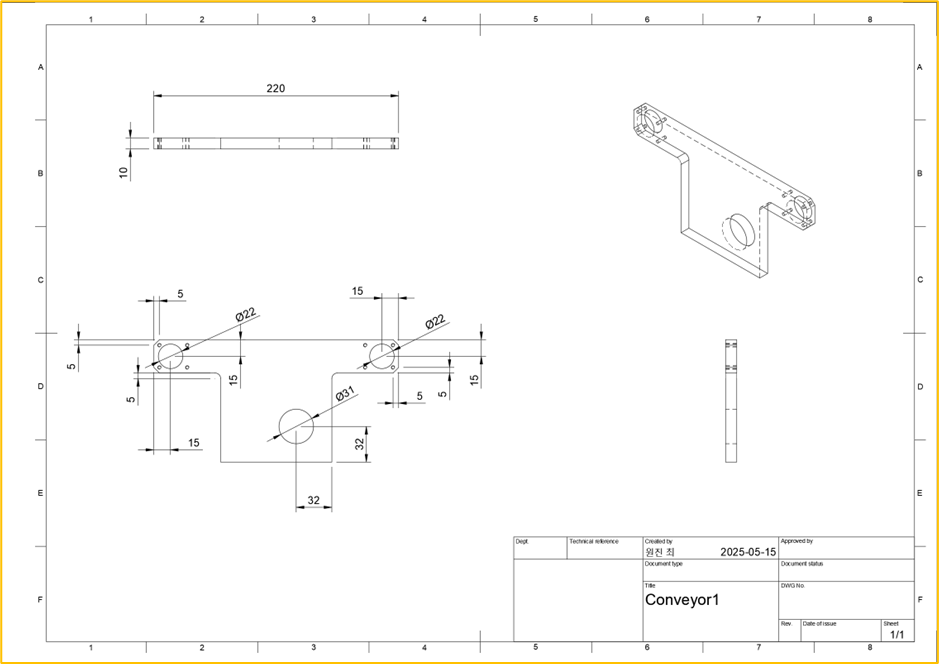
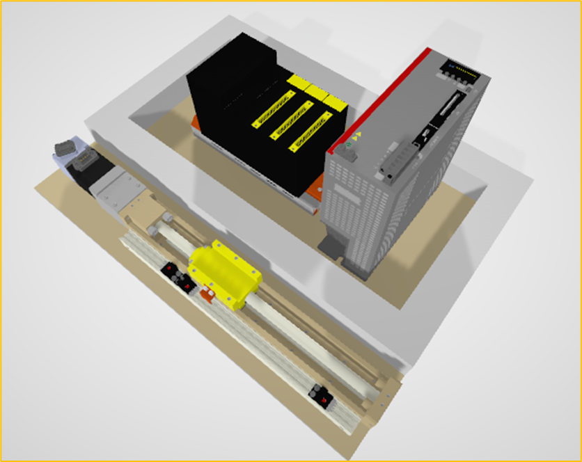
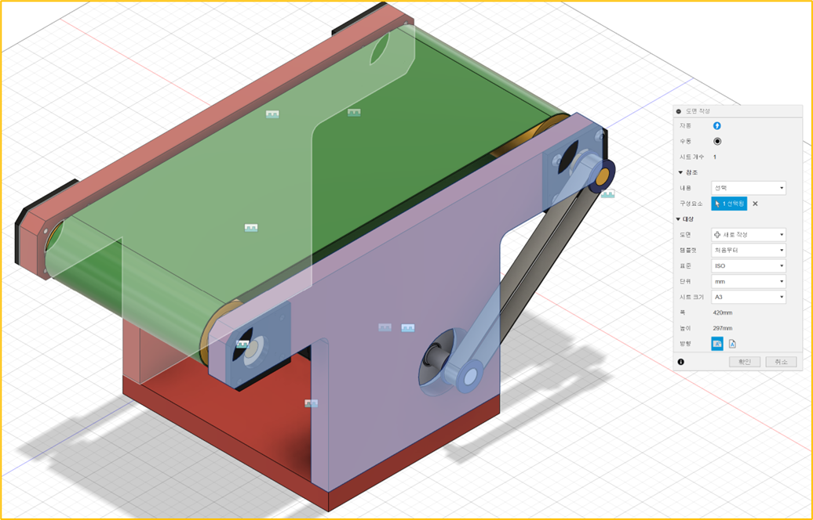
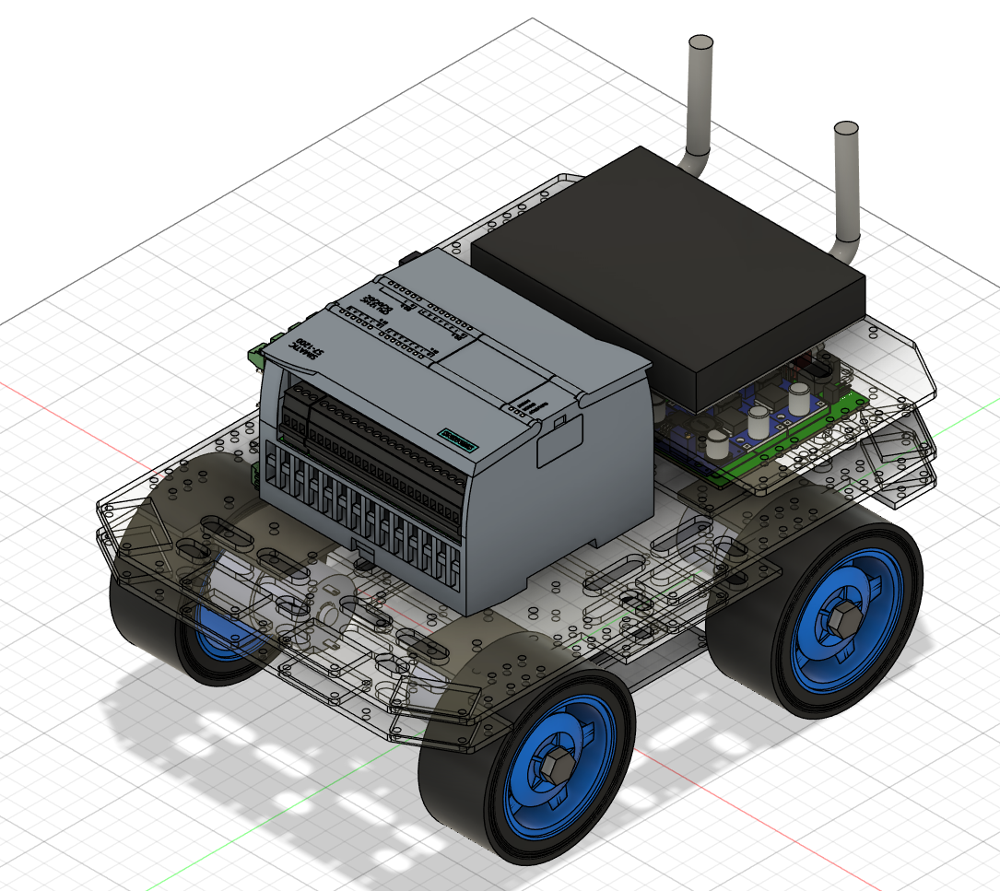
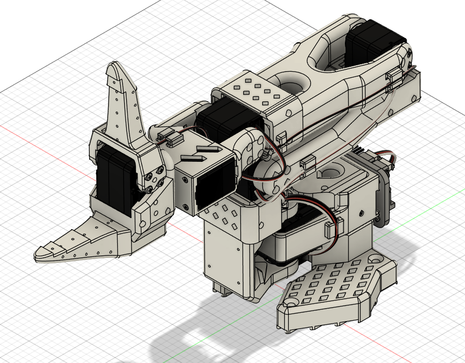

<!-- _class: title -->

# 02-01. 전체 학습 주제 개요 및 학습 목표 이해

## 핵심 개념과 실무 적용

---

# 전체 학습 주제 개요 및 학습 목표 이해

- 앞에서는 기계를 제작하기 위해 필요한 재료의 기초 개념을 살펴보았습니다.
- 기계 설계의 목적은 단순히 3D 모델을 만드는 것이 아닙니다.
- 설계한 형상을 실제 재료로 제작하고, 여러 부품을 조립하여 최종적으로 사용할 수 있는 제품이나 장비를 만드는 것이…

<!--
발표자 노트 · 원문

# 전체 학습 주제 개요 및 학습 목표 이해

#### 설계에서 제작까지

앞에서는 기계를 제작하기 위해 필요한 재료의 기초 개념을 살펴보았습니다.

기계 설계의 목적은 단순히 3D 모델을 만드는 것이 아닙니다.

설계한 형상을 실제 재료로 제작하고, 여러 부품을 조립하여 최종적으로 사용할 수 있는 제품이나 장비를 만드는 것이 기계 설계의 중요한 목표입니다.

전체적인 흐름은 다음과 같이 생각할 수 있습니다.

재료 선택

↓

부품 설계

↓

제작

↓

조립

↓

완성

따라서 설계를 할 때는 형상만 고려하는 것이 아니라 어떤 부품을 직접 만들고, 어떤 부품을 구매하여 사용할 것인지까지 함께 판단해야 합니다.
-->

---

# 왜 모든 부품을 직접 만들지 않는가

- 설계 시간 증가
- 제작 비용 증가
- 제작 기간 증가
- 생산성 저하

<!--
발표자 노트 · 원문

#### 왜 모든 부품을 직접 만들지 않는가

이론적으로는 제품에 필요한 모든 부품을 직접 설계하고 제작할 수 있습니다.

하지만 실제로 모든 부품을 직접 만들려고 하면 여러 문제가 발생합니다.

- 설계 시간 증가
- 제작 비용 증가
- 제작 기간 증가
- 생산성 저하
- 유지보수 어려움

예를 들어 볼트, 너트, 베어링, 모터, 센서 등을 모두 직접 설계하고 제작하는 것은 현실적으로 효율적이지 않습니다.

이러한 부품은 이미 표준화된 제품이 대량 생산되고 있으며, 직접 제작하는 것보다 구매해서 사용하는 것이 훨씬 저렴하고 신뢰성도 높습니다.

실제 산업에서는 얼마나 어렵게 만들었는지보다 다음과 같은 결과가 더 중요합니다.

- 요구 기능을 만족하는가?
- 가격이 적절한가?
- 납기를 맞출 수 있는가?
- 유지보수가 가능한가?
- 필요한 품질을 만족하는가?

따라서 설계자는 다음 두 가지를 구분할 수 있어야 합니다.

- 직접 설계하고 제작해야 하는 부품
- 기성품을 선정하여 사용해야 하는 부품

좋은 설계는 모든 것을 직접 만드는 것이 아니라 필요한 부분만 직접 설계하고, 사용할 수 있는 기성품을 적절하게 활용하는 것입니다.
-->

---

# 기성품을 활용하는 설계

- 볼트와 너트
- 와셔
- 베어링
- 모터

<!--
발표자 노트 · 원문

#### 기성품을 활용하는 설계

실제 기계 설계에서는 매우 많은 기성품을 사용합니다.

대표적인 예는 다음과 같습니다.

- 볼트와 너트
- 와셔
- 베어링
- 모터
- 감속기
- 센서
- 실린더
- LM 가이드
- 볼스크류
- 커플링
- 벨트와 풀리
- 체인과 스프로킷

이러한 부품은 제조사에서 이미 규격과 성능이 정해져 있습니다.

따라서 설계자는 직접 제작하기보다 카탈로그를 확인하고 필요한 사양의 제품을 선정한 뒤 해당 부품이 장착될 구조를 설계합니다.

이 과정에서 중요한 것이 표준 규격과 제조사 도면을 읽을 수 있는 능력입니다.
-->

---

# 도면 제작 방식의 변화

- AutoCAD
- Fusion
- SolidWorks

<!--
발표자 노트 · 원문

#### 도면 제작 방식의 변화

과거에는 종이와 제도 도구를 이용하여 도면을 직접 작성했습니다.

하지만 현재는 대부분의 설계가 CAD(Computer Aided Design) 프로그램을 이용하여 이루어집니다.

CAD는 컴퓨터를 이용하여 설계와 도면 작성을 수행하는 기술을 의미합니다.

대표적인 프로그램으로 다음과 같은 것들이 있습니다.

- AutoCAD
- Fusion
- SolidWorks
- Inventor
- CATIA
- NX

AutoCAD는 2D 도면 작성에 널리 사용되고 있으며, Fusion, SolidWorks, Inventor, CATIA, NX 등은 3D 모델링을 중심으로 다양한 설계 기능을 제공합니다.

이 과정에서는 Fusion을 이용하여 3D 모델링을 먼저 학습하고 이후 2D Drawing 과정에서 도면 작성 방법을 살펴봅니다.
-->

---

# 2D 중심에서 3D 중심으로

- 과거에는 2D 도면을 먼저 작성한 뒤 이를 기반으로 가공하고 제작하는 방식이 일반적이었습니다.
- 현재도 산업 분야와 업체에 따라 2D 도면을 중심으로 작업하는 경우가 있습니다.
- 하지만 기계 설계에서는 3D CAD를 이용하여 먼저 부품과 조립품을 모델링하고, 필요한 2D 도면을 생성하는 방식…

<!--
발표자 노트 · 원문

#### 2D 중심에서 3D 중심으로

과거에는 2D 도면을 먼저 작성한 뒤 이를 기반으로 가공하고 제작하는 방식이 일반적이었습니다.

현재도 산업 분야와 업체에 따라 2D 도면을 중심으로 작업하는 경우가 있습니다.

하지만 기계 설계에서는 3D CAD를 이용하여 먼저 부품과 조립품을 모델링하고, 필요한 2D 도면을 생성하는 방식이 매우 널리 사용됩니다.

전체적인 흐름은 다음과 같습니다.

3D 모델링

↓

조립 및 간섭 검토

↓

2D 도면 작성

↓

제작 의뢰

3D 데이터를 제작 장비에서 직접 활용하는 경우도 많기 때문에 모든 제작 과정에서 반드시 2D 도면이 필요한 것은 아닙니다.

하지만 치수, 공차, 표면 처리, 재질, 가공 요구사항 등을 명확하게 전달해야 하는 기계 부품에서는 여전히 2D 도면이 매우 중요한 역할을 합니다.
-->

---

# 3D 모델링을 먼저 하는 이유

- 형상을 직관적으로 확인 가능
- 여러 부품의 조립 상태 확인 가능
- 부품 간 간섭 검토 가능
- 전체 장비의 크기와 배치 확인 가능

<!--
발표자 노트 · 원문

#### 3D 모델링을 먼저 하는 이유

3D 모델링의 가장 큰 장점은 설계 결과를 실제 제품과 유사한 형태로 확인할 수 있다는 것입니다.

대표적인 장점은 다음과 같습니다.

- 형상을 직관적으로 확인 가능
- 여러 부품의 조립 상태 확인 가능
- 부품 간 간섭 검토 가능
- 전체 장비의 크기와 배치 확인 가능
- 설계 변경이 용이함
- 부품 관리가 편리함
- BOM 작성과 연계 가능
- 2D 도면 생성 가능
- CAM, 3D 프린팅 등의 제작 데이터로 활용 가능

예를 들어 모터와 브라켓을 각각 설계한 뒤 실제로 조립하기 전에 3D 환경에서 먼저 결합해 볼 수 있습니다.

이 과정에서 볼트 구멍의 위치가 맞는지, 다른 부품과 충돌하지 않는지, 조립 공간은 충분한지 등을 미리 확인할 수 있습니다.

이를 통해 실제 제작 전에 많은 설계 오류를 줄일 수 있습니다.
-->

---

# 간섭 검토

- 모터와 프레임이 겹침
- 볼트가 다른 부품과 충돌
- 회전 부품의 동작 범위에 구조물이 존재
- 센서를 설치할 공간이 부족함

<!--
발표자 노트 · 원문

#### 간섭 검토

3D 설계에서 매우 중요한 기능 중 하나가 간섭(Interference) 검토입니다.

여러 부품이 같은 공간을 동시에 차지하도록 설계되어 있는지를 확인하는 기능입니다.

예를 들어 다음과 같은 문제가 발생할 수 있습니다.

- 모터와 프레임이 겹침
- 볼트가 다른 부품과 충돌
- 회전 부품의 동작 범위에 구조물이 존재
- 센서를 설치할 공간이 부족함
- 조립 공구가 들어갈 공간이 없음

이러한 문제는 2D 도면만으로 확인하기 어려운 경우가 있지만 3D 모델에서는 비교적 쉽게 확인할 수 있습니다.

따라서 단순히 부품의 형상만 만드는 것이 아니라 실제 조립과 동작까지 고려하여 모델링하는 것이 중요합니다.
-->

---

# BOM

- 프레임
- 벨트
- 롤러
- 모터

<!--
발표자 노트 · 원문

#### BOM

BOM(Bill of Materials)은 제품이나 장비를 구성하는 부품 목록입니다.

예를 들어 하나의 컨베이어를 제작한다면 다음과 같은 부품들이 필요할 수 있습니다.

- 프레임
- 벨트
- 롤러
- 모터
- 베어링
- 센서
- 볼트
- 너트
- 브라켓

이러한 부품들의 이름, 규격, 수량 등을 정리한 것이 BOM입니다.

3D CAD에서는 조립품에 포함된 부품 정보를 이용하여 BOM 작성과 연계할 수 있습니다.

따라서 3D 모델링은 단순히 형상을 그리는 작업이 아니라 실제 제작과 부품 관리의 기초 데이터가 되기도 합니다.
-->

---

# 제작 방식

- 레이저 커팅
- 3D 프린팅
- 절삭 가공

<!--
발표자 노트 · 원문

#### 제작 방식

설계한 부품을 실제로 제작하는 방법은 매우 다양합니다.

본 과정에서는 이해와 실습을 위해 대표적인 세 가지 방식을 중심으로 살펴봅니다.

- 레이저 커팅
- 3D 프린팅
- 절삭 가공

이 중 레이저 커팅과 3D 프린팅은 비교적 저렴한 비용으로 직접 실습하기 좋습니다.

반면 CNC나 머시닝센터를 이용하는 절삭 가공은 전문 장비와 비용이 필요하기 때문에 본 과정에서는 제작 방식과 도면 작성 방법을 중심으로 이해합니다.
-->

---

# 2D Laser Cutting

- 아크릴
- 철판
- 스테인리스강 판재
- 알루미늄 판재

<!--
발표자 노트 · 원문

#### 2D Laser Cutting

레이저 커팅은 판재를 레이저로 절단하여 원하는 2D 형상을 만드는 방법입니다.

대표적으로 다음과 같은 재료를 사용할 수 있습니다.

- 아크릴
- 철판
- 스테인리스강 판재
- 알루미늄 판재

실제 사용 가능한 재료는 레이저 장비의 종류와 출력에 따라 달라집니다.

CAD에서 작성한 2D 형상 데이터를 이용하여 자동으로 절단할 수 있습니다.

대표적인 데이터 형식으로 DXF가 많이 사용됩니다.

특징은 다음과 같습니다.

- 2D 판재 가공에 적합
- 제작 속도가 빠름
- 비교적 저렴한 비용
- 반복 제작이 용이함
- 산업 현장 활용도가 높음

교육 과정에서는 아크릴 판재를 이용하여 충분한 제작 실습이 가능합니다.

아크릴은 레이저 가공이 비교적 쉽고 결과를 눈으로 확인하기 좋기 때문에 교육용 재료로 활용하기 좋습니다.
-->

---

# 3D Printing

- PLA
- PETG
- ABS
- TPU

<!--
발표자 노트 · 원문

#### 3D Printing

3D 프린팅은 재료를 한 층씩 적층하여 3차원 형상을 만드는 제작 방법입니다.

일반적인 교육 환경에서는 FDM 방식의 3D 프린터를 많이 사용합니다.

대표적인 재료는 다음과 같습니다.

- PLA
- PETG
- ABS
- TPU

대표적인 출력 데이터 형식으로 STL이 널리 사용되지만 최근에는 3MF 등의 형식도 사용됩니다.

특징은 다음과 같습니다.

- 복잡한 형상 제작 가능
- 별도의 금형이 필요하지 않음
- 시제품 제작에 적합
- 소량 제작에 유리
- 교육용으로 활용하기 좋음

3D 프린팅은 시제품 제작에 매우 널리 사용되지만 산업 분야에 따라 최종 제품이나 소량 생산용 부품 제작에도 사용되고 있습니다.

따라서 단순히 “양산에는 사용할 수 없다”고 보기보다는 생산 수량, 재료, 요구 강도, 비용에 따라 적용 범위가 달라진다고 이해하는 것이 좋습니다.

본 과정에서는 PLA를 이용하여 다양한 기계 부품을 직접 출력합니다.
-->

---

# 절삭 가공

- 선반
- 밀링 머신
- CNC 선반
- 머시닝센터

<!--
발표자 노트 · 원문

#### 절삭 가공

절삭 가공은 원재료를 깎아 원하는 형상을 만드는 방식입니다.

대표적인 장비는 다음과 같습니다.

- 선반
- 밀링 머신
- CNC 선반
- 머시닝센터

절삭 가공은 금속 부품을 제작할 때 매우 중요한 제작 방식입니다.

대표적인 재료는 다음과 같습니다.

- 철강
- 알루미늄
- 스테인리스강
- 구리
- POM 등의 플라스틱

특징은 다음과 같습니다.

- 높은 정밀도 구현 가능
- 다양한 금속 재료 가공 가능
- 기계 부품 제작에 매우 널리 사용
- 전문적인 장비와 기술이 필요
- 일반적으로 3D 프린팅이나 교육용 레이저 커팅보다 비용이 높음

가공 업체에 제작을 의뢰할 때는 2D 도면과 3D CAD 데이터를 함께 전달하는 경우가 많습니다.

사용되는 파일 형식은 업체와 공정에 따라 다르며 DWG, DXF, STEP 등의 형식이 활용될 수 있습니다.
-->

---

# 제작 방법 비교

- 어떤 제작 방법이 가장 좋은 것은 아닙니다.
- 설계하려는 부품의 재료, 형상, 수량, 비용, 정밀도를 고려하여 적절한 제작 방법을 선택해야 합니다.

<!--
발표자 노트 · 원문

#### 제작 방법 비교

| 구분 | 레이저 커팅 | 3D 프린팅 | 절삭 가공 |
| —- | —- | —- | —- |
| 주요 형상 | 2D 판재 | 3D 형상 | 3D 정밀 부품 |
| 대표 재료 | 아크릴, 금속 판재 | PLA, PETG, ABS, TPU | 철, 알루미늄, STS, POM |
| 비용 | 비교적 낮음 | 비교적 낮음 | 비교적 높음 |
| 정밀도 | 비교적 높음 | 장비에 따라 다름 | 높음 |
| 형상 자유도 | 판재 형상 중심 | 매우 높음 | 높음 |
| 교육 활용 | 매우 좋음 | 매우 좋음 | 제한적 |
| 산업 활용 | 매우 높음 | 높아지는 추세 | 매우 높음 |

어떤 제작 방법이 가장 좋은 것은 아닙니다.

설계하려는 부품의 재료, 형상, 수량, 비용, 정밀도를 고려하여 적절한 제작 방법을 선택해야 합니다.
-->

---

# Fusion 실습 준비

- 서보모터 연습 키트
- 컨베이어
- 미니 자동차
- 로봇

<!--
발표자 노트 · 원문

#### Fusion 실습 준비

이제부터는 Fusion을 이용하여 실제 3D 모델링을 시작합니다.

먼저 기본적인 스케치와 모델링 기능을 학습한 뒤 여러 개의 작은 프로젝트를 통해 기능을 반복해서 사용해 봅니다.

단순히 프로그램의 명령어를 외우는 것이 아니라 실제로 어떤 제품과 부품을 설계할 때 각각의 기능을 사용하는지를 익히는 것이 목표입니다.

이 과정에서 다음과 같은 프로젝트를 활용합니다.

- 서보모터 연습 키트
- 컨베이어
- 미니 자동차
- 로봇

각 프로젝트는 단순한 3D 모델링 연습에 그치지 않고 이후 제작, 전기, 제어, 디지털 트윈 과정으로 확장할 수 있도록 구성합니다.
-->

---

# 서보모터 연습 키트

- PLC
- 서보 드라이브
- 서보 모터

<!--
발표자 노트 · 원문

#### 서보모터 연습 키트

서보모터 연습 키트는 산업용 서보 시스템의 구조를 이해하기 위한 프로젝트입니다.

구성 요소는 다음과 같습니다.

- PLC
- 서보 드라이브
- 서보 모터
- 기계 구조물

산업용 PLC와 서보 시스템은 실제 장비의 가격이 높기 때문에 모든 교육 과정에서 실제 장비를 구성하기에는 부담이 있습니다.

따라서 우선 3D 환경에서 기계적인 구조와 장비 배치를 설계하고 추후 디지털 트윈 환경에서 제어 시스템과 연결하는 방식으로 활용할 수 있습니다.

이 프로젝트를 통해 다음 내용을 학습할 수 있습니다.

- 모터 장착 구조
- 커플링 구조
- 축 구조
- 센서 배치
- 서보 시스템의 기본 구성
- 디지털 트윈 적용
-->

---

# 컨베이어

- 3D 프린팅
- 레이저 커팅
- 기성품 사용

<!--
발표자 노트 · 원문

#### 컨베이어

컨베이어는 자동화 교육에서 활용도가 매우 높은 프로젝트입니다.

구조가 비교적 단순하면서도 기계, 전기, 전자, 제어 등 다양한 기술을 적용할 수 있습니다.

또한 실제 제작도 가능합니다.

제작 과정에서는 다음과 같은 방법을 활용할 수 있습니다.

- 3D 프린팅
- 레이저 커팅
- 기성품 사용

기계 설계 과정에서는 다음 내용을 학습할 수 있습니다.

- 프레임 설계
- 롤러 구조
- 벨트 구조
- 축과 베어링
- 모터 장착
- 텐션 조절
- 센서 브라켓 설계

이후 과정에서는 다음과 같이 확장할 수 있습니다.

기계 설계

↓

모터 구동

↓

센서 적용

↓

PLC 또는 마이크로컨트롤러 제어

↓

디지털 트윈

↓

AI 적용

하나의 장비를 여러 교육 과정에서 반복적으로 확장할 수 있다는 점에서 매우 높은 교육적 가치가 있습니다.
-->

---

# 미니 자동차

- 모터 장착
- 바퀴 설계
- 감속기

<!--
발표자 노트 · 원문

#### 미니 자동차

미니 자동차는 이동형 장치의 기계 구조와 제어를 학습하기 좋은 프로젝트입니다.

다음과 같은 내용을 적용할 수 있습니다.

- 모터 장착
- 바퀴 설계
- 감속기
- 캐스터
- 배터리 장착
- 센서 배치
- 전자회로
- 모터 제어

이후에는 다음과 같은 기술로 확장할 수 있습니다.

- 거리 센서
- 라인 센서
- 엔코더
- 카메라
- 주행 알고리즘
- 자율주행
- ROS
- AI Vision

따라서 기계 설계부터 소프트웨어와 인공지능까지 연결하기 좋은 프로젝트입니다.
-->

---

# 로봇

- Link 구조
- Joint 구조
- 모터 장착

<!--
발표자 노트 · 원문

#### 로봇

로봇은 기계 설계와 제어를 종합적으로 학습할 수 있는 프로젝트입니다.

로봇을 설계하려면 여러 개의 관절과 링크를 연결해야 하기 때문에 일반적인 기계 장치보다 높은 수준의 구조적 이해가 필요합니다.

기계 설계에서는 다음 내용을 학습할 수 있습니다.

- Link 구조
- Joint 구조
- 모터 장착
- 축과 베어링
- 감속 구조
- 케이블 배치
- 작업 범위

이후에는 다음 기술로 확장할 수 있습니다.

- 서보 제어
- Forward Kinematics
- Inverse Kinematics
- ROS2
- Simulation
- Digital Twin
- AI

교육 난이도는 높지만 여러 기술을 하나의 프로젝트 안에서 연결할 수 있다는 장점이 있습니다.
-->

---

# 프로젝트를 사용하는 이유

- 각 프로젝트의 목적은 완성된 제품 하나를 만드는 것이 아닙니다.
- 동일한 프로젝트를 학습 단계에 따라 계속 확장하는 것이 중요합니다.
- 예를 들어 컨베이어를 이용한다면 다음과 같이 발전시킬 수 있습니다.

<!--
발표자 노트 · 원문

#### 프로젝트를 사용하는 이유

각 프로젝트의 목적은 완성된 제품 하나를 만드는 것이 아닙니다.

동일한 프로젝트를 학습 단계에 따라 계속 확장하는 것이 중요합니다.

예를 들어 컨베이어를 이용한다면 다음과 같이 발전시킬 수 있습니다.

기계 설계

↓

2D 도면

↓

레이저 커팅 및 3D 프린팅

↓

조립

↓

전기 배선

↓

센서와 모터

↓

PLC 제어

↓

소프트웨어

↓

디지털 트윈

↓

AI

이러한 방식으로 학습하면 각각의 기술을 별개의 분야로 배우는 것이 아니라 하나의 실제 시스템 안에서 서로 어떻게 연결되는지를 이해할 수 있습니다.
-->

---

# 앞으로의 학습 흐름

- Fusion 기본 기능 학습
- 3D 모델링 실습
- 프로젝트 모델링
- 2D 도면 작성

<!--
발표자 노트 · 원문

#### 앞으로의 학습 흐름

이제 기계 설계의 기본적인 이론을 마치고 실제 설계 과정으로 넘어갑니다.

앞으로의 학습 흐름은 다음과 같습니다.

1. Fusion 기본 기능 학습
2. 3D 모델링 실습
3. 프로젝트 모델링
4. 2D 도면 작성
5. 레이저 커팅과 3D 프린팅
6. 실제 제작
7. 부품 조립
8. 이후 전기·전자 및 제어 과정과 연결

기계 설계는 단순히 도면을 그리는 기술이 아닙니다.

아이디어를 실제로 사용할 수 있는 제품으로 만드는 과정 전체를 이해하는 것이 중요합니다.

설계

↓

제작

↓

조립

↓

전기·전자

↓

제어

↓

소프트웨어

↓

디지털 트윈

↓

AI

앞으로의 실습에서는 이러한 전체 흐름의 출발점인 3D 모델링부터 시작합니다.

이제 Fusion을 이용하여 실제 부품과 장비를 설계해 보겠습니다.
-->
