<!-- _class: title -->

# 02-04. 컨베이어 시스템 3D 모델링

## 핵심 개념과 실무 적용

---

# 컨베이어 시스템 3D 모델링

- 앞의 두 챕터에서는 Fusion 360의 기본 기능을 익히고, 기성품을 배치하여 하나의 장비 형태를 구성하는 방법…
- 이번에는 한 단계 더 나아가 실제로 제작하고 조립할 수 있는 컨베이어를 설계합니다.
- 이번 프로젝트에서 가장 먼저 생각해야 할 것은 형상이 아닙니다.

<!--
발표자 노트 · 원문

# 컨베이어 시스템 3D 모델링

앞의 두 챕터에서는 Fusion 360의 기본 기능을 익히고, 기성품을 배치하여 하나의 장비 형태를 구성하는 방법을 살펴보았습니다.

이번에는 한 단계 더 나아가 실제로 제작하고 조립할 수 있는 컨베이어를 설계합니다.

이번 프로젝트에서 가장 먼저 생각해야 할 것은 형상이 아닙니다.

어떤 재료를 사용하고, 어떤 방법으로 제작할 것인지를 먼저 결정해야 합니다.

이번 컨베이어는 PLA와 TPU를 이용하여 3D 프린팅으로 제작합니다.

따라서 처음부터 적층 가공에 적합한 구조로 설계해야 합니다.

만약 같은 컨베이어를 철이나 알루미늄으로 제작한다면 선반, 밀링, CNC 등의 절삭 가공을 고려해야 하고, 아크릴 판재로 제작한다면 레이저 커팅에 적합한 2D 판재 구조로 설계해야 합니다.

즉,

재료 선택

↓

제작 방법 결정

↓

제작 방법에 맞는 설계

의 순서로 접근해야 합니다.

> 같은 기능의 제품이라도 사용하는 재료와 제작 방법에 따라 설계 구조는 완전히 달라질 수 있습니다.
>
-->

---

# 컨베이어의 기본 구조

- 이번에 제작할 컨베이어는 모터의 회전력을 타이밍 벨트와 샤프트를 통해 전달하여 컨베이어 벨트를 움직이는 구조입니다.
- 기본적인 동력 전달 과정은 다음과 같습니다.
- 모터

<!--
발표자 노트 · 원문

#### 컨베이어의 기본 구조

이번에 제작할 컨베이어는 모터의 회전력을 타이밍 벨트와 샤프트를 통해 전달하여 컨베이어 벨트를 움직이는 구조입니다.

기본적인 동력 전달 과정은 다음과 같습니다.

모터

↓

모터 풀리

↓

타이밍 벨트

↓

샤프트 풀리

↓

샤프트

↓

컨베이어 벨트

컨베이어 양쪽 끝에는 센서를 장착하여 이동 물체가 끝 위치에 도달했는지를 확인할 수 있도록 구성합니다.

이후 전기·전자 과정에서는 실제 모터와 센서를 연결하여 컨베이어가 왕복 동작하도록 제어할 수 있습니다.
-->

---

# 사용 부품

- JGB37-520 12V 45RPM 모터 1개
- TCRT5000 센서 모듈 2개
- GT2 6 mm 타이밍 벨트
- M2 목공피스

<!--
발표자 노트 · 원문

#### 사용 부품

이번 컨베이어에는 다음과 같은 주요 부품을 사용합니다.

- JGB37-520 12V 45RPM 모터 1개
- TCRT5000 센서 모듈 2개
- GT2 6 mm 타이밍 벨트
- M2 목공피스
- M3 볼트
- MR128ZZ 베어링 4개
- PLA
- TPU

모터, 센서, 베어링과 같은 기성품은 직접 설계하지 않고 이미 만들어진 제품을 구매하여 사용합니다.

그리고 이러한 기성품을 장착하고 서로 연결하기 위한 구조물을 직접 설계합니다.
-->

---

# JGB37-520 모터

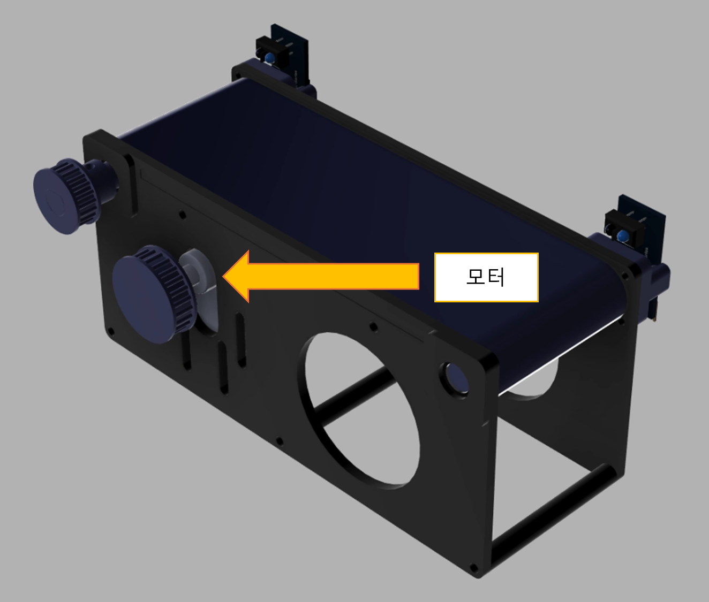

- 컨베이어를 움직이기 위한 구동원으로 JGB37-520 기어드 모터를 사용합니다.
- 이번 프로젝트에서는 12V, 45RPM 사양을 기준으로 설계합니다.
- 모터가 회전하면 모터 축에 연결된 1차측 풀리가 회전합니다.

<!--
발표자 노트 · 원문

#### JGB37-520 모터

컨베이어를 움직이기 위한 구동원으로 JGB37-520 기어드 모터를 사용합니다.

이번 프로젝트에서는 12V, 45RPM 사양을 기준으로 설계합니다.

모터가 회전하면 모터 축에 연결된 1차측 풀리가 회전합니다.

이 회전력은 타이밍 벨트를 통해 2차측 풀리로 전달되고, 다시 샤프트와 컨베이어 벨트로 전달됩니다.

모터의 전기적인 동작 원리는 이후 전기·전자 과정에서 자세히 다룹니다.
-->

---

# 기성품의 CAD 데이터

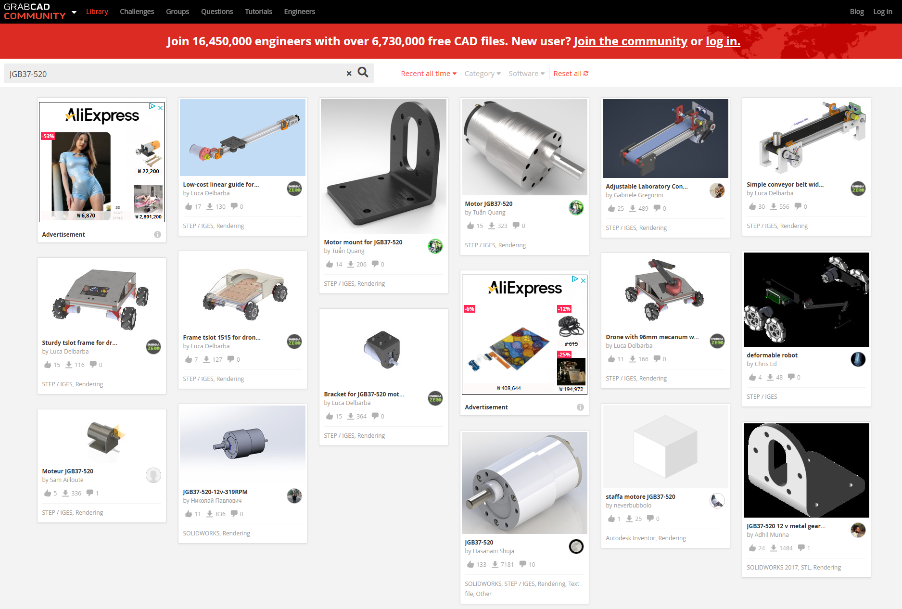

- STEP : 서로 다른 CAD 프로그램 사이에서 3D 모델을 주고받을 때 사용하는 대표적인 형식
- STL : 3D 프린팅용 데이터로 많이 사용하는 형식
- IGES : CAD 데이터 교환용 형식

<!--
발표자 노트 · 원문

#### 기성품의 CAD 데이터

모터와 센서, 베어링 등의 기성품은 직접 모델링할 수도 있지만 인터넷에서 제공되는 CAD 파일을 이용하면 설계 시간을 크게 줄일 수 있습니다.

[https://grabcad.com/library?page=1&time=all_time&sort=recent&query=JGB37](https://grabcad.com/library?page=1&time=all_time&sort=recent&query=JGB37)

이번 프로젝트에서는 GrabCAD 등의 사이트에서 필요한 모델을 검색하여 사용합니다.

CAD 파일을 받을 때는 가능하면 STEP 형식이 포함된 모델을 선택합니다.

대표적인 파일 형식은 다음과 같습니다.

- STEP : 서로 다른 CAD 프로그램 사이에서 3D 모델을 주고받을 때 사용하는 대표적인 형식
- STL : 3D 프린팅용 데이터로 많이 사용하는 형식
- IGES : CAD 데이터 교환용 형식
- 각 CAD 프로그램의 전용 파일

기계 설계에서 기성품을 배치하려는 목적이라면 STEP 파일이 사용하기 편리합니다.

다만 커뮤니티에 올라온 CAD 데이터는 실제 제조사가 제공한 공식 모델이 아닐 수 있습니다.

따라서 실제 부품을 구매했다면 다음 내용을 확인하는 것이 좋습니다.

- 전체 외형 치수
- 축 직경
- 고정 홀 위치
- 볼트 규격
- 돌출부 크기

특히 조립과 관련된 치수는 실제 제품을 직접 측정하여 확인하는 것이 가장 확실합니다.
-->

---

# TCRT5000 센서

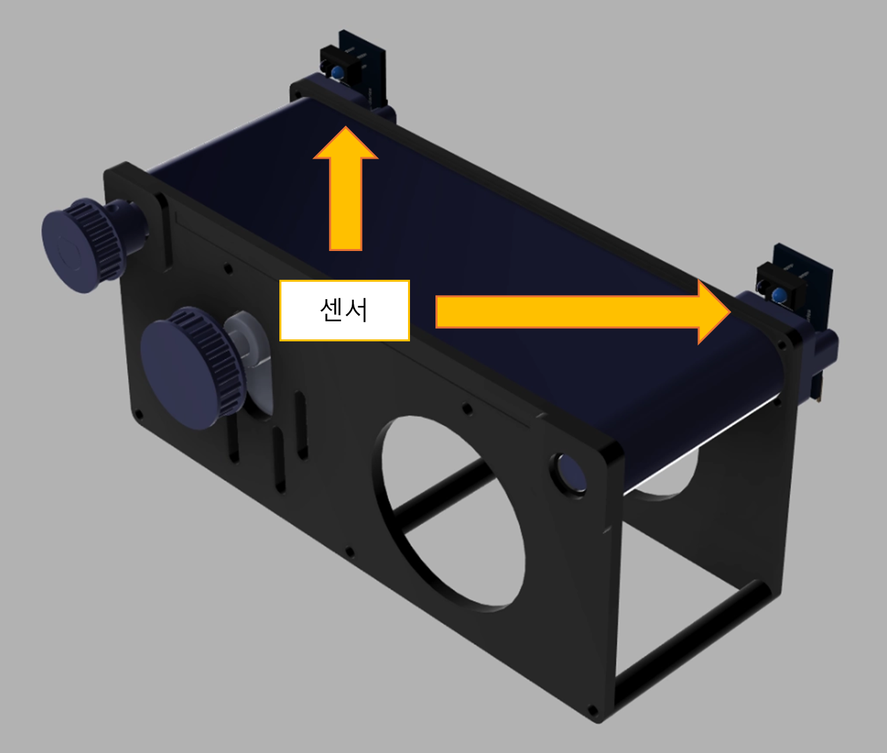

- 컨베이어의 양쪽 끝에는 TCRT5000 센서 모듈을 하나씩 배치합니다.
- 센서는 컨베이어 위를 이동하는 물체가 끝 위치에 도달했는지를 확인하는 용도로 사용합니다.
- 이번 기계 설계 과정에서는 센서를 장착할 공간과 고정 방법을 설계하는 데 집중합니다.

<!--
발표자 노트 · 원문

#### TCRT5000 센서

컨베이어의 양쪽 끝에는 TCRT5000 센서 모듈을 하나씩 배치합니다.

센서는 컨베이어 위를 이동하는 물체가 끝 위치에 도달했는지를 확인하는 용도로 사용합니다.

이번 기계 설계 과정에서는 센서를 장착할 공간과 고정 방법을 설계하는 데 집중합니다.

센서의 전기적인 동작 원리와 신호 처리 방법은 이후 전기·전자 과정에서 다룹니다.
-->

---

# 타이밍 벨트와 풀리

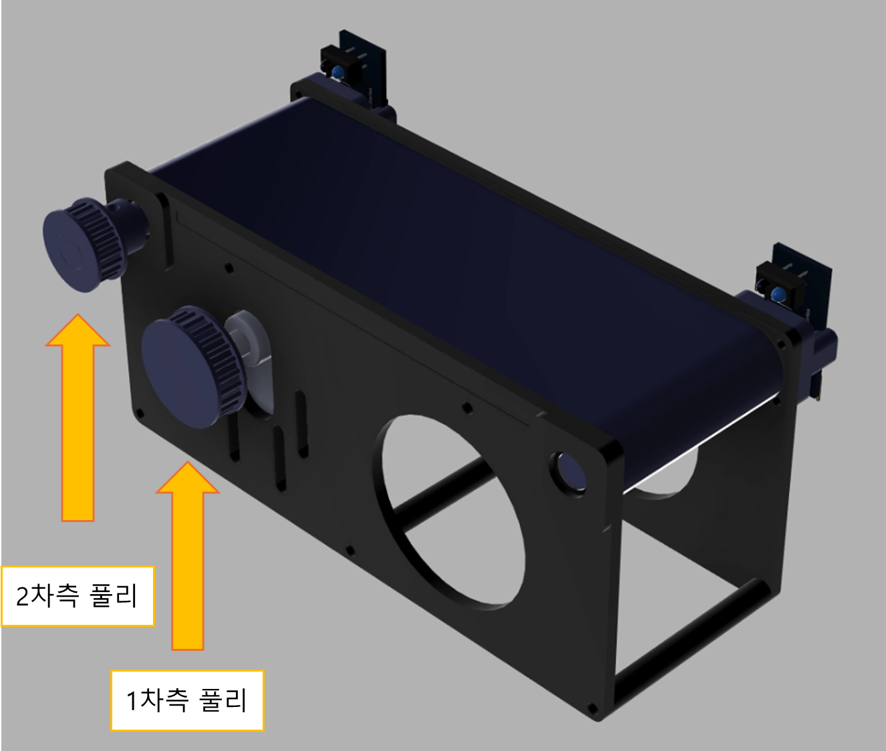

- 모터의 회전력을 샤프트로 전달하기 위해 타이밍 벨트와 타이밍 풀리를 사용합니다.
- 일반적인 매끄러운 벨트와 풀리는 큰 힘이 전달될 때 미끄러질 수 있습니다.
- 타이밍 벨트와 풀리에는 서로 맞물리는 톱니가 있기 때문에 회전력을 보다 정확하게 전달할 수 있습니다.

<!--
발표자 노트 · 원문

#### 타이밍 벨트와 풀리

모터의 회전력을 샤프트로 전달하기 위해 타이밍 벨트와 타이밍 풀리를 사용합니다.

일반적인 매끄러운 벨트와 풀리는 큰 힘이 전달될 때 미끄러질 수 있습니다.

타이밍 벨트와 풀리에는 서로 맞물리는 톱니가 있기 때문에 회전력을 보다 정확하게 전달할 수 있습니다.

이번 프로젝트에서는 GT2 계열의 타이밍 벨트를 사용합니다.

타이밍 벨트는 완벽한 실제 형상을 모델링하기보다 필요한 크기와 배치 관계를 확인할 수 있는 수준으로 단순화합니다.
-->

---

# 베어링

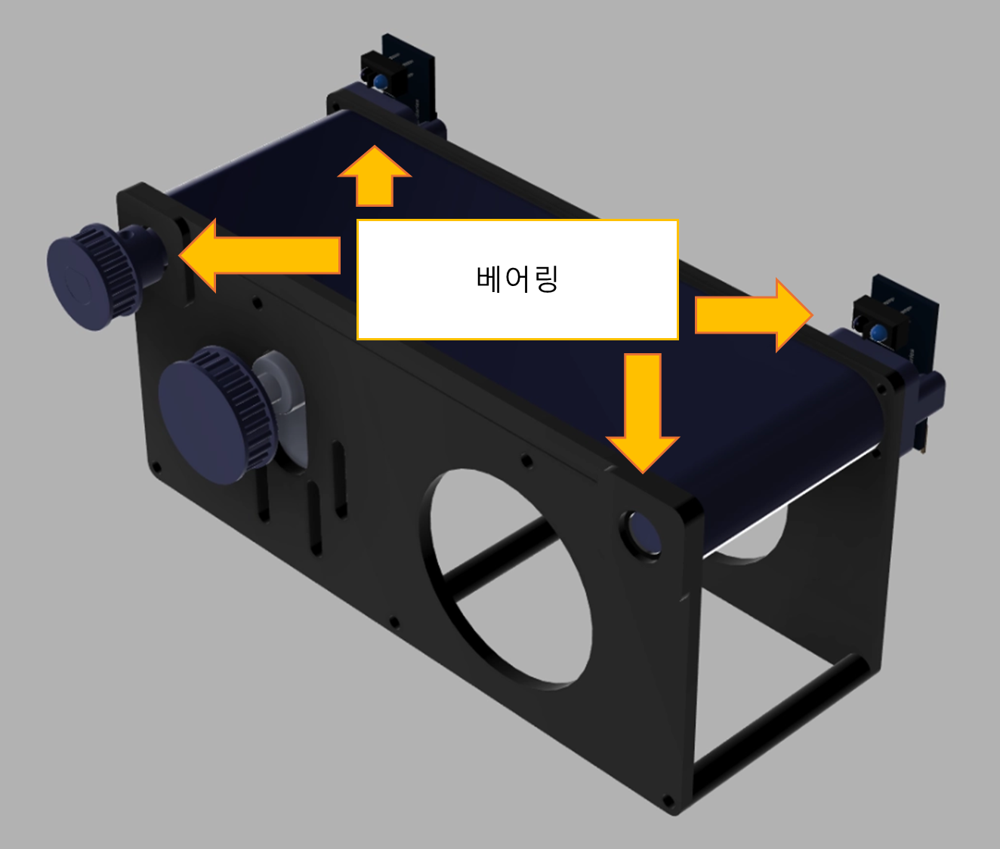

- 외륜
- 내륜
- 볼

<!--
발표자 노트 · 원문

#### 베어링

컨베이어 양쪽에는 샤프트가 설치됩니다.

샤프트는 계속 회전해야 하므로 플레이트에 직접 끼우면 큰 마찰이 발생합니다.

이를 줄이기 위해 베어링을 사용합니다.

이번 프로젝트에서는 MR128ZZ 베어링을 사용합니다.

베어링의 기본 구조는 다음과 같습니다.

- 외륜
- 내륜
- 볼
- 실드

외륜은 구조물에 고정되고, 내륜은 샤프트와 함께 회전합니다.

그 사이에 있는 볼이 마찰을 줄여 샤프트가 원활하게 회전할 수 있도록 합니다.
-->

---

# 체결 부품

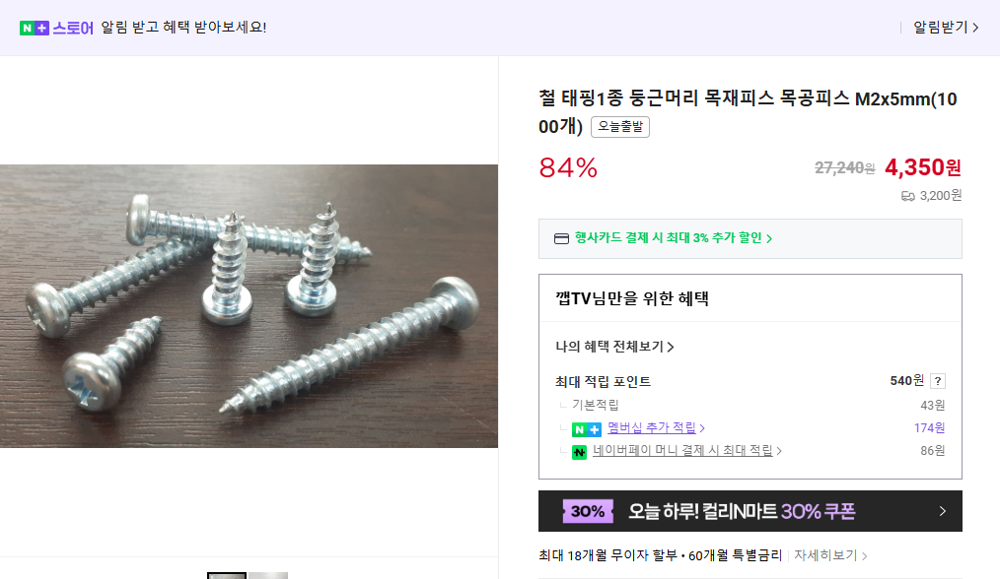

- 3D 프린팅한 부품을 서로 연결하기 위해 M2 목공피스를 사용합니다.
- 모터 고정에는 M3 볼트를 사용합니다.
- 이번 프로젝트에서는 체결 부품까지 모두 직접 모델링하지 않습니다.

<!--
발표자 노트 · 원문

#### 체결 부품

3D 프린팅한 부품을 서로 연결하기 위해 M2 목공피스를 사용합니다.

모터 고정에는 M3 볼트를 사용합니다.

이번 프로젝트에서는 체결 부품까지 모두 직접 모델링하지 않습니다.

Fusion의 McMaster-Carr 구성요소 삽입 기능 등을 이용하여 비슷한 규격의 볼트를 불러와 배치할 수 있습니다.

실제 제작에 사용하는 볼트와 모델링에서 표현하는 볼트가 반드시 완벽하게 동일할 필요는 없습니다.

중요한 것은 체결 위치와 필요한 공간을 확인하는 것입니다.
-->

---

# 프로젝트 구조 관리

- 기성품
- 모터
- 센서
- 베어링

<!--
발표자 노트 · 원문

#### 프로젝트 구조 관리

새 프로젝트를 만든 뒤 기성품과 직접 제작할 부품을 구분하여 관리하는 것이 좋습니다.

예를 들어 브라우저에서 다음과 같이 구성할 수 있습니다.

- 기성품
    - 모터
    - 센서
    - 베어링
    - 볼트
- 직접 제작
    - PLATE_MOTOR
    - PLATE_SIDE
    - COVER_BEARING
    - SHAFT_IDLE
    - SHAFT_MOTOR
    - PULLY_MOTOR
    - PULLY_SHAFT
    - PLATE_SUPPORT
    - BELT

더 큰 프로젝트에서는 직접 제작하는 부품도 제작 방식에 따라 분류할 수 있습니다.

- 절삭 가공
- 3D 프린팅
- 레이저 커팅

처음부터 구조를 정리해 두면 부품 수가 증가했을 때 관리하기 편해집니다.
-->

---

# 기성품 삽입

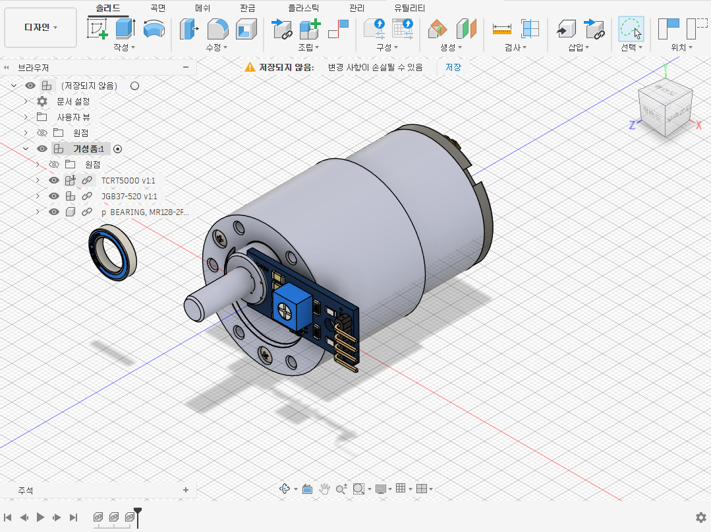

- 모터 : 1개
- 센서 : 2개
- 베어링 : 4개

<!--
발표자 노트 · 원문

#### 기성품 삽입

먼저 모터, 센서, 베어링 CAD 파일을 프로젝트에 가져옵니다.

기성품 구성요소가 활성화된 상태에서 파일을 삽입하면 해당 구성요소 아래에 정리할 수 있습니다.

외부에서 다운로드한 조립품의 내부 부품이 서로 분리되어 움직인다면 강체 그룹을 설정합니다.

이번 프로젝트에서는 다음 수량을 사용하므로 필요한 만큼 미리 복사할 수 있습니다.

- 모터 : 1개
- 센서 : 2개
- 베어링 : 4개
-->

---

# PLATEMOTOR

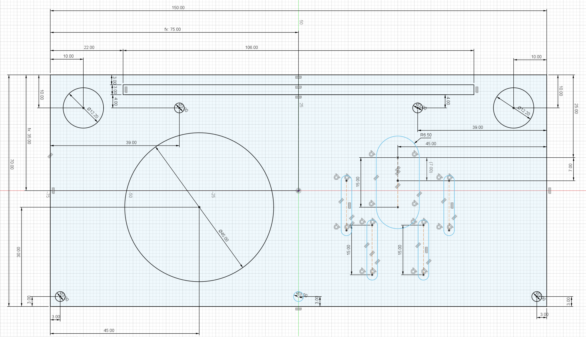

- 중심 돌출부의 직경
- 모터 중심과 돌출부 중심의 관계
- 고정 홀 직경

<!--
발표자 노트 · 원문

#### PLATE_MOTOR

첫 번째로 설계할 부품은 모터를 고정하는 `PLATE_MOTOR`입니다.

무작정 형상을 그리기 전에 먼저 모터의 치수를 측정합니다.

Fusion의 다음 기능을 사용합니다.

검사 → 측정

모터의 장착부에서 확인해야 할 대표적인 치수는 다음과 같습니다.

- 중심 돌출부의 직경
- 모터 중심과 돌출부 중심의 관계
- 고정 홀 직경
- 고정 홀의 중심 거리
- 고정 홀의 배치 각도

이번 모델에서는 모터 돌출부가 약 Φ12.50 mm이므로 플레이트의 구멍에는 약간의 여유를 두어 Φ13.00 mm를 적용합니다.

모터 고정용 M3 볼트가 지나가는 홀은 Φ3.20 mm로 설계합니다.

볼트의 실제 외경과 동일하게 Φ3.00 mm로 만들지 않고 약간의 간극을 주어 쉽게 삽입될 수 있도록 하는 것입니다.
-->

---

# 3D 프린팅과 공차

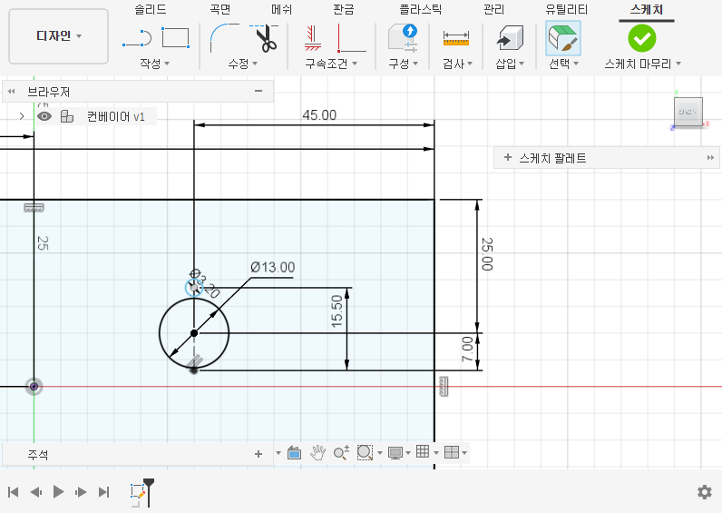

- 볼트 삽입 홀
- 베어링 삽입부
- 샤프트

<!--
발표자 노트 · 원문

#### 3D 프린팅과 공차

CAD에서 Φ13.00 mm로 설계했다고 해서 실제 출력물이 정확하게 Φ13.00 mm로 만들어지는 것은 아닙니다.

3D 프린터의 상태와 설정에 따라 출력 오차가 발생합니다.

따라서 서로 조립되는 부분에는 적절한 간극이 필요합니다.

예를 들어 실제 부품의 돌출부가 Φ12.50 mm라면 출력용 구멍을 그보다 조금 크게 설계할 수 있습니다.

같은 원리로 다음과 같은 부분에도 여유를 고려합니다.

- 볼트 삽입 홀
- 베어링 삽입부
- 샤프트
- 벨트 폭
- 서로 맞닿는 플레이트

정확한 간극은 사용하는 프린터와 필라멘트, 출력 조건에 따라 달라질 수 있으므로 실제 출력 테스트를 통해 보정하는 것이 좋습니다.
-->

---

# 원형 패턴

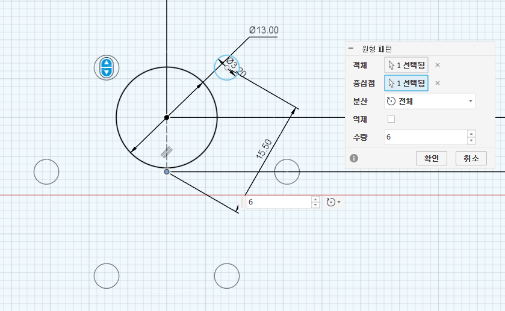

- 모터 고정 홀은 중심을 기준으로 일정한 각도로 반복되어 있습니다.
- 이러한 구조는 원형 패턴(Circular Pattern)을 이용하면 쉽게 만들 수 있습니다.
- 먼저 하나의 볼트 홀을 정확한 위치에 만든 뒤 모터 중심을 기준으로 필요한 수량만큼 복제합니다.

<!--
발표자 노트 · 원문

#### 원형 패턴

모터 고정 홀은 중심을 기준으로 일정한 각도로 반복되어 있습니다.

이러한 구조는 원형 패턴(Circular Pattern)을 이용하면 쉽게 만들 수 있습니다.

먼저 하나의 볼트 홀을 정확한 위치에 만든 뒤 모터 중심을 기준으로 필요한 수량만큼 복제합니다.

이 방법을 사용하면 동일한 형상을 하나씩 직접 그리는 것보다 훨씬 빠르고 정확하게 작업할 수 있습니다.
-->

---

# 벨트 장력 조절 구조

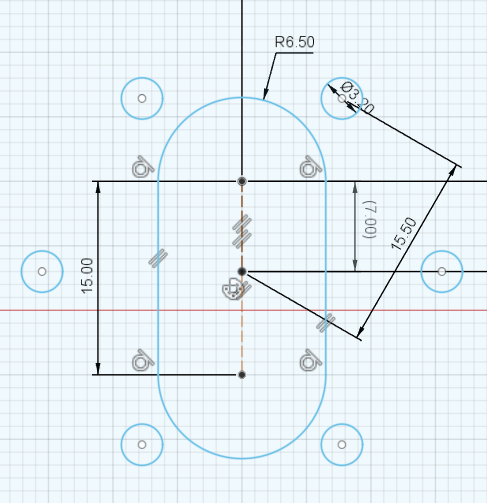

- 제조 공차
- 사용에 따른 늘어남
- 조립 위치 오차

<!--
발표자 노트 · 원문

#### 벨트 장력 조절 구조

모터를 고정된 위치에만 설치하면 타이밍 벨트 길이에 오차가 있을 때 장력을 맞추기 어렵습니다.

실제 벨트에는 다음과 같은 변수가 존재할 수 있습니다.

- 제조 공차
- 사용에 따른 늘어남
- 조립 위치 오차
- 3D 프린팅 부품의 치수 오차

따라서 모터의 위치를 조금 이동할 수 있도록 장공(Slot)을 적용합니다.

모터 위치를 조정하면 풀리 사이의 거리를 변경할 수 있기 때문에 타이밍 벨트의 장력을 조절할 수 있습니다.

즉, 장공은 단순히 긴 구멍이 아니라 실제 조립 공차를 흡수하는 설계 요소입니다.
-->

---

# 간섭을 고려한 설계 변경

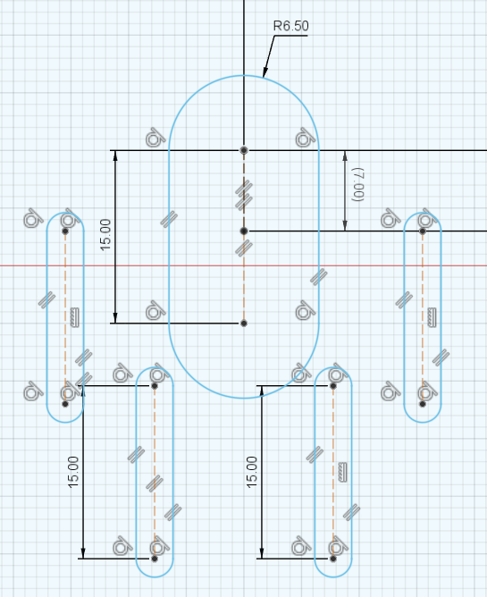

- 처음 설계한 구조에서는 일부 모터 고정 홀이 장공과 간섭했습니다.
- 따라서 해당 홀을 제거하고 모터를 4개의 볼트로 고정하는 구조로 변경합니다.
- 설계 과정에서는 이런 수정이 매우 흔하게 발생합니다.

<!--
발표자 노트 · 원문

#### 간섭을 고려한 설계 변경

처음 설계한 구조에서는 일부 모터 고정 홀이 장공과 간섭했습니다.

따라서 해당 홀을 제거하고 모터를 4개의 볼트로 고정하는 구조로 변경합니다.

설계 과정에서는 이런 수정이 매우 흔하게 발생합니다.

처음 설계한 형상이 한 번에 완성되는 것이 아니라 다음 과정을 반복합니다.

설계

↓

조립 검토

↓

간섭 발견

↓

수정

↓

다시 검토

좋은 설계는 처음부터 완벽한 설계라기보다 이러한 수정 과정을 통해 완성도가 높아진 결과에 가깝습니다.
-->

---

# 베어링 삽입부

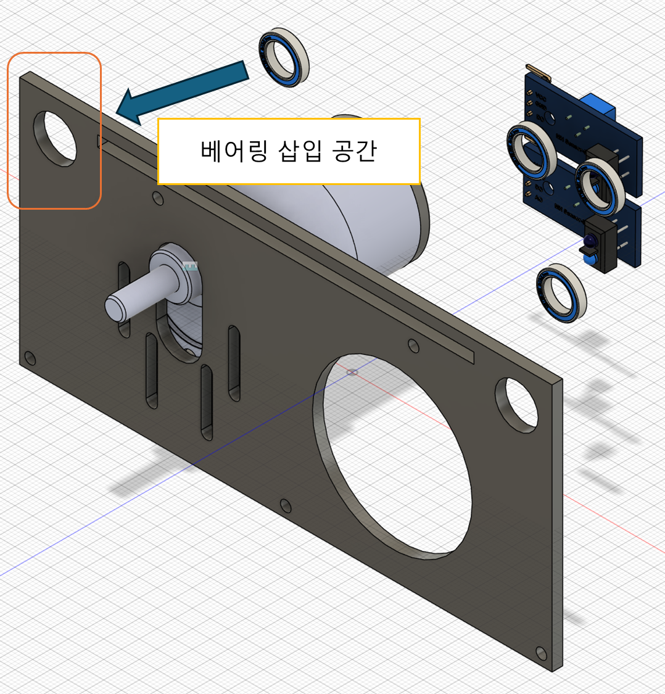

- MR128ZZ 베어링의 외경을 기준으로 베어링이 들어갈 구멍을 설계합니다.
- 이번 프로젝트에서는 실제 베어링 외경보다 약간 큰 홀을 사용하여 삽입할 수 있도록 합니다.
- 하지만 단순히 구멍만 만들면 베어링이 바깥쪽으로 빠질 수 있습니다.

<!--
발표자 노트 · 원문

#### 베어링 삽입부

MR128ZZ 베어링의 외경을 기준으로 베어링이 들어갈 구멍을 설계합니다.

이번 프로젝트에서는 실제 베어링 외경보다 약간 큰 홀을 사용하여 삽입할 수 있도록 합니다.

하지만 단순히 구멍만 만들면 베어링이 바깥쪽으로 빠질 수 있습니다.

금속 가공이나 레이저 커팅 구조라면 별도의 베어링 커버를 제작하고 볼트로 고정하는 방법을 사용할 수 있습니다.

그러나 이번에는 3D 프린팅을 사용합니다.

3D 프린팅은 적층 방식이므로 형상 자유도가 높습니다.

따라서 별도의 커버를 추가하지 않고 PLATE_MOTOR 자체에 베어링 이탈 방지 구조를 만들 수 있습니다.

이것이 제작 방법에 따라 설계가 달라지는 대표적인 예입니다.
-->

---

# 베어링 이탈 방지 구조

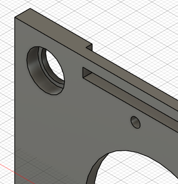

- PLATEMOTOR에 베어링을 삽입할 공간과 외륜을 잡아주는 구조를 추가합니다.
- 이때 중요한 것은 베어링의 회전 부분을 방해하지 않는 것입니다.
- 베어링의 외륜은 구조물에 고정되어도 되지만 내륜과 샤프트는 자유롭게 회전해야 합니다.

<!--
발표자 노트 · 원문

#### 베어링 이탈 방지 구조

PLATE_MOTOR에 베어링을 삽입할 공간과 외륜을 잡아주는 구조를 추가합니다.

이때 중요한 것은 베어링의 회전 부분을 방해하지 않는 것입니다.

베어링의 외륜은 구조물에 고정되어도 되지만 내륜과 샤프트는 자유롭게 회전해야 합니다.

따라서 커버는 베어링 전체를 막는 것이 아니라 외륜이 빠지지 않도록 필요한 부분만 잡는 형태로 설계합니다.
-->

---

# 필렛과 챔퍼

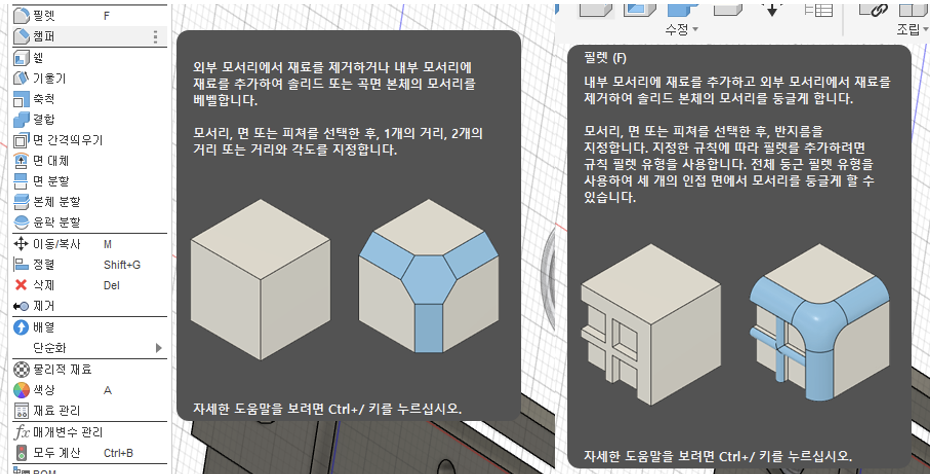

- 부품의 기본 형상이 완성되면 모서리를 정리합니다.
- Fusion에서는 대표적으로 다음 두 기능을 사용합니다.
- 필렛(Fillet)

<!--
발표자 노트 · 원문

#### 필렛과 챔퍼

부품의 기본 형상이 완성되면 모서리를 정리합니다.

Fusion에서는 대표적으로 다음 두 기능을 사용합니다.

**필렛(Fillet)**

모서리를 둥글게 만드는 기능입니다.

**챔퍼(Chamfer)**

모서리를 일정한 각도로 잘라내는 기능입니다.

금속 부품에서는 날카로운 모서리로 인한 부상을 방지하고 조립성을 개선하기 위해 많이 사용합니다.

3D 프린팅 부품에서도 외관과 조립성을 개선하는 데 활용할 수 있습니다.

이번 PLATE_MOTOR에서는 바깥쪽 모서리에 필렛을 적용합니다.
-->

---

# PLATESIDE

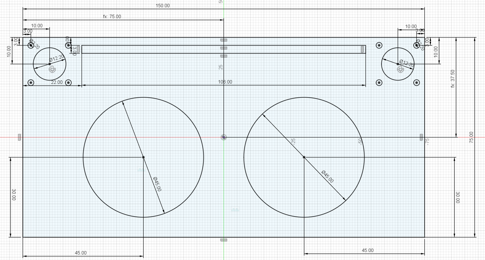

- 두 번째로 제작할 부품은 PLATESIDE입니다.
- 기본적인 구조는 PLATEMOTOR와 유사하지만 모터가 설치되지 않는 반대쪽 측판 역할을 합니다.
- 이번에는 베어링 커버를 별도의 부품으로 제작합니다.

<!--
발표자 노트 · 원문

#### PLATE_SIDE

두 번째로 제작할 부품은 `PLATE_SIDE`입니다.

기본적인 구조는 PLATE_MOTOR와 유사하지만 모터가 설치되지 않는 반대쪽 측판 역할을 합니다.

이번에는 베어링 커버를 별도의 부품으로 제작합니다.

처음부터 양쪽 플레이트에 베어링 커버를 일체형으로 설계할 수도 있지만 조립 편의성을 고려하여 별도 부품으로 분리합니다.

이처럼 설계에서는 단순히 부품 수를 줄이는 것만이 항상 좋은 것은 아닙니다.

조립성과 유지보수까지 함께 고려해야 합니다.
-->

---

# 목공피스 체결 홀

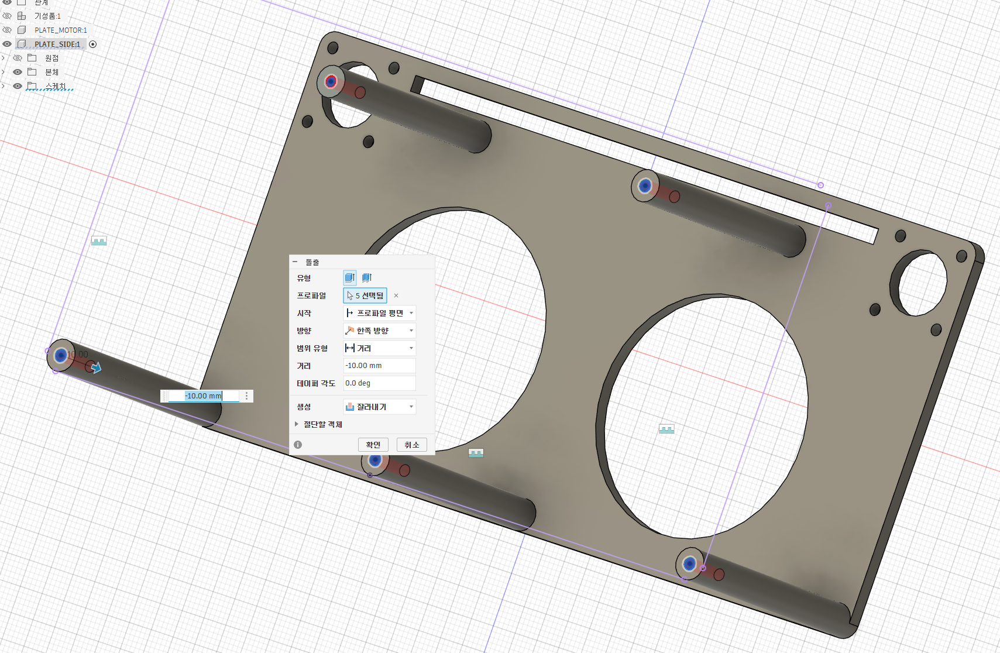

- PLATESIDE에는 M2 목공피스를 이용하여 다른 3D 프린팅 부품을 고정합니다.
- 이를 위해 목공피스가 들어갈 수 있는 홀을 설계합니다.
- 이 홀은 일반적인 볼트의 통과 홀과는 조금 다르게 접근할 수 있습니다.

<!--
발표자 노트 · 원문

#### 목공피스 체결 홀

PLATE_SIDE에는 M2 목공피스를 이용하여 다른 3D 프린팅 부품을 고정합니다.

이를 위해 목공피스가 들어갈 수 있는 홀을 설계합니다.

이 홀은 일반적인 볼트의 통과 홀과는 조금 다르게 접근할 수 있습니다.

목공피스는 PLA 내부에 나사산을 직접 만들면서 고정되기 때문에 지나치게 큰 구멍을 만들면 고정력이 떨어질 수 있습니다.

반대로 너무 작은 홀은 삽입이 어렵거나 PLA가 손상될 수 있습니다.

따라서 실제 사용하는 피스와 출력 조건을 기준으로 시험하여 적절한 크기를 결정하는 것이 좋습니다.
-->

---

# 타임라인을 이용한 설계 수정

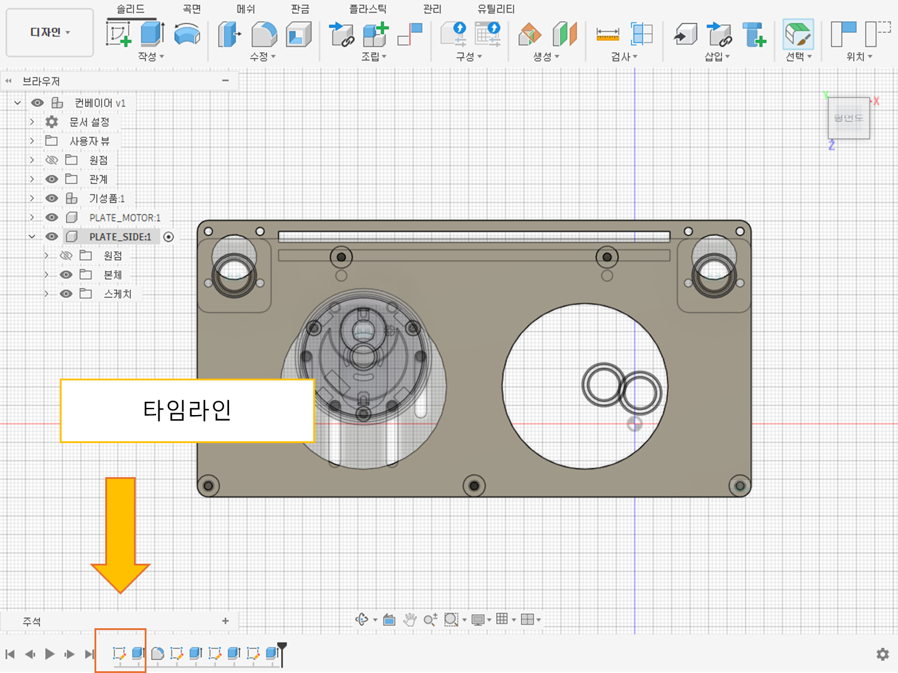

- PLATEMOTOR와 PLATESIDE를 조립해 보니 약 5 mm 정도 치수가 맞지 않는 문제가 발견되었습니다.
- 원인을 확인해 보니 PLATESIDE의 초기 스케치 치수가 잘못 입력되어 있었습니다.
- Fusion의 타임라인에서 처음 스케치로 돌아가 잘못된 치수를 수정하면 이후 작업들이 새로운 치수를 기준으로 자동…

<!--
발표자 노트 · 원문

#### 타임라인을 이용한 설계 수정

PLATE_MOTOR와 PLATE_SIDE를 조립해 보니 약 5 mm 정도 치수가 맞지 않는 문제가 발견되었습니다.

원인을 확인해 보니 PLATE_SIDE의 초기 스케치 치수가 잘못 입력되어 있었습니다.

Fusion의 타임라인에서 처음 스케치로 돌아가 잘못된 치수를 수정하면 이후 작업들이 새로운 치수를 기준으로 자동으로 다시 계산됩니다.

이것이 파라메트릭 모델링의 큰 장점 중 하나입니다.

설계 후반에 오류가 발견되더라도 처음부터 다시 모델링하지 않고 이전 작업을 수정하여 전체 결과를 업데이트할 수 있습니다.
-->

---

# COVERBEARING

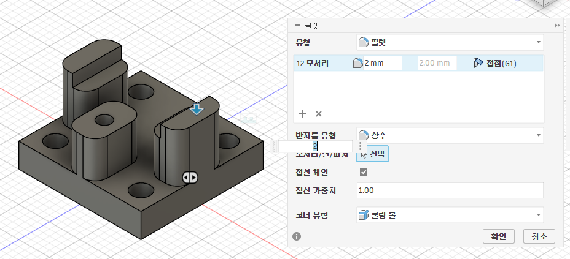

- 베어링 이탈 방지
- 베어링 외륜 고정
- 센서 장착

<!--
발표자 노트 · 원문

#### COVER_BEARING

이번에는 베어링이 빠지는 것을 방지하면서 동시에 센서를 고정할 수 있는 `COVER_BEARING`을 설계합니다.

이 부품은 3D 프린팅의 장점을 적극적으로 활용합니다.

철이나 알루미늄으로 절삭 가공한다면 제작이 복잡해질 수 있고, 2D 판재를 절단하는 레이저 커팅 방식으로는 동일한 구조를 한 부품으로 만들기 어렵습니다.

그러나 적층 방식인 3D 프린팅에서는 여러 높이와 돌출 구조를 하나의 부품으로 만들 수 있습니다.

따라서 다음 기능을 하나의 부품에 통합합니다.

- 베어링 이탈 방지
- 베어링 외륜 고정
- 센서 장착
- 센서 좌우 움직임 제한
-->

---

# 볼트 삽입

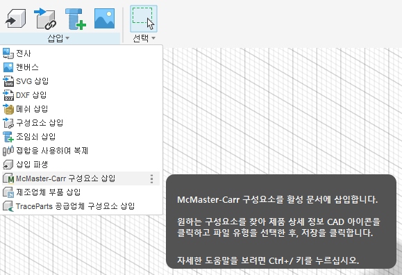

- M2
- M3
- 기타 체결 부품

<!--
발표자 노트 · 원문

#### 볼트 삽입

모델링에서도 볼트가 실제로 어떤 위치에 설치되는지 확인하는 것이 좋습니다.

Fusion에서는 McMaster-Carr 구성요소 삽입 기능을 이용해 다양한 볼트와 기계 요소를 가져올 수 있습니다.

볼트 수가 많아질 수 있으므로 브라우저에서 별도의 구성요소를 만들어 정리하면 편리합니다.

예를 들어 다음과 같이 관리할 수 있습니다.

조임쇠

- M2
- M3
- 기타 체결 부품

가져온 볼트는 복사한 뒤 각각의 위치에 접합합니다.
-->

---

# SHAFTIDLE

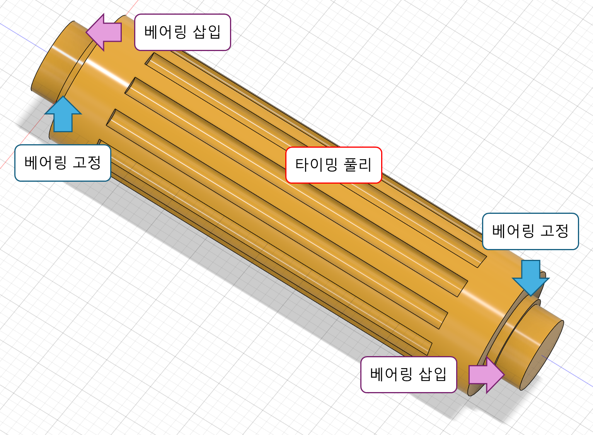

- 베어링 삽입부
- 베어링 위치를 제한하는 턱
- 컨베이어 벨트를 구동하는 중앙부

<!--
발표자 노트 · 원문

#### SHAFT_IDLE

다음으로 풀리가 연결되지 않는 반대쪽 샤프트인 `SHAFT_IDLE`을 설계합니다.

이 샤프트는 양쪽 베어링에 삽입되어 회전합니다.

따라서 베어링 내경보다 약간 작은 직경으로 설계하여 삽입할 수 있도록 합니다.

샤프트에는 다음과 같은 구조가 필요합니다.

- 베어링 삽입부
- 베어링 위치를 제한하는 턱
- 컨베이어 벨트를 구동하는 중앙부

이번 샤프트의 중앙부에는 컨베이어 벨트가 미끄러지지 않도록 톱니와 비슷한 형상을 추가합니다.
-->

---

# 샤프트와 베어링 간극

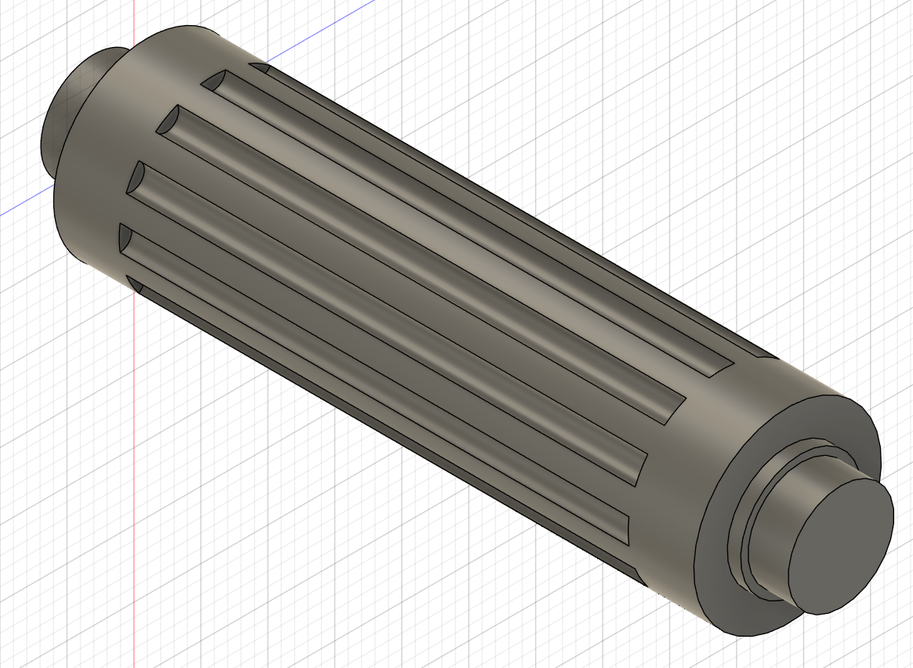

- 베어링 내경과 샤프트 외경이 완전히 동일하면 3D 프린팅 오차 때문에 조립되지 않을 수 있습니다.
- 반대로 간극이 너무 크면 샤프트가 베어링 내부에서 흔들릴 수 있습니다.
- 따라서 실제 출력 특성을 고려하여 적절한 치수를 결정해야 합니다.

<!--
발표자 노트 · 원문

#### 샤프트와 베어링 간극

베어링 내경과 샤프트 외경이 완전히 동일하면 3D 프린팅 오차 때문에 조립되지 않을 수 있습니다.

반대로 간극이 너무 크면 샤프트가 베어링 내부에서 흔들릴 수 있습니다.

따라서 실제 출력 특성을 고려하여 적절한 치수를 결정해야 합니다.

이 역시 앞에서 학습한 공차 개념이 실제 설계에 적용되는 부분입니다.
-->

---

# SHAFTMOTOR

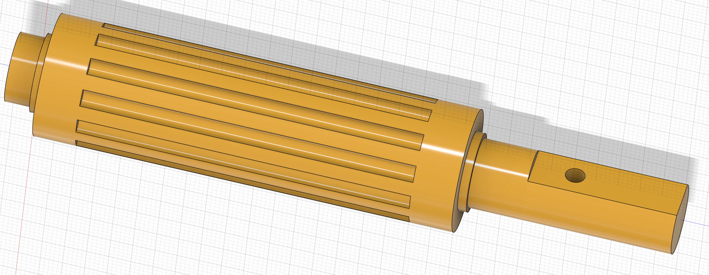

- SHAFTMOTOR는 SHAFTIDLE과 기본 구조는 비슷하지만 타이밍 풀리와 연결되는 부분이 추가됩니다.
- 이미 만든 부품을 처음부터 다시 설계할 필요는 없습니다.
- SHAFTIDLE을 복사하여 새로운 부품으로 만든 뒤 필요한 부분만 수정합니다.

<!--
발표자 노트 · 원문

#### SHAFT_MOTOR

`SHAFT_MOTOR`는 SHAFT_IDLE과 기본 구조는 비슷하지만 타이밍 풀리와 연결되는 부분이 추가됩니다.

이미 만든 부품을 처음부터 다시 설계할 필요는 없습니다.

SHAFT_IDLE을 복사하여 새로운 부품으로 만든 뒤 필요한 부분만 수정합니다.

비슷한 구조의 부품을 재사용하면 설계 시간을 크게 줄일 수 있습니다.
-->

---

# D-Cut

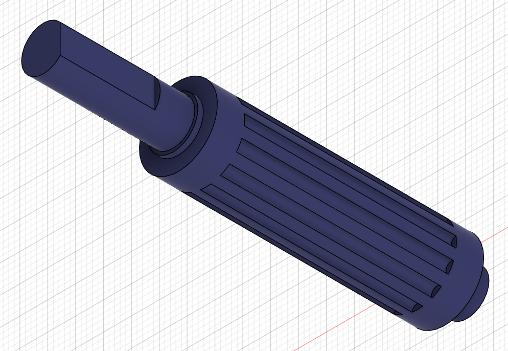

- SHAFTMOTOR의 끝부분에는 D-Cut 형상을 적용합니다.
- D-Cut은 원형 축의 한쪽 면을 평평하게 만든 형상입니다.
- 모터 축이나 풀리 장착부에서 자주 볼 수 있습니다.

<!--
발표자 노트 · 원문

#### D-Cut

SHAFT_MOTOR의 끝부분에는 D-Cut 형상을 적용합니다.

D-Cut은 원형 축의 한쪽 면을 평평하게 만든 형상입니다.

모터 축이나 풀리 장착부에서 자주 볼 수 있습니다.

원형 축에 풀리를 단순히 끼우면 큰 토크가 전달될 때 축과 풀리가 서로 미끄러질 수 있습니다.

D-Cut을 적용하면 평평한 면을 이용해 회전력을 보다 확실하게 전달할 수 있습니다.

필요한 경우 측면에서 볼트나 세트스크루를 이용하여 추가로 고정할 수 있습니다.
-->

---

# PULLYMOTOR

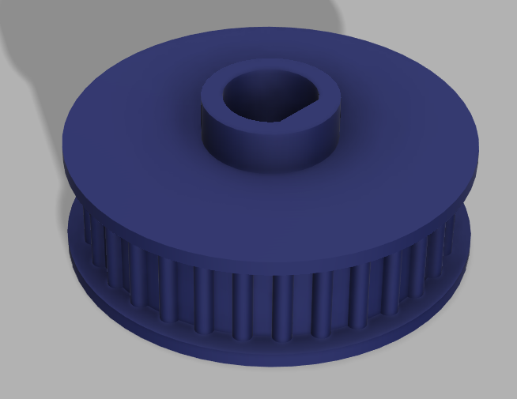

- 벨트 이탈 방지용 플랜지
- 타이밍 벨트와 맞물리는 톱니
- 모터 축 삽입부

<!--
발표자 노트 · 원문

#### PULLY_MOTOR

다음으로 모터의 회전력을 타이밍 벨트에 전달하는 모터 풀리를 설계합니다.

이름은 `PULLY_MOTOR`로 지정합니다.

풀리의 기본 구조는 다음과 같습니다.

- 벨트 이탈 방지용 플랜지
- 타이밍 벨트와 맞물리는 톱니
- 모터 축 삽입부
- D-Cut 구조

이번 모터 풀리는 30개의 톱니를 갖도록 구성합니다.

타이밍 벨트 폭보다 약간 넓게 만들어 벨트와의 간섭을 줄입니다.
-->

---

# PULLYSHAFT

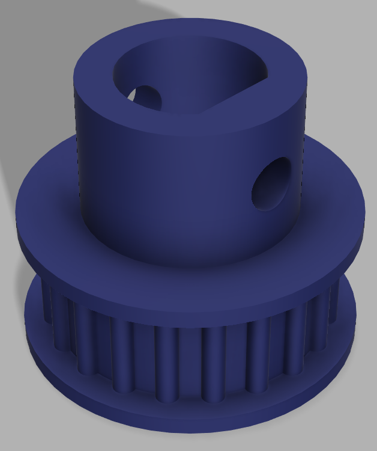

- 모터 풀리 : 30 Tooth
- 샤프트 풀리 : 20 Tooth

<!--
발표자 노트 · 원문

#### PULLY_SHAFT

샤프트 쪽에도 타이밍 풀리를 설치합니다.

이 부품을 `PULLY_SHAFT`로 지정합니다.

샤프트 풀리는 타이밍 벨트에서 전달받은 회전을 샤프트로 전달합니다.

이번 구조에서는 샤프트 풀리에 20개의 톱니를 적용합니다.

따라서 모터 풀리와 샤프트 풀리는 다음과 같이 구성됩니다.

- 모터 풀리 : 30 Tooth
- 샤프트 풀리 : 20 Tooth
-->

---

# 풀리비와 회전 속도

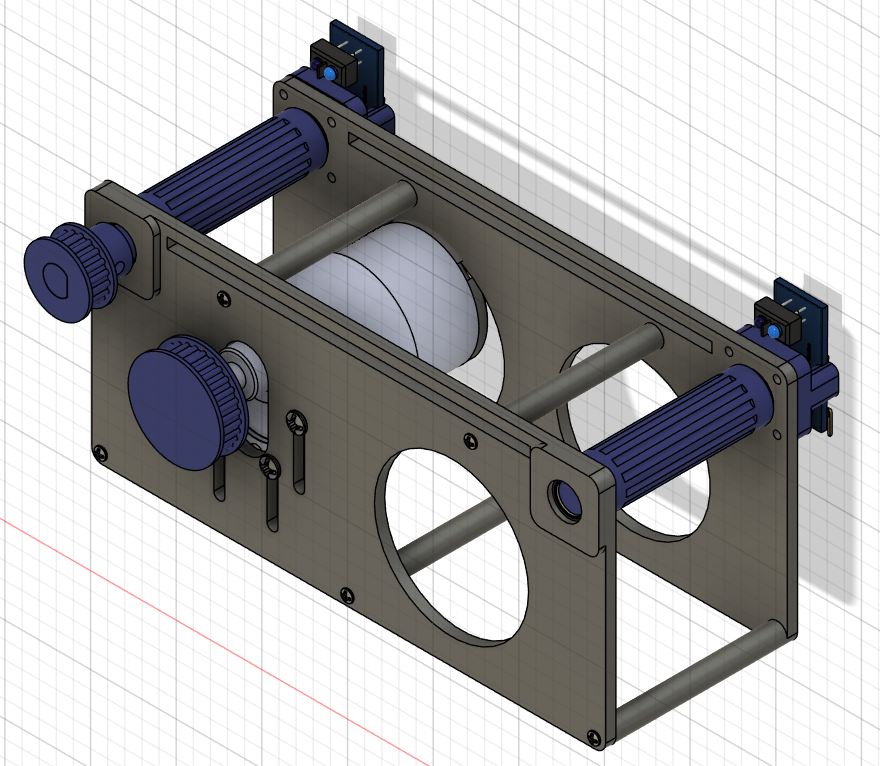

- 모터 풀리가 한 바퀴 회전하면 타이밍 벨트는 30개의 톱니만큼 이동합니다.
- 샤프트 풀리의 톱니 수는 20개이므로 같은 벨트 이동량에 대해 샤프트 풀리는 더 많이 회전하게 됩니다.
- 회전비는 다음과 같이 생각할 수 있습니다.

<!--
발표자 노트 · 원문

#### 풀리비와 회전 속도

모터 풀리가 한 바퀴 회전하면 타이밍 벨트는 30개의 톱니만큼 이동합니다.

샤프트 풀리의 톱니 수는 20개이므로 같은 벨트 이동량에 대해 샤프트 풀리는 더 많이 회전하게 됩니다.

회전비는 다음과 같이 생각할 수 있습니다.

30 ÷ 20 = 1.5

따라서 모터가 1회전하면 샤프트는 약 1.5회전합니다.

즉, 이번 구조는 모터보다 샤프트의 회전 속도를 높이는 증속 구조입니다.

대신 일반적으로 회전 속도를 높이면 전달 가능한 토크는 감소하는 방향으로 작용합니다.
-->

---

# 컨베이어 속도 계산

- 모터 실제 회전수
- 부하
- 전압
- 벨트의 변형

<!--
발표자 노트 · 원문

#### 컨베이어 속도 계산

컨베이어 벨트의 이동 속도를 간단하게 계산해 볼 수 있습니다.

샤프트 직경이 약 14 mm라면 한 바퀴 회전할 때 벨트가 이동하는 거리는 원주와 같습니다.

원주 = π × 직경

약 3.14 × 14 mm로 계산할 수 있습니다.

샤프트가 모터보다 1.5배 빠르게 회전하므로 모터 1회전에 대한 벨트 이동 거리를 계산할 수 있습니다.

모터가 45RPM이라면 이를 다시 분당 이동 거리와 초당 이동 거리로 환산할 수 있습니다.

이번 설계에서는 대략 초당 50 mm 수준의 이동 속도를 예상하고 있습니다.

실제 속도는 다음과 같은 요인에 따라 달라질 수 있습니다.

- 모터 실제 회전수
- 부하
- 전압
- 벨트의 변형
- 풀리의 실제 유효 직경
- 마찰

따라서 계산값은 설계 단계에서 예상 속도를 확인하기 위한 값으로 사용합니다.
-->

---

# PLATESUPPORT

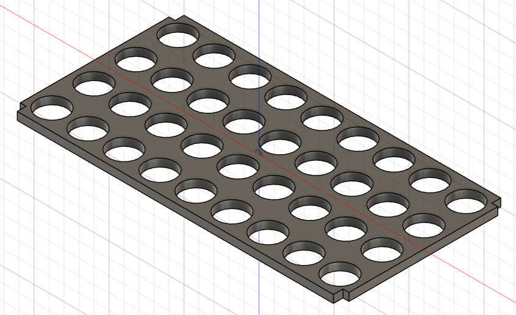

- 컨베이어 벨트 아래에는 벨트를 지지할 구조가 필요합니다.
- 아무런 지지 구조가 없다면 컨베이어 위에 물체가 올라왔을 때 벨트가 아래로 처질 수 있습니다.
- 이를 막기 위해 PLATESUPPORT를 설계합니다.

<!--
발표자 노트 · 원문

#### PLATE_SUPPORT

컨베이어 벨트 아래에는 벨트를 지지할 구조가 필요합니다.

아무런 지지 구조가 없다면 컨베이어 위에 물체가 올라왔을 때 벨트가 아래로 처질 수 있습니다.

이를 막기 위해 `PLATE_SUPPORT`를 설계합니다.

PLATE_SUPPORT는 컨베이어 벨트 아래에 위치하여 벨트와 물체의 하중을 지지합니다.

다만 벨트와 지지판이 넓은 면적으로 계속 접촉하면 마찰이 증가할 수 있습니다.

따라서 여러 개의 구멍을 만들어 접촉 면적을 줄이는 구조를 적용합니다.
-->

---

# 직사각형 패턴

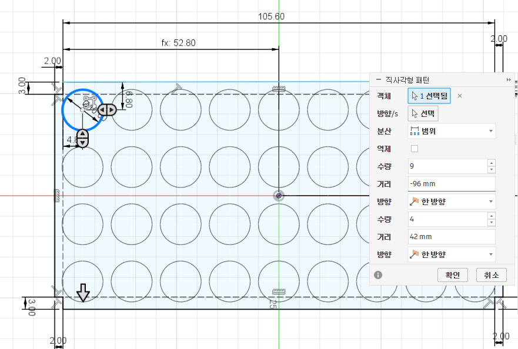

- PLATESUPPORT에는 같은 크기의 홀이 규칙적으로 반복됩니다.
- 이러한 경우 하나씩 직접 그리지 않고 직사각형 패턴(Rectangular Pattern)을 사용합니다.
- 하나의 홀을 만든 뒤 가로와 세로 방향으로 필요한 수량만큼 반복 배치하면 됩니다.

<!--
발표자 노트 · 원문

#### 직사각형 패턴

PLATE_SUPPORT에는 같은 크기의 홀이 규칙적으로 반복됩니다.

이러한 경우 하나씩 직접 그리지 않고 직사각형 패턴(Rectangular Pattern)을 사용합니다.

하나의 홀을 만든 뒤 가로와 세로 방향으로 필요한 수량만큼 반복 배치하면 됩니다.

원형 패턴과 직사각형 패턴은 기계 설계에서 매우 자주 사용하는 기능입니다.
-->

---

# 조립 간극

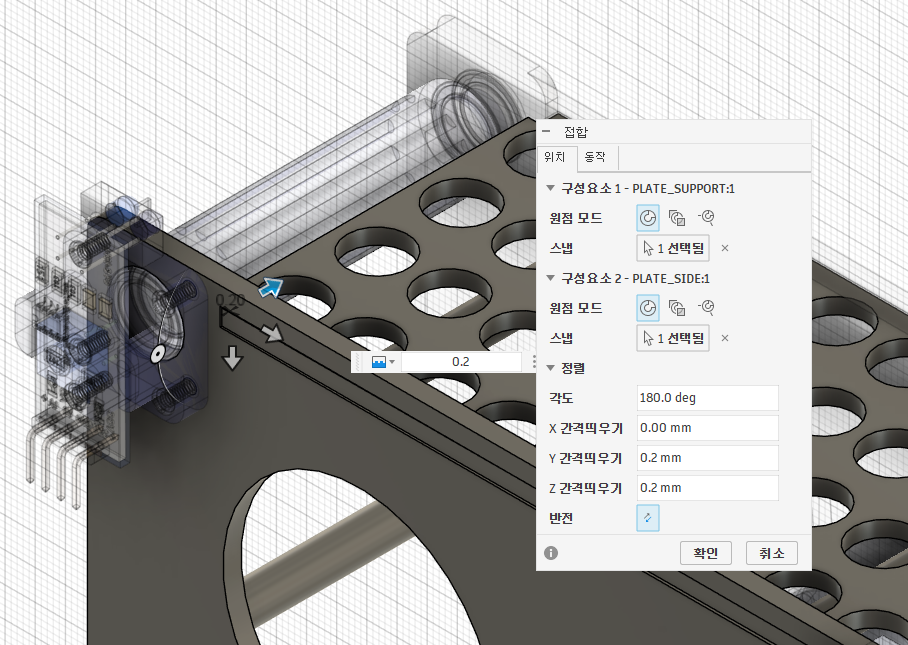

- PLATESUPPORT는 두 측면 플레이트 사이에 삽입됩니다.
- 두 부품 사이의 폭을 정확하게 동일하게 설계하면 출력 오차 때문에 조립이 어려울 수 있습니다.
- 따라서 양쪽에 일정한 간극을 두어 실제 조립이 가능하도록 설계합니다.

<!--
발표자 노트 · 원문

#### 조립 간극

PLATE_SUPPORT는 두 측면 플레이트 사이에 삽입됩니다.

두 부품 사이의 폭을 정확하게 동일하게 설계하면 출력 오차 때문에 조립이 어려울 수 있습니다.

따라서 양쪽에 일정한 간극을 두어 실제 조립이 가능하도록 설계합니다.

이처럼 설계에서 공차는 단순히 도면에 숫자를 적는 개념이 아니라 실제로 부품이 조립될 수 있도록 만드는 매우 중요한 요소입니다.
-->

---

# 컨베이어 BELT

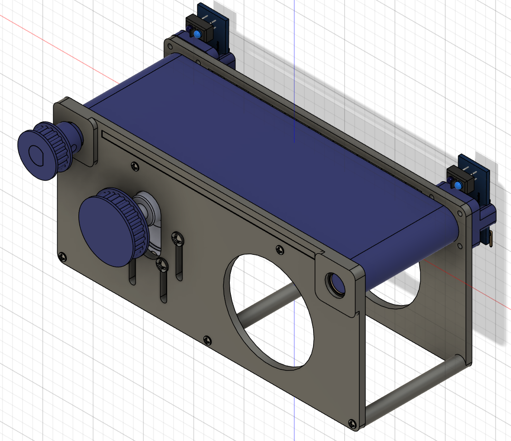

- 3D 모델링에서 표현하기 위한 벨트
- 실제 3D 프린팅을 위한 벨트

<!--
발표자 노트 · 원문

#### 컨베이어 BELT

이제 실제 물체가 올라가는 컨베이어 벨트를 설계합니다.

이번에는 벨트를 두 가지 형태로 구분합니다.

- 3D 모델링에서 표현하기 위한 벨트
- 실제 3D 프린팅을 위한 벨트

두 벨트의 목적이 다르기 때문입니다.
-->

---

# 모델링용 벨트

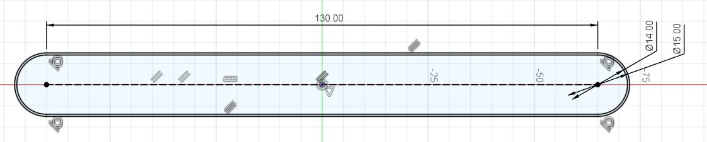

- 3D 모델 안에서 컨베이어의 모습을 자연스럽게 표현하려면 실제 장착된 것과 같은 슬롯 형태의 벨트를 만드는 것이…
- Fusion의 중심 대 중심 슬롯 기능을 사용하면 두 샤프트를 감싸는 벨트 형상을 비교적 쉽게 만들 수 있습니다.
- 이 벨트는 조립된 컨베이어의 모습을 확인하기 위한 모델링용 데이터입니다.

<!--
발표자 노트 · 원문

#### 모델링용 벨트

3D 모델 안에서 컨베이어의 모습을 자연스럽게 표현하려면 실제 장착된 것과 같은 슬롯 형태의 벨트를 만드는 것이 편리합니다.

Fusion의 중심 대 중심 슬롯 기능을 사용하면 두 샤프트를 감싸는 벨트 형상을 비교적 쉽게 만들 수 있습니다.

이 벨트는 조립된 컨베이어의 모습을 확인하기 위한 모델링용 데이터입니다.
-->

---

# 출력용 벨트

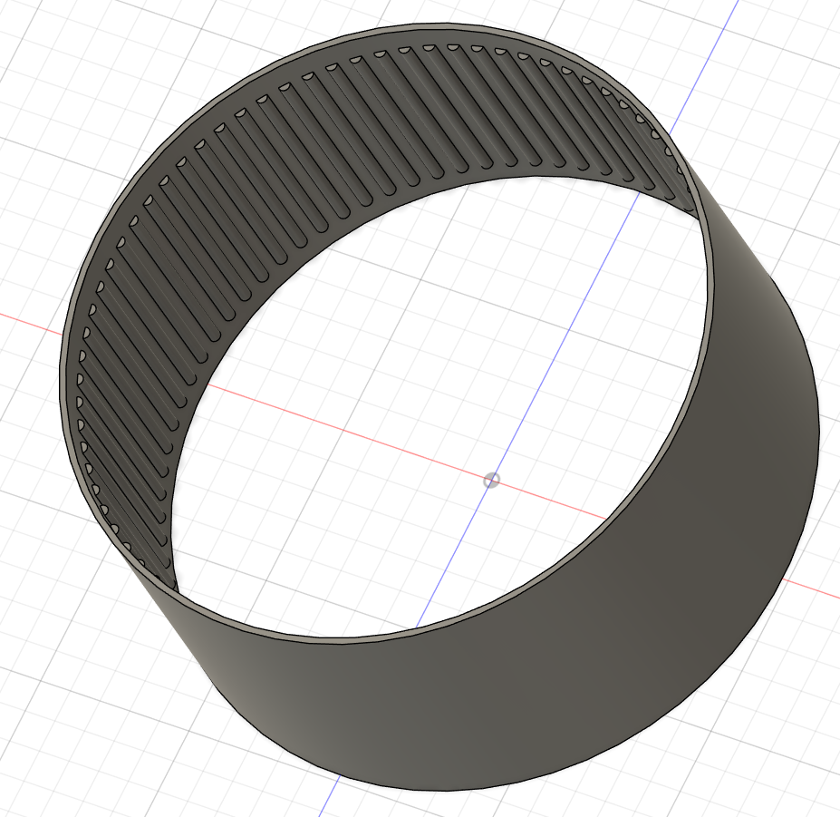

- 모델링 화면에서 보기 좋은 벨트와 실제 3D 프린팅하기 좋은 형상은 서로 다를 수 있습니다.
- 따라서 실제 출력용 벨트는 별도로 설계합니다.
- 이번에는 TPU를 이용하여 유연한 벨트를 출력합니다.

<!--
발표자 노트 · 원문

#### 출력용 벨트

모델링 화면에서 보기 좋은 벨트와 실제 3D 프린팅하기 좋은 형상은 서로 다를 수 있습니다.

따라서 실제 출력용 벨트는 별도로 설계합니다.

이번에는 TPU를 이용하여 유연한 벨트를 출력합니다.

TPU는 고무와 비슷한 탄성을 가지고 있기 때문에 원형으로 출력한 뒤 늘려서 샤프트에 장착할 수 있습니다.

벨트 길이는 샤프트의 직경과 중심 간 거리를 이용하여 대략 계산합니다.

그 후 TPU의 탄성을 고려하여 실제 필요한 길이보다 조금 작게 제작할 수 있습니다.

정확한 치수는 사용하는 TPU의 경도와 프린터의 출력 특성에 따라 조정해야 합니다.
-->

---

# 타이밍 벨트 길이 확인

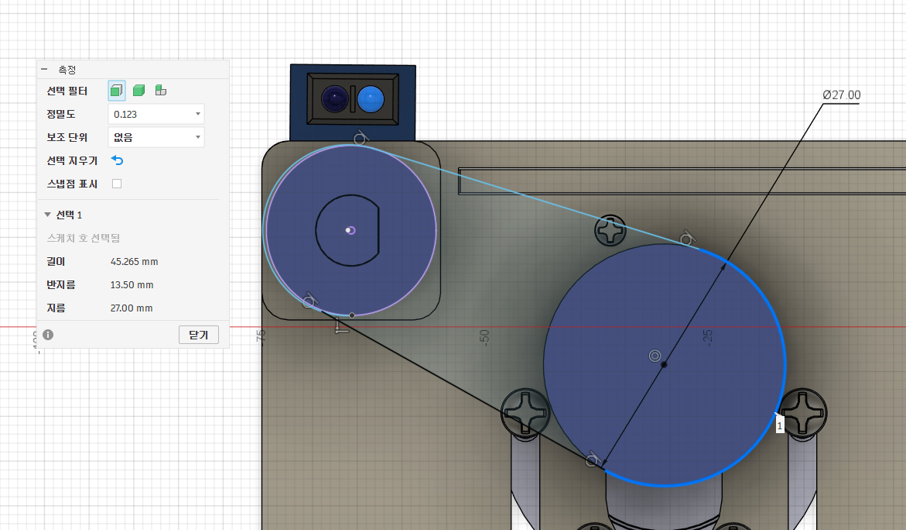

- 모터와 샤프트 사이를 연결하는 타이밍 벨트는 직접 출력하지 않고 기성품을 구매합니다.
- 따라서 모델링 단계에서는 필요한 벨트의 대략적인 길이를 확인하면 됩니다.
- 풀리 주변의 경로를 측정한 뒤 시중에서 구매할 수 있는 규격 중 적절한 길이를 선택합니다.

<!--
발표자 노트 · 원문

#### 타이밍 벨트 길이 확인

모터와 샤프트 사이를 연결하는 타이밍 벨트는 직접 출력하지 않고 기성품을 구매합니다.

따라서 모델링 단계에서는 필요한 벨트의 대략적인 길이를 확인하면 됩니다.

풀리 주변의 경로를 측정한 뒤 시중에서 구매할 수 있는 규격 중 적절한 길이를 선택합니다.

앞에서 모터 고정부에 장공을 만들어 둔 이유가 여기서 다시 중요해집니다.

벨트 길이가 조금 달라도 모터 위치를 이동시켜 장력을 조절할 수 있기 때문입니다.
-->

---

# 제작 방법이 설계를 결정한다

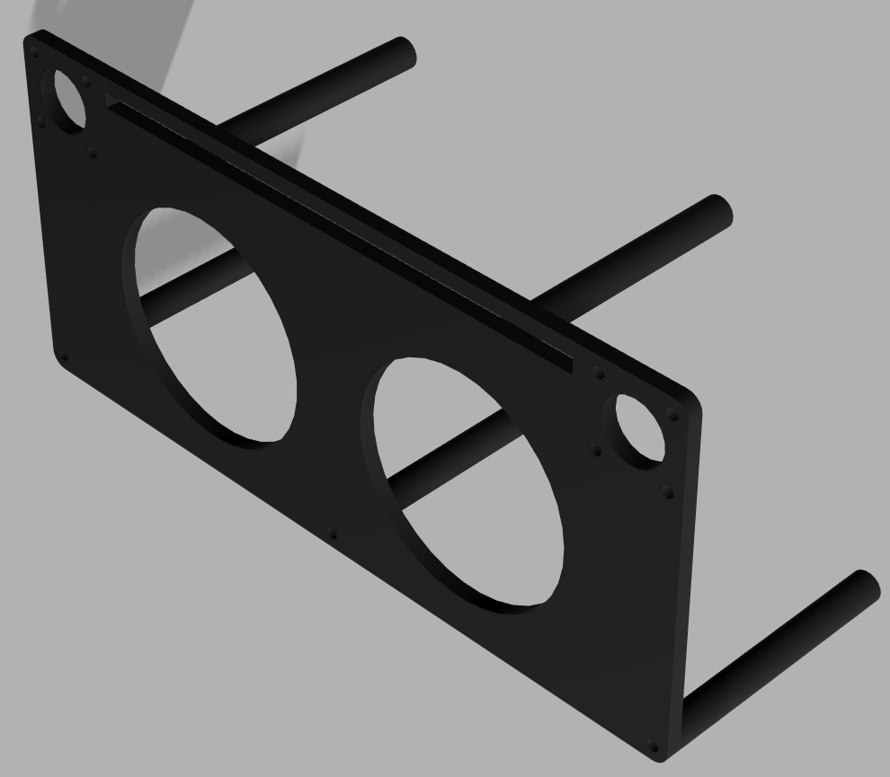

- 베어링 커버 일체형 구조
- 복잡한 센서 브라켓
- 여러 높이를 가진 돌출 구조

<!--
발표자 노트 · 원문

#### 제작 방법이 설계를 결정한다

이번 컨베이어는 PLA와 TPU를 이용하여 3D 프린팅합니다.

그렇기 때문에 다음과 같은 구조를 자유롭게 사용할 수 있었습니다.

- 베어링 커버 일체형 구조
- 복잡한 센서 브라켓
- 여러 높이를 가진 돌출 구조
- 일체형 샤프트와 벨트 형상
- 복잡한 내부 공간

만약 같은 컨베이어를 철이나 알루미늄으로 제작한다면 동일한 형상을 그대로 사용할 수 없습니다.

절삭 가공, 판금 절곡, 용접 등의 제조 공정을 고려하여 부품을 다시 분리하고 설계해야 합니다.

아크릴 판재를 레이저 커팅하여 제작한다면 대부분의 부품을 2D 판재 형상으로 바꾸고 볼트와 너트 등을 이용해 조립하는 방식으로 설계해야 합니다.

따라서 다시 한번 다음 관계를 기억해야 합니다.

재료

↓

제작 방식

↓

설계 방식

이 세 가지는 서로 분리해서 생각할 수 없습니다.
-->

---

# 이번 프로젝트에서 사용한 Fusion 기능

- 새 구성요소
- 외부 STEP 파일 삽입
- 강체 그룹
- 측정

<!--
발표자 노트 · 원문

#### 이번 프로젝트에서 사용한 Fusion 기능

이번 컨베이어 프로젝트에서는 지금까지 배운 기본 기능에 몇 가지 새로운 기능을 추가했습니다.

- 새 구성요소
- 외부 STEP 파일 삽입
- 강체 그룹
- 측정
- 스케치
- 돌출
- 접합
- 잘라내기
- 원형 패턴
- 직사각형 패턴
- 슬롯
- 이동/복사
- 필렛
- 챔퍼
- 부품 복사 및 수정
- McMaster-Carr 구성요소 삽입
- 타임라인 수정
- 색상
- 렌더링

기능의 종류는 많아 보이지만 실제 작업의 핵심은 여전히 동일합니다.

스케치

↓

돌출

↓

수정

↓

조립

여기에 반복되는 형상을 빠르게 만드는 패턴과 실제 제작을 고려한 공차 개념이 추가된 것입니다.
-->

---

# 이번 프로젝트에서 배운 설계 요소

- 기성품 선정
- CAD 데이터 활용
- 실물 치수 확인
- 제작 방식에 따른 구조 설계

<!--
발표자 노트 · 원문

#### 이번 프로젝트에서 배운 설계 요소

이번 컨베이어를 설계하면서 단순한 Fusion 사용법 이외에도 실제 기계 설계에 필요한 여러 요소를 확인했습니다.

- 기성품 선정
- CAD 데이터 활용
- 실물 치수 확인
- 제작 방식에 따른 구조 설계
- 조립 공차
- 베어링 적용
- 샤프트 설계
- 벨트와 풀리를 이용한 동력 전달
- 장력 조절
- 볼트 체결
- 센서 장착
- 간섭 검토
- 부품 재사용
- 설계 수정
- 속도 계산

이러한 요소들이 하나의 제품 안에서 서로 연결되어 있다는 점이 중요합니다.
-->

---

# 완성된 컨베이어

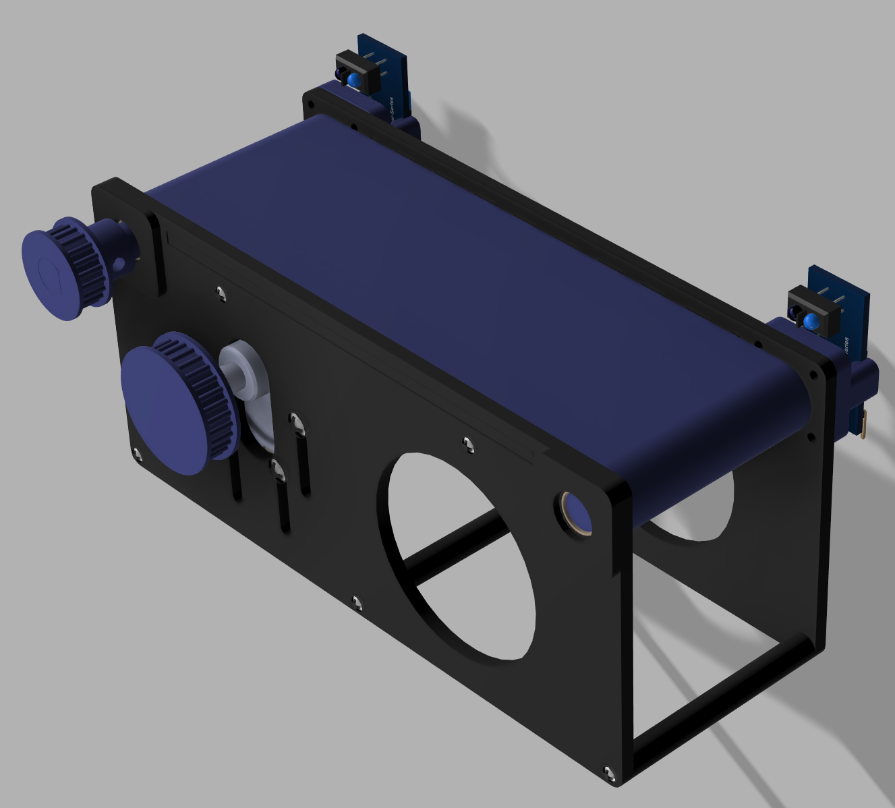

- 어떤 모터를 사용할 것인지
- 어떤 센서를 사용할 것인지
- 어떤 베어링을 사용할 것인지

<!--
발표자 노트 · 원문

#### 완성된 컨베이어

이번 프로젝트를 통해 실제로 3D 프린팅하여 제작할 수 있는 형태의 컨베이어 모델을 완성했습니다.

완성된 모델은 Fusion의 디자인 환경에서 확인할 수 있으며, 렌더링 환경으로 변경하면 재질과 조명을 적용하여 실제 제품에 가까운 이미지로 표현할 수도 있습니다.

하지만 렌더링된 모습보다 더 중요한 것은 이 모델이 실제 제작을 고려하여 설계되었다는 점입니다.

단순히 보기 좋은 3D 형상을 만든 것이 아니라,

- 어떤 모터를 사용할 것인지
- 어떤 센서를 사용할 것인지
- 어떤 베어링을 사용할 것인지
- 어떤 볼트를 사용할 것인지
- 어떤 재료로 출력할 것인지
- 어느 정도의 간극을 줄 것인지
- 벨트 장력을 어떻게 조절할 것인지
- 회전력을 어떻게 전달할 것인지

를 하나씩 판단하면서 설계했습니다.
-->

---

# 이번 프로젝트의 핵심

- 이번 프로젝트에서 가장 중요하게 기억해야 할 내용은 Fusion의 명령어가 아닙니다.
- 실제로 만들 수 있는 제품을 설계하려면 재료와 제작 방법을 먼저 생각해야 합니다.
- 3D 프린팅으로 만들 것인지,

<!--
발표자 노트 · 원문

#### 이번 프로젝트의 핵심

이번 프로젝트에서 가장 중요하게 기억해야 할 내용은 Fusion의 명령어가 아닙니다.

> 실제로 만들 수 있는 제품을 설계하려면 재료와 제작 방법을 먼저 생각해야 합니다.
> 

3D 프린팅으로 만들 것인지,

레이저 커팅으로 만들 것인지,

금속을 절삭 가공할 것인지에 따라 같은 제품이라도 설계 방법이 달라집니다.

또한 모든 것을 직접 만들 필요도 없습니다.

모터, 센서, 베어링, 볼트와 같은 기성품은 구매하여 사용하고, 설계자는 이 부품들을 목적에 맞게 연결할 수 있는 구조를 만듭니다.

전체 흐름은 다음과 같이 정리할 수 있습니다.

목적 설정

↓

재료 선택

↓

제작 방법 결정

↓

기성품 선정

↓

기성품 실측 및 CAD 데이터 확보

↓

직접 제작할 부품 설계

↓

공차 적용

↓

조립 및 간섭 검토

↓

동작 검토

↓

제작

↓

조립

↓

수정

이 과정을 반복하면서 하나의 실제 제품이 완성됩니다.

설계는 단순히 원하는 형상을 그리는 작업이 아닙니다.

어떻게 만들 것인지, 어떻게 조립할 것인지, 실제로 동작할 수 있는지를 모두 고려하여 현실적인 답을 찾아가는 과정입니다.
-->
