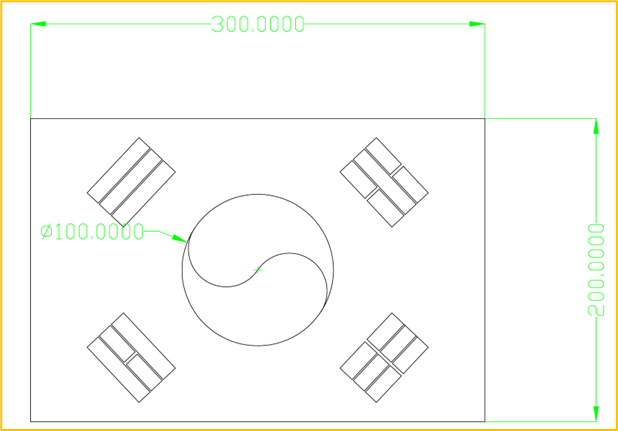

<!-- _class: title -->

# 03-01. 전체 학습 주제 개요 및 학습 목표 이해

## 핵심 개념과 실무 적용

---

# 전체 학습 주제 개요 및 학습 목표 이해

- 지금까지 우리는 3D 모델링을 통해 기본적인 기계 설계 방법을 학습했습니다.
- 3D 모델링을 할 수 있게 되면 단순히 화면에서 제품의 형상을 만드는 것을 넘어, 설계한 부품을 실제 제품으로 제…
- 앞에서 만든 3D 모델 역시 3D 프린터, CNC, 머시닝센터와 같은 다양한 제작 장비를 이용하여 실제 부품으로…

<!--
발표자 노트 · 원문

# 전체 학습 주제 개요 및 학습 목표 이해

지금까지 우리는 3D 모델링을 통해 기본적인 기계 설계 방법을 학습했습니다.

3D 모델링을 할 수 있게 되면 단순히 화면에서 제품의 형상을 만드는 것을 넘어, 설계한 부품을 실제 제품으로 제작하는 단계까지 연결할 수 있습니다.

앞에서 만든 3D 모델 역시 3D 프린터, CNC, 머시닝센터와 같은 다양한 제작 장비를 이용하여 실제 부품으로 만들 수 있습니다.

하지만 CAD에서 만든 3D 모델을 제작 장비가 그대로 이해하는 것은 아닙니다.

설계 데이터를 실제 장비가 사용할 수 있는 제조 데이터로 변환하는 과정이 필요합니다.

이 과정에서 자주 등장하는 것이 G-Code입니다.

> G-Code는 CNC나 3D 프린터와 같은 장비에 이동 위치, 속도, 가공 동작 등을 지시하기 위해 사용하는 명령 체계입니다.
> 

즉,

설계 데이터

↓

제조 데이터 생성

↓

G-Code

↓

제작 장비 동작

과 같은 흐름으로 생각할 수 있습니다.
-->

---

# 설계에서 제작으로

- 3D 프린팅
- CNC 절삭 가공
- 레이저 커팅

<!--
발표자 노트 · 원문

#### 설계에서 제작으로

설계한 제품을 실제로 제작하는 방법은 다양합니다.

같은 3D 모델이라도 어떤 재료를 사용하고 어떤 장비로 제작할 것인지에 따라 제조 과정은 달라집니다.

이번 과정에서는 대표적으로 다음 세 가지 제작 방법을 중심으로 생각합니다.

- 3D 프린팅
- CNC 절삭 가공
- 레이저 커팅

각각의 제작 방식에서는 CAD 데이터를 실제 장비에서 사용할 수 있는 데이터로 변환하는 과정이 필요합니다.
-->

---

# 3D 프린팅

- Layer Height
- Printing Speed
- Infill
- Support

<!--
발표자 노트 · 원문

#### 3D 프린팅

3D 프린팅은 재료를 한 층씩 쌓아 올려 제품을 만드는 적층 가공(Additive Manufacturing) 방식입니다.

일반적인 FDM 3D 프린터의 제작 흐름은 다음과 같습니다.

3D CAD 모델

↓

STL 또는 3MF 등의 Mesh 데이터

↓

Slicer

↓

G-Code

↓

3D Printer

**Mesh**

3D 형상의 표면을 많은 삼각형 등의 작은 면으로 표현한 데이터입니다.

STL은 대표적인 Mesh 파일 형식입니다.

**Slicer**

3D 모델을 실제 프린터가 출력할 수 있도록 여러 층으로 나누고 프린터의 이동 경로를 계산하는 프로그램입니다.

Slicer에서는 다음과 같은 다양한 조건을 설정할 수 있습니다.

- Layer Height
- Printing Speed
- Infill
- Support
- Temperature

이 정보를 바탕으로 최종적으로 G-Code가 생성됩니다.

3D 프린터는 생성된 G-Code를 읽으며 노즐과 각 축을 움직이고 재료를 적층합니다.

3D 프린팅은 비교적 장비 가격이 낮고 교육 환경을 구축하기 쉬우므로 다음 챕터에서 실제 출력 과정을 함께 실습합니다.
-->

---

# CNC 절삭 가공

- CNC 선반
- CNC 밀링
- 머시닝센터(MCT)
- 사용할 공구

<!--
발표자 노트 · 원문

#### CNC 절삭 가공

CNC 가공은 원재료를 깎아 원하는 형상을 만드는 절삭 가공(Subtractive Manufacturing) 방식입니다.

대표적인 장비로 다음과 같은 것들이 있습니다.

- CNC 선반
- CNC 밀링
- 머시닝센터(MCT)

일반적인 작업 흐름은 다음과 같이 생각할 수 있습니다.

CAD 모델

↓

CAM

↓

Tool Path 생성

↓

NC Code 또는 G-Code

↓

CNC 장비

**CAM**

CAM은 Computer Aided Manufacturing의 약자로 CAD에서 만든 제품 형상을 실제 가공하기 위한 공구 경로로 변환하는 과정입니다.

CAM에서는 다음과 같은 내용을 설정합니다.

- 사용할 공구
- 공구의 회전 속도
- 이동 속도
- 절삭 깊이
- 가공 순서
- 공구 이동 경로

3D 프린터가 재료를 쌓는 방식이라면 CNC 가공은 반대로 원재료를 깎아내는 방식입니다.
-->

---

# 3D 프린팅과 CNC의 차이

- 두 제작 방법의 가장 큰 차이는 재료를 다루는 방식입니다.
- 3D 프린터는 작은 교육용 장비도 비교적 쉽게 사용할 수 있습니다.
- 반면 CNC나 머시닝센터는 장비 가격이 높고 공구, 소재, 안전, 가공 조건 등 함께 고려해야 할 내용이 많습니다.

<!--
발표자 노트 · 원문

#### 3D 프린팅과 CNC의 차이

두 제작 방법의 가장 큰 차이는 재료를 다루는 방식입니다.

| 구분 | 3D 프린팅 | CNC |
| —- | —- | —- |
| 방식 | 적층 | 절삭 |
| 영어 | Additive | Subtractive |
| 재료 처리 | 재료를 추가 | 재료를 제거 |
| 대표 중간 과정 | Slicer | CAM |
| 장점 | 복잡한 형상, 시제품 | 높은 정밀도, 금속 부품 |
| 교육 접근성 | 높음 | 상대적으로 낮음 |

3D 프린터는 작은 교육용 장비도 비교적 쉽게 사용할 수 있습니다.

반면 CNC나 머시닝센터는 장비 가격이 높고 공구, 소재, 안전, 가공 조건 등 함께 고려해야 할 내용이 많습니다.

최근에는 메이커 스페이스나 공공 장비 지원 시설 등을 통해 CNC 장비를 사용할 수 있는 환경도 늘어나고 있지만, 초보자가 충분한 시간을 가지고 반복 실습하기에는 상대적으로 제약이 있습니다.

따라서 본 과정에서는 3D 프린팅을 직접 실습하고 CNC 가공은 설계와 제작의 기본 흐름을 이해하는 수준으로 다룹니다.
-->

---

# G-Code

- 어느 위치로 이동할 것인가
- 어느 속도로 이동할 것인가
- 어느 방향으로 이동할 것인가
- 공구를 어떻게 동작시킬 것인가

<!--
발표자 노트 · 원문

#### G-Code

3D 프린터와 CNC는 제작 방식은 서로 다르지만 최종적으로 장비의 움직임을 제어하는 명령으로 G-Code 계열을 사용하는 경우가 많습니다.

G-Code에는 다음과 같은 정보가 포함될 수 있습니다.

- 어느 위치로 이동할 것인가
- 어느 속도로 이동할 것인가
- 어느 방향으로 이동할 것인가
- 공구를 어떻게 동작시킬 것인가

예를 들어 장비에서는 X, Y, Z축의 위치를 숫자로 지정하여 이동할 수 있습니다.

따라서 G-Code는 다음과 같이 이해하면 좋습니다.

> CAD가 제품의 형상을 정의한다면, G-Code는 제작 장비가 실제로 어떻게 움직여야 하는지를 정의합니다.
> 

다만 실제 장비마다 지원하는 명령과 제어 방식에는 차이가 있을 수 있으므로 모든 장비가 완전히 동일한 G-Code를 사용하는 것은 아닙니다.
-->

---

# 2D Drawing이 필요한 이유

- 정확한 치수
- 치수 공차
- 끼워맞춤 공차
- 재질

<!--
발표자 노트 · 원문

#### 2D Drawing이 필요한 이유

그렇다면 3D 모델이 있는데 왜 별도의 2D 도면을 만들어야 할까요?

3D 모델은 제품의 형상을 확인하는 데 매우 유용합니다.

하지만 실제 제품을 제작하기 위해서는 형상 이외에도 제작자에게 전달해야 할 정보가 많습니다.

예를 들어 다음과 같습니다.

- 정확한 치수
- 치수 공차
- 끼워맞춤 공차
- 재질
- 표면 처리
- 홀 규격
- Tap 규격
- 가공 요구사항
- 수량

이러한 정보를 체계적으로 전달하는 문서가 2D 제작 도면입니다.

즉,

> 3D 모델은 제품의 형상을 정의하고, 2D 도면은 제품을 어떻게 제작해야 하는지 필요한 정보를 전달합니다.
>
-->

---

# 제작 도면

- 샤프트
- 모터 브라켓
- 베어링 하우징
- 알루미늄 플레이트

<!--
발표자 노트 · 원문

#### 제작 도면

제작 도면(Manufacturing Drawing)은 실제 부품 제작을 위한 기준 문서입니다.

예를 들어 다음과 같은 부품을 가공 업체에 의뢰한다고 생각해 보겠습니다.

- 샤프트
- 모터 브라켓
- 베어링 하우징
- 알루미늄 플레이트

3D 모델만 전달하면 전체 형상은 확인할 수 있지만 제작자가 설계자의 의도를 모두 판단하기는 어렵습니다.

어느 부분이 중요한 치수인지, 어느 정도의 오차를 허용하는지, 어떤 재질을 사용해야 하는지 등이 명확하지 않을 수 있기 때문입니다.

따라서 제작 도면에 필요한 정보를 함께 표시합니다.
-->

---

# 제작 도면에 표시하는 정보

- 정면도
- 평면도
- 측면도
- 등각도

<!--
발표자 노트 · 원문

#### 제작 도면에 표시하는 정보

일반적인 제작 도면에서는 다음과 같은 정보를 표현합니다.

- 정면도
- 평면도
- 측면도
- 등각도
- 치수
- 공차
- Hole
- Tap
- 재질
- 표면 처리
- 기하공차
- 주석

모든 부품에 이 모든 정보가 필요한 것은 아닙니다.

제품의 형상과 제작 방법에 따라 필요한 정보만 표시하면 됩니다.
-->

---

# 3D 모델과 2D 도면의 관계

- 과거에는 2D 도면을 먼저 작성하고 이를 기준으로 제품을 제작하는 방식이 일반적이었습니다.
- 현재의 3D CAD 환경에서는 다음과 같은 방식이 널리 사용됩니다.
- 3D 모델링

<!--
발표자 노트 · 원문

#### 3D 모델과 2D 도면의 관계

과거에는 2D 도면을 먼저 작성하고 이를 기준으로 제품을 제작하는 방식이 일반적이었습니다.

현재의 3D CAD 환경에서는 다음과 같은 방식이 널리 사용됩니다.

3D 모델링

↓

2D Drawing 생성

↓

치수 및 공차 표시

↓

제작 의뢰

이 방법의 장점은 3D 모델과 2D 도면을 서로 연결해서 관리할 수 있다는 것입니다.

3D 모델의 치수가 변경되면 연결된 2D 도면에도 변경 사항을 반영할 수 있습니다.

따라서 앞에서 학습한 3D 모델링과 이번에 학습할 2D Drawing은 서로 별개의 기술이 아니라 하나의 설계 과정으로 연결되어 있습니다.
-->

---

# 레이저 커팅

- 아크릴
- 철판
- 스테인리스강 판재
- 알루미늄 판재

<!--
발표자 노트 · 원문

#### 레이저 커팅

2D CAD 데이터가 직접적으로 활용되는 대표적인 제작 방식 중 하나가 레이저 커팅입니다.

레이저 커팅은 고출력 레이저를 이용하여 판재를 절단하는 가공 방식입니다.

대표적인 재료는 다음과 같습니다.

- 아크릴
- 철판
- 스테인리스강 판재
- 알루미늄 판재

사용 가능한 재료는 사용하는 레이저 장비의 종류와 출력에 따라 달라집니다.

레이저 커팅은 기본적으로 판재의 2D 형상을 절단하는 데 특화되어 있습니다.
-->

---

# 레이저 커팅의 장점

- 판넬
- 브라켓
- 커버
- 베이스

<!--
발표자 노트 · 원문

#### 레이저 커팅의 장점

레이저 커팅의 가장 큰 장점은 빠른 가공 속도와 비교적 낮은 제작 비용입니다.

특히 판재 형태의 부품을 제작할 때 매우 효율적입니다.

예를 들어 다음과 같은 부품을 만들 수 있습니다.

- 판넬
- 브라켓
- 커버
- 베이스
- 프레임 부품
- 아크릴 구조물

복잡한 2D 형상도 레이저가 이동하면서 빠르게 절단할 수 있습니다.

소량의 판재 부품을 제작할 때 매우 유용한 방법입니다.
-->

---

# 레이저 커팅의 한계

- 레이저 커팅은 기본적으로 판재를 절단하는 방식이므로 3D 프린팅처럼 자유로운 입체 형상을 직접 만들기는 어렵습니다.
- 따라서 복잡한 제품을 만들 때는 여러 개의 판재를 각각 절단하고 볼트, 너트 또는 다른 체결 방법을 이용하여 조립…
- 그러나 설계를 적절하게 구성하면 이러한 단순한 판재 가공만으로도 매우 다양한 제품을 만들 수 있습니다.

<!--
발표자 노트 · 원문

#### 레이저 커팅의 한계

레이저 커팅은 기본적으로 판재를 절단하는 방식이므로 3D 프린팅처럼 자유로운 입체 형상을 직접 만들기는 어렵습니다.

따라서 복잡한 제품을 만들 때는 여러 개의 판재를 각각 절단하고 볼트, 너트 또는 다른 체결 방법을 이용하여 조립해야 합니다.

그러나 설계를 적절하게 구성하면 이러한 단순한 판재 가공만으로도 매우 다양한 제품을 만들 수 있습니다.

따라서 다음과 같이 생각할 수 있습니다.

> 3D 형상이 반드시 필요한 부분은 3D 프린팅이나 절삭 가공을 사용하고, 판재로 충분한 부분은 레이저 커팅을 활용합니다.
> 

어떤 제작 방식이 가장 좋은 것이 아니라 제품의 목적에 가장 적합한 방식을 선택하는 것이 중요합니다.
-->

---

# 레이저 커팅과 DXF

- 레이저 커팅에서는 CAD에서 작성한 2D 형상을 DXF 파일로 전달하는 경우가 많습니다.
- 일반적인 흐름은 다음과 같습니다.
- 2D CAD

<!--
발표자 노트 · 원문

#### 레이저 커팅과 DXF

레이저 커팅에서는 CAD에서 작성한 2D 형상을 DXF 파일로 전달하는 경우가 많습니다.

일반적인 흐름은 다음과 같습니다.

2D CAD

↓

DXF

↓

레이저 가공 프로그램

↓

절단 경로 생성

↓

Laser Cutting

DXF에는 선, 원, 호와 같은 2D 형상 정보를 저장할 수 있습니다.

따라서 레이저 커팅뿐만 아니라 워터젯, 플라즈마 절단 등의 여러 판재 가공에서도 활용됩니다.
-->

---

# 2D Drawing과 전기 설계

- 전기 회로도
- 제어반 배치
- PLC 배치
- 단자대 배치

<!--
발표자 노트 · 원문

#### 2D Drawing과 전기 설계

2D CAD는 기계 부품 제작뿐만 아니라 전기 설계에서도 매우 많이 사용됩니다.

자동화 장비를 제작하려면 기계 구조뿐만 아니라 다음과 같은 전기 설계도 필요합니다.

- 전기 회로도
- 제어반 배치
- PLC 배치
- 단자대 배치
- 케이블 덕트 배치
- 배선 정보

전기 설계를 위한 전문적인 프로그램도 존재합니다.

대표적으로 다음과 같은 프로그램이 있습니다.

- EPLAN Electric P8
- QElectroTech

전문 프로그램을 사용하면 전기 심볼, 부품 데이터, 배선 정보 등을 보다 체계적으로 관리할 수 있습니다.
-->

---

# AutoCAD 기반 전기 설계

- 전기 설계에서도 범용 2D CAD를 사용하는 경우가 많습니다.
- 특히 기존 도면이 CAD 형식으로 관리되고 있거나 단순한 제어반 배치와 회로도를 작성하는 환경에서는 2D CAD를…
- 전기 판넬 설계의 경우 실제 장비의 깊이와 간섭까지 검토하려면 3D 설계가 유리하지만, 단순한 배치와 제작 도면에…

<!--
발표자 노트 · 원문

#### AutoCAD 기반 전기 설계

전기 설계에서도 범용 2D CAD를 사용하는 경우가 많습니다.

특히 기존 도면이 CAD 형식으로 관리되고 있거나 단순한 제어반 배치와 회로도를 작성하는 환경에서는 2D CAD를 활용할 수 있습니다.

전기 판넬 설계의 경우 실제 장비의 깊이와 간섭까지 검토하려면 3D 설계가 유리하지만, 단순한 배치와 제작 도면에서는 2D 방식이 빠르고 직관적인 경우도 많습니다.

전기 전문 설계 도구와 범용 CAD는 서로 경쟁 관계라기보다 프로젝트의 규모와 목적에 따라 선택하여 사용하는 도구로 이해하면 좋습니다.
-->

---

# 3D 기반 전기 판넬 설계

- EPLAN Pro Panel
- Fusion
- 기타 3D CAD
- 부품 간 간섭

<!--
발표자 노트 · 원문

#### 3D 기반 전기 판넬 설계

전기 판넬 역시 3D 환경에서 설계할 수 있습니다.

대표적으로 다음과 같은 방법이 있습니다.

- EPLAN Pro Panel
- Fusion
- 기타 3D CAD

3D 환경에서는 다음 내용을 확인하기 유리합니다.

- 부품 간 간섭
- 실제 장착 공간
- 케이블 덕트 공간
- 판넬 깊이
- 유지보수 공간

반면 간단한 회로도나 배치 도면은 2D 방식이 더 빠를 수 있습니다.

따라서 실제 자동화 설계에서는 2D와 3D를 목적에 맞게 함께 사용하는 것이 효과적입니다.
-->

---

# 이번 과정에서 사용할 도구

- 이번 2D Drawing 과정에서는 nanoCAD 5.0을 사용합니다.
- nanoCAD는 AutoCAD와 유사한 방식으로 사용할 수 있는 2D CAD 프로그램입니다.
- 이번 과정에서는 기본적인 2D CAD 명령어와 도면 작성 원리를 익히는 용도로 사용합니다.

<!--
발표자 노트 · 원문

#### 이번 과정에서 사용할 도구

이번 2D Drawing 과정에서는 nanoCAD 5.0을 사용합니다.

nanoCAD는 AutoCAD와 유사한 방식으로 사용할 수 있는 2D CAD 프로그램입니다.

이번 과정에서는 기본적인 2D CAD 명령어와 도면 작성 원리를 익히는 용도로 사용합니다.

Fusion도 함께 사용합니다.

따라서 다음 두 가지 방식을 모두 경험합니다.

**nanoCAD**

처음부터 2D 형상을 직접 작성합니다.

**Fusion**

기존 3D 모델에서 2D Drawing을 생성합니다.

두 가지 방식을 모두 경험하면 2D 도면이 어떻게 만들어지는지 보다 쉽게 이해할 수 있습니다.
-->

---

# 2D CAD 기본 학습

- Line
- Circle
- Arc
- Rectangle

<!--
발표자 노트 · 원문

#### 2D CAD 기본 학습

2D CAD 역시 처음부터 모든 명령어를 외우는 것이 목적은 아닙니다.

기본적인 도형을 만들고 수정하는 데 필요한 핵심 기능부터 익힙니다.

대표적으로 다음과 같은 기능을 사용하게 됩니다.

- Line
- Circle
- Arc
- Rectangle
- Trim
- Extend
- Offset
- Move
- Copy
- Rotate
- Mirror
- Array
- Dimension

이러한 기본 기능을 조합하면 상당히 복잡한 2D 형상도 만들 수 있습니다.

3D 모델링에서 스케치와 돌출이라는 기본 기능을 반복했던 것처럼 2D CAD 역시 몇 가지 핵심 명령을 반복하여 사용하는 것이 중요합니다.
-->

---

# 태극기 그리기

- 선
- 원
- 호

<!--
발표자 노트 · 원문

#### 태극기 그리기

첫 번째 기초 실습으로 태극기를 그려 봅니다.

태극기는 단순한 그림처럼 보이지만 2D CAD의 기본 기능을 연습하기에 적합한 형상을 가지고 있습니다.

실습 과정에서 다음과 같은 기능을 사용할 수 있습니다.

- 선
- 원
- 호
- 회전
- 복사
- 대칭
- 배열
- 간격 지정

즉, 하나의 간단한 그림을 완성하면서 여러 기본 명령을 반복적으로 사용할 수 있습니다.

이 실습의 목적은 태극기를 정확하게 그리는 것 자체가 아니라 CAD 좌표계와 기본 명령의 사용 방식에 익숙해지는 것입니다.
-->

---

# 프로젝트 실습

- 기본적인 2D CAD 기능을 익힌 다음 실제 제작과 연결되는 프로젝트를 진행합니다.
- 첫 번째 프로젝트는 자동차 키트용 프레임 설계입니다.
- nanoCAD를 이용하여 2D 판재 형상을 설계하고 실제 레이저 커팅에 사용할 수 있는 데이터로 만들어 봅니다.

<!--
발표자 노트 · 원문

#### 프로젝트 실습

기본적인 2D CAD 기능을 익힌 다음 실제 제작과 연결되는 프로젝트를 진행합니다.

첫 번째 프로젝트는 자동차 키트용 프레임 설계입니다.

nanoCAD를 이용하여 2D 판재 형상을 설계하고 실제 레이저 커팅에 사용할 수 있는 데이터로 만들어 봅니다.

이를 통해 다음 흐름을 경험합니다.

아이디어

↓

2D 설계

↓

DXF

↓

레이저 커팅

↓

실제 부품 제작
-->

---

# Fusion Drawing 실습

- Base View
- Projected View
- 치수
- 중심선

<!--
발표자 노트 · 원문

#### Fusion Drawing 실습

다음으로 Fusion에서 기존 3D 모델을 이용하여 2D 제작 도면을 생성합니다.

앞에서 직접 모델링한 부품을 이용하면 3D 모델과 2D 도면의 관계를 보다 쉽게 이해할 수 있습니다.

이 과정에서는 다음과 같은 내용을 학습합니다.

- Base View
- Projected View
- 치수
- 중심선
- 중심 표시
- Hole 정보
- 공차
- 재질
- 주석

이를 통해 3D 모델을 실제 가공 업체에 전달할 수 있는 제작 도면으로 만드는 기본적인 과정을 학습합니다.
-->

---

# 이후 전기 설계로 확장

- 전기 판넬 외형
- PLC 배치
- SMPS 배치
- 릴레이 배치

<!--
발표자 노트 · 원문

#### 이후 전기 설계로 확장

2D CAD는 이번 기계 설계 과정에서 끝나지 않습니다.

이후 전기·전자 과정에서는 같은 2D CAD 개념을 이용하여 전기 판넬 설계로 확장합니다.

예를 들어 다음과 같은 설계를 할 수 있습니다.

- 전기 판넬 외형
- PLC 배치
- SMPS 배치
- 릴레이 배치
- 차단기 배치
- 단자대
- 케이블 덕트
- 배선 경로

따라서 이번 2D Drawing 과정은 기계와 전기 설계를 연결하는 공통적인 기초 기술이라고 볼 수 있습니다.
-->

---

# 설계와 제작 데이터의 관계

- 지금까지 배운 내용을 전체적으로 연결하면 다음과 같습니다.
- 3D 프린팅
- 3D CAD

<!--
발표자 노트 · 원문

#### 설계와 제작 데이터의 관계

지금까지 배운 내용을 전체적으로 연결하면 다음과 같습니다.

**3D 프린팅**

3D CAD

↓

Mesh(STL·3MF)

↓

Slicer

↓

G-Code

↓

3D Printer

**CNC 가공**

3D CAD

↓

CAM

↓

Tool Path

↓

NC Code / G-Code

↓

CNC

**레이저 커팅**

2D CAD

↓

DXF 등의 2D 데이터

↓

가공 프로그램

↓

절단 경로

↓

Laser Cutter

**일반 제작 도면**

3D CAD

↓

2D Drawing

↓

치수 · 공차 · 재질 · 가공 정보

↓

제작자 또는 가공 업체

각 방식의 데이터는 조금씩 다르지만 모두 설계 정보를 실제 제작으로 전달하기 위한 과정이라는 공통점이 있습니다.
-->

---

# 이번 챕터의 목표

- 2D CAD의 기본 사용 방법
- 3D 모델과 2D Drawing의 관계
- 제작 도면의 역할
- 치수와 공차의 표현

<!--
발표자 노트 · 원문

#### 이번 챕터의 목표

이번 챕터에서는 단순히 2D 선을 그리는 방법만 배우지 않습니다.

최종 목표는 설계 데이터를 실제 제작으로 연결하는 방법을 이해하는 것입니다.

이번 과정을 통해 다음 내용을 학습합니다.

- 2D CAD의 기본 사용 방법
- 3D 모델과 2D Drawing의 관계
- 제작 도면의 역할
- 치수와 공차의 표현
- 레이저 커팅용 2D 데이터 작성
- 실제 제작 방식에 맞는 도면 작성
- 전기 설계로 확장할 수 있는 2D CAD 기초
-->

---

# 이번 챕터에서 기억해야 할 핵심

- 3D 모델링을 완료했다고 해서 설계가 모두 끝난 것은 아닙니다.
- 실제 제품으로 만들기 위해서는 제작 방법에 맞는 정보로 변환해야 합니다.
- 3D 프린터에는 Slicer와 G-Code가 필요하고,

<!--
발표자 노트 · 원문

#### 이번 챕터에서 기억해야 할 핵심

3D 모델링을 완료했다고 해서 설계가 모두 끝난 것은 아닙니다.

실제 제품으로 만들기 위해서는 제작 방법에 맞는 정보로 변환해야 합니다.

3D 프린터에는 Slicer와 G-Code가 필요하고,

CNC 가공에는 CAM과 가공 경로가 필요하며,

레이저 커팅에는 2D 형상 데이터가 필요합니다.

그리고 사람이 제작하거나 검사하기 위해서는 치수, 공차, 재질 등의 정보가 포함된 제작 도면이 필요합니다.

따라서 전체적인 흐름은 다음과 같습니다.

설계

↓

제작 방법 결정

↓

제작에 필요한 데이터 작성

↓

실제 제작

이번 챕터에서는 이 흐름 가운데 설계자와 제작자를 연결하는 가장 기본적인 문서인 2D Drawing을 학습합니다.

3D 모델에서 제품의 형상을 만들었다면, 이제 그 형상을 실제로 제작할 수 있도록 정확한 정보를 표현하는 방법을 배워 보겠습니다.
-->
