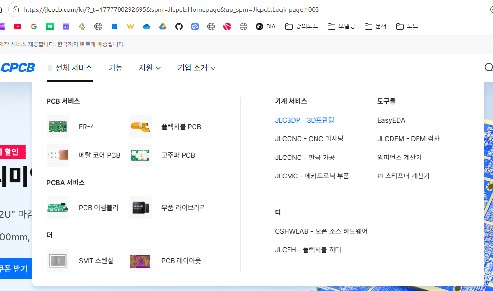
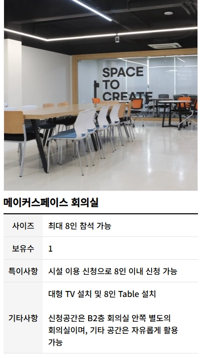
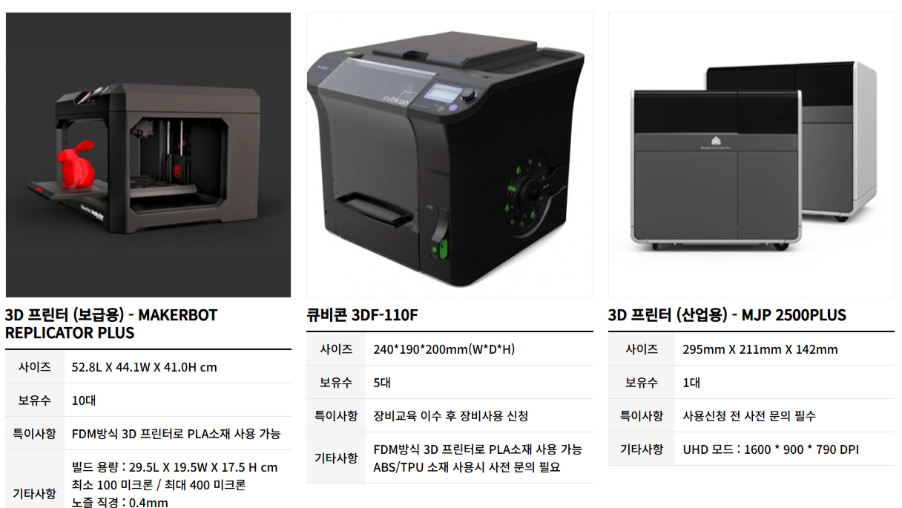
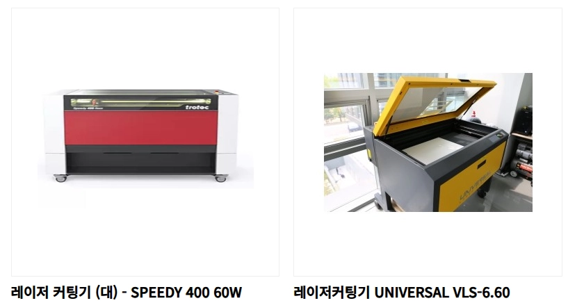
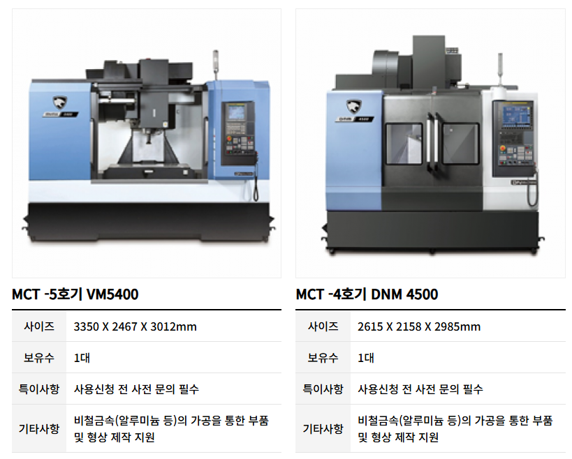

<!-- _class: title -->

# 04-02. 공용 3D 프린터 사용 방법

## 핵심 개념과 실무 적용

---

# 공용 3D 프린터 사용 방법

- 직접 장비를 보유하여 제작
- 전문 제작 업체에 의뢰
- 메이커 스페이스 이용

<!--
발표자 노트 · 원문

# 공용 3D 프린터 사용 방법

이번 내용은 3D 프린터를 중심으로 설명하지만, 레이저 커팅과 CNC 가공에도 동일하게 적용되는 내용입니다.

앞에서 우리는 3D 프린터, 레이저 커팅, CNC 가공과 같은 다양한 제작 방식을 살펴보았습니다.

하지만 이러한 장비를 개인이 모두 보유하는 것은 현실적으로 쉽지 않습니다.

특히 CNC 가공기와 레이저 커팅기는 장비 가격뿐만 아니라 설치 공간, 전원, 소음, 냄새, 분진, 연기, 안전 관리 등의 문제가 함께 발생합니다.

3D 프린터는 비교적 크기가 작고 설치가 간단하기 때문에 개인이 보유하기 쉽지만, 출력 속도가 느리다는 한계가 있습니다.

따라서 개인이 직접 모든 제작 장비를 구매하기보다는 필요에 따라 다음과 같은 방법을 활용하는 것이 현실적입니다.

- 직접 장비를 보유하여 제작
- 전문 제작 업체에 의뢰
- 메이커 스페이스 이용
-->

---

# 장비를 직접 보유하기 어려운 이유

- 장비 크기가 큼
- 연기 발생
- 냄새 발생
- 배기 시설 필요

<!--
발표자 노트 · 원문

#### 장비를 직접 보유하기 어려운 이유

제작 장비는 종류에 따라 필요한 환경이 크게 다릅니다.

3D 프린터는 일반적인 가정이나 교육 공간에서도 비교적 쉽게 설치할 수 있습니다.

하지만 레이저 커팅이나 CNC 장비는 상황이 다릅니다.

레이저 커팅의 경우 다음과 같은 문제가 있습니다.

- 장비 크기가 큼
- 연기 발생
- 냄새 발생
- 배기 시설 필요
- 화재 위험 관리 필요
- 재료에 따라 유해 가스 발생 가능

CNC 가공 역시 다음과 같은 환경이 필요할 수 있습니다.

- 큰 설치 공간
- 높은 장비 가격
- 절삭유 관리
- 금속 칩과 분진
- 큰 소음
- 공구 관리
- 안전 관리

따라서 교육이나 개인 프로젝트를 위해 이러한 장비를 모두 직접 구매하는 것은 효율적이지 않을 수 있습니다.
-->

---

# 3D 프린터를 직접 보유하는 경우

- 비교적 저렴한 장비 가격
- 작은 설치 공간
- 다양한 형상 제작 가능
- CAD 설계 후 바로 제작 가능

<!--
발표자 노트 · 원문

#### 3D 프린터를 직접 보유하는 경우

3D 프린터는 다른 제작 장비에 비해 개인이 보유하기 쉬운 편입니다.

장점은 다음과 같습니다.

- 비교적 저렴한 장비 가격
- 작은 설치 공간
- 다양한 형상 제작 가능
- CAD 설계 후 바로 제작 가능
- 시제품 제작에 매우 적합

특히 설계를 공부하는 단계에서는 언제든지 모델을 출력하고 수정할 수 있다는 점이 매우 큰 장점입니다.

하지만 단점도 있습니다.

가장 큰 문제는 출력 속도입니다.

작은 부품도 몇 시간이 걸릴 수 있고, 큰 부품은 하루 이상 출력해야 하는 경우도 있습니다.

따라서 1~2개의 시제품이나 설계 검증에는 매우 유용하지만, 같은 부품을 수십 개 또는 수백 개씩 생산하려면 여러 대의 프린터를 동시에 운영해야 할 수 있습니다.

즉, 개인이 보유한 3D 프린터는 대량 생산 장비라기보다 설계 검증과 시제품 제작 장비로 생각하는 것이 좋습니다.
-->

---

# 제작을 직접 하지 않아도 된다

- 설계자가 반드시 직접 제작 장비를 운영해야 하는 것은 아닙니다.
- 제품을 설계한 뒤 필요한 데이터만 제작 업체에 전달하면 전문 업체에서 대신 제작할 수 있습니다.
- 예를 들어 3D 프린팅이라면 다음과 같은 방식으로 진행할 수 있습니다.

<!--
발표자 노트 · 원문

#### 제작을 직접 하지 않아도 된다

설계자가 반드시 직접 제작 장비를 운영해야 하는 것은 아닙니다.

제품을 설계한 뒤 필요한 데이터만 제작 업체에 전달하면 전문 업체에서 대신 제작할 수 있습니다.

예를 들어 3D 프린팅이라면 다음과 같은 방식으로 진행할 수 있습니다.

3D 모델링

↓

STL 또는 STEP 파일 생성

↓

제작 업체에 업로드

↓

재료와 옵션 선택

↓

견적 확인

↓

제작 의뢰

↓

완성품 배송

따라서 3D 프린터가 없어도 3D 모델링만 할 수 있다면 실제 제품 제작까지 연결할 수 있습니다.
-->

---

# 3D 프린팅 대행

- 제작할 3D 모델을 준비한다.
- STL 또는 지원되는 3D 파일을 업로드한다.
- 사용할 재료를 선택한다.

<!--
발표자 노트 · 원문

#### 3D 프린팅 대행

가장 간단한 방법 중 하나가 3D 프린팅 전문 업체에 제작을 의뢰하는 것입니다.

국내외에 다양한 제작 업체가 있으며, 온라인으로 파일을 업로드하면 바로 견적을 확인할 수 있는 업체도 많습니다.

대표적인 예로 JLC3DP와 같은 서비스를 이용할 수 있습니다.

일반적인 과정은 매우 단순합니다.

1. 제작할 3D 모델을 준비한다.
2. STL 또는 지원되는 3D 파일을 업로드한다.
3. 사용할 재료를 선택한다.
4. 제작 방식과 품질 옵션을 선택한다.
5. 자동으로 계산된 견적을 확인한다.
6. 제작을 주문한다.

직접 장비를 구매하지 않고도 다양한 재료와 제조 방식을 사용할 수 있다는 것이 큰 장점입니다.
-->

---

# 외주 제작 비용이 발생하는 이유

- 출력물이 베드에 제대로 붙지 않음
- 출력 중 부품이 넘어짐
- 필라멘트 공급 문제
- 노즐 막힘

<!--
발표자 노트 · 원문

#### 외주 제작 비용이 발생하는 이유

3D 프린팅은 단순히 프린터가 자동으로 움직이는 것처럼 보이지만 실제로는 생각보다 사람의 관리가 많이 필요합니다.

예를 들어 다음과 같은 문제가 발생할 수 있습니다.

- 출력물이 베드에 제대로 붙지 않음
- 출력 중 부품이 넘어짐
- 필라멘트 공급 문제
- 노즐 막힘
- 출력 중간 실패
- Support 제거
- 출력물 정리
- 후처리

특히 출력 시간이 긴 제품이 중간에 실패하면 장시간 사용한 장비 시간과 재료가 모두 손실됩니다.

따라서 제작 업체는 단순히 필라멘트 가격만 받는 것이 아니라 다음과 같은 비용까지 포함해야 합니다.

- 장비 사용 시간
- 재료비
- 작업자 인건비
- 실패 위험
- 후처리
- 장비 유지보수
- 포장과 배송

이 때문에 직접 출력했을 때의 단순 재료비보다 외주 제작 가격이 높아지는 것은 자연스러운 구조입니다.
-->

---

# 직접 제작과 외주의 선택

- 3D 프린터
- 필라멘트
- 설치 공간
- 출력 시간

<!--
발표자 노트 · 원문

#### 직접 제작과 외주의 선택

3D 프린터를 직접 보유하는 것이 항상 저렴한 것도 아니고, 외주 제작이 항상 비싼 것도 아닙니다.

예를 들어 단순히 제품 하나만 필요한 경우를 생각해 보겠습니다.

직접 제작하려면 다음이 필요합니다.

- 3D 프린터
- 필라멘트
- 설치 공간
- 출력 시간
- 유지보수
- 실패 시 재출력

반면 외주 업체에 맡기면 제작비는 발생하지만 이러한 장비와 관리가 필요하지 않습니다.

따라서 제작 수량과 사용 빈도에 따라 판단하는 것이 좋습니다.

가끔 제품을 한두 개 제작한다면 외주가 효율적일 수 있고, 계속해서 설계와 출력 실습을 해야 한다면 직접 프린터를 보유하는 것이 훨씬 편리합니다.
-->

---

# 메이커 스페이스

- 3D 프린터
- 레이저 커팅기
- CNC 장비
- 목공 장비

<!--
발표자 노트 · 원문

#### 메이커 스페이스

외주 제작과 직접 장비 구매 사이의 좋은 대안이 메이커 스페이스입니다.

메이커 스페이스는 일반 사용자가 다양한 제작 장비를 사용할 수 있도록 마련된 공간입니다.

공공기관이나 대학, 지방자치단체 등의 지원을 받아 운영되는 곳도 많습니다.

시설에 따라 다음과 같은 장비를 보유하고 있습니다.

- 3D 프린터
- 레이저 커팅기
- CNC 장비
- 목공 장비
- 전자 제작 장비
- 각종 공구

장비를 직접 구매하지 않고도 필요한 순간에 사용할 수 있다는 것이 가장 큰 장점입니다.
-->

---

# 메이커 스페이스의 장점

- 장비 사용 교육
- 장비 예약
- 무료 또는 저렴한 장비 사용

<!--
발표자 노트 · 원문

#### 메이커 스페이스의 장점

메이커 스페이스는 단순히 장비만 빌려주는 공간이 아닙니다.

시설마다 차이는 있지만 다음과 같은 서비스를 제공하는 경우가 많습니다.

- 장비 사용 교육
- 장비 예약
- 무료 또는 저렴한 장비 사용
- 제작 지원
- 기술 상담
- 일부 제작 대행

따라서 처음 장비를 접하는 사람에게도 매우 유용합니다.

특히 레이저 커팅이나 CNC처럼 개인이 구매하기 부담스러운 장비를 경험해 볼 수 있다는 점에서 가치가 큽니다.
-->

---

# 3D 프린터 활용

- 사용 가능한 프린터 종류
- 지원 재료
- 출력 가능한 최대 크기

<!--
발표자 노트 · 원문

#### 3D 프린터 활용

메이커 스페이스에는 여러 대의 3D 프린터를 보유한 경우도 있습니다.

개인이 프린터 한 대만 사용할 때보다 여러 대를 동시에 사용할 수 있기 때문에 여러 부품을 제작해야 할 때 매우 유용합니다.

시설에 따라 파일을 전달하면 출력을 대신 해주는 경우도 있습니다.

다만 많은 양을 출력하거나 특정 재료를 사용하는 경우에는 필라멘트를 직접 준비해야 할 수도 있습니다.

따라서 방문 전 다음 내용을 확인하는 것이 좋습니다.

- 사용 가능한 프린터 종류
- 지원 재료
- 출력 가능한 최대 크기
- 필라멘트 제공 여부
- 장비 이용료
- 예약 방법
-->

---

# 레이저 커팅기 활용

- 메이커 스페이스에서 특히 유용한 장비 중 하나가 레이저 커팅기입니다.
- 개인이 레이저 커팅기를 구매하기 어려운 가장 큰 이유는 장비 자체의 크기뿐만 아니라 배기와 냄새 문제 때문입니다.
- 레이저 커팅에서는 재료가 타거나 녹으면서 연기와 냄새가 발생합니다.

<!--
발표자 노트 · 원문

#### 레이저 커팅기 활용

메이커 스페이스에서 특히 유용한 장비 중 하나가 레이저 커팅기입니다.

개인이 레이저 커팅기를 구매하기 어려운 가장 큰 이유는 장비 자체의 크기뿐만 아니라 배기와 냄새 문제 때문입니다.

레이저 커팅에서는 재료가 타거나 녹으면서 연기와 냄새가 발생합니다.

따라서 일반적으로 별도의 배기 시설이 필요합니다.

이러한 설비까지 개인 공간에 구축하는 것은 쉽지 않습니다.

반면 메이커 스페이스에서는 이미 장비와 배기 시설이 설치되어 있기 때문에 필요한 DXF 등의 파일과 재료만 준비하여 사용할 수 있습니다.
-->

---

# 레이저 커팅의 생산성

- 레이저 커팅은 판재 부품을 매우 빠르게 제작할 수 있습니다.
- 예를 들어 하나의 판재에 여러 부품을 배치하고 한 번에 절단할 수 있습니다.
- 따라서 교육용 키트처럼 동일한 형상의 부품이 여러 개 필요할 때 매우 유용합니다.

<!--
발표자 노트 · 원문

#### 레이저 커팅의 생산성

레이저 커팅은 판재 부품을 매우 빠르게 제작할 수 있습니다.

예를 들어 하나의 판재에 여러 부품을 배치하고 한 번에 절단할 수 있습니다.

따라서 교육용 키트처럼 동일한 형상의 부품이 여러 개 필요할 때 매우 유용합니다.

직접 장비를 사용할 수 있다면 한 번 방문하여 여러 개의 부품을 한꺼번에 제작할 수도 있습니다.

이러한 이유로 레이저 커팅은 개인이 장비를 보유하기보다는 메이커 스페이스 같은 시설에서 필요할 때 사용하는 방식이 매우 효율적일 수 있습니다.
-->

---

# CNC 장비 활용

- 사용 가능한 재료
- 최대 가공 크기
- 필요한 CAD 데이터

<!--
발표자 노트 · 원문

#### CNC 장비 활용

일부 메이커 스페이스나 전문 제작 시설에서는 CNC 밀링, CNC 선반, 머시닝센터 등의 장비도 보유하고 있습니다.

이러한 장비는 레이저 커팅이나 3D 프린터보다 사용 난이도가 높기 때문에 직접 사용하기 전에 교육이 필요한 경우가 많습니다.

또한 장비에 따라 운영자가 직접 가공을 해주는 방식으로 운영될 수도 있습니다.

따라서 CNC 장비를 사용하려면 먼저 해당 시설에 문의하여 다음 내용을 확인하는 것이 좋습니다.

- 사용 가능한 재료
- 최대 가공 크기
- 필요한 CAD 데이터
- 도면 형식
- 사용 가능한 공구
- 장비 교육 여부
- 제작 비용
-->

---

# 메이커 스페이스를 찾는 방법

- 가까운 시설 검색
- 보유 장비 확인
- 예약
- 필요한 교육 수강

<!--
발표자 노트 · 원문

#### 메이커 스페이스를 찾는 방법

메이커 스페이스는 지역마다 다양한 시설이 운영되고 있습니다.

인터넷에서 다음과 같은 키워드로 검색하면 가까운 시설을 찾을 수 있습니다.

`메이커 스페이스`

`지역명 + 메이커 스페이스`

`지역명 + 3D 프린터`

`지역명 + 레이저 커팅`

`지역명 + CNC`

시설을 찾았다면 방문하기 전에 홈페이지나 전화 문의를 통해 이용 방법을 확인하는 것이 좋습니다.

일반적으로 다음과 같은 절차를 따릅니다.

1. 가까운 시설 검색
2. 보유 장비 확인
3. 예약
4. 필요한 교육 수강
5. 재료 준비
6. CAD 데이터 준비
7. 방문 후 제작
-->

---

# 직접 제작의 비용

- 재료 구매
- 이동 시간
- 장비 예약
- 교육 시간

<!--
발표자 노트 · 원문

#### 직접 제작의 비용

메이커 스페이스를 이용하면 장비 비용을 크게 줄일 수 있습니다.

하지만 완전히 비용이 없는 것은 아닙니다.

다음과 같은 비용이나 시간이 필요할 수 있습니다.

- 재료 구매
- 이동 시간
- 장비 예약
- 교육 시간
- 실제 제작 시간

즉, 장비 사용료는 저렴하거나 무료일 수 있지만 직접 움직여야 한다는 비용이 발생합니다.
-->

---

# 외주 제작의 비용

- 제작비
- 장비 사용료
- 작업자 인건비
- 후처리

<!--
발표자 노트 · 원문

#### 외주 제작의 비용

반대로 외주 제작은 이동하거나 직접 장비를 사용할 필요가 없습니다.

설계 데이터를 전달하면 제작 업체에서 완성품을 보내줍니다.

대신 다음 비용이 포함됩니다.

- 제작비
- 장비 사용료
- 작업자 인건비
- 후처리
- 업체 마진
- 배송비

따라서 가장 편리하지만 일반적으로 직접 제작하는 것보다 비용은 높아질 수 있습니다.
-->

---

# 결국 시간과 비용의 선택

- 언제든지 제작 가능
- 반복 실습에 유리
- 설계 수정 후 바로 출력 가능
- 장비 구매 비용

<!--
발표자 노트 · 원문

#### 결국 시간과 비용의 선택

어떤 방법이 가장 좋은지는 상황에 따라 다릅니다.

**직접 장비 보유**

장점

- 언제든지 제작 가능
- 반복 실습에 유리
- 설계 수정 후 바로 출력 가능

단점

- 장비 구매 비용
- 유지보수
- 설치 공간 필요

**메이커 스페이스**

장점

- 비싼 장비를 저렴하게 사용 가능
- 다양한 장비 경험 가능
- 교육과 지원을 받을 수 있음

단점

- 직접 방문해야 함
- 예약 필요
- 재료를 준비해야 할 수 있음

**전문 제작 업체**

장점

- 가장 편리함
- 전문 장비 사용 가능
- 다양한 재료 선택 가능

단점

- 제작 비용
- 배송 시간
- 설계 변경 시 재주문 필요

따라서 제작 방법뿐만 아니라 장비를 어떻게 사용할 것인지까지도 전체적인 비용과 시간 관점에서 판단해야 합니다.
-->

---

# 설계자가 장비를 모두 보유할 필요는 없다

- 어떤 재료를 사용할지 결정
- 어떤 제작 방법이 적합한지 판단
- 제작 가능한 형태로 설계
- 제작에 필요한 데이터를 생성

<!--
발표자 노트 · 원문

#### 설계자가 장비를 모두 보유할 필요는 없다

기계 설계를 처음 배우면 자신이 직접 모든 장비를 가지고 있어야 제품을 만들 수 있다고 생각하기 쉽습니다.

하지만 실제로는 그렇지 않습니다.

설계자가 가장 먼저 갖추어야 할 능력은 제작 장비를 소유하는 것이 아니라 다음과 같은 능력입니다.

- 어떤 재료를 사용할지 결정
- 어떤 제작 방법이 적합한지 판단
- 제작 가능한 형태로 설계
- 제작에 필요한 데이터를 생성
- 제작 업체와 의사소통

이 능력이 있다면 실제 제작 장비는 상황에 따라 선택해서 사용할 수 있습니다.

3D 프린터가 없다면 출력 업체에 맡길 수 있습니다.

레이저 커팅기가 없다면 메이커 스페이스를 이용하거나 전문 업체에 의뢰할 수 있습니다.

CNC 장비가 없다면 가공 업체에 도면과 CAD 데이터를 전달하면 됩니다.
-->

---

# 설계와 제작의 역할

- 기능 결정
- 재료 선정
- 제작 방법 선정
- CAD 모델 작성

<!--
발표자 노트 · 원문

#### 설계와 제작의 역할

이 관점에서 보면 설계와 제작의 역할을 다음과 같이 구분할 수 있습니다.

설계자

- 기능 결정
- 재료 선정
- 제작 방법 선정
- CAD 모델 작성
- 도면 작성
- 공차 결정

제작자

- 재료 준비
- 장비 설정
- 실제 가공
- 품질 확인

물론 실제 현장에서는 한 사람이 두 역할을 모두 수행하기도 합니다.

하지만 설계자가 반드시 모든 제작 장비를 직접 다룰 필요는 없습니다.

제작 방법의 특징과 한계를 이해하고 제작자에게 필요한 정보를 정확하게 전달할 수 있는 것이 더 중요합니다.
-->

---

# 이번 챕터에서 기억해야 할 핵심

- 3D 프린터, 레이저 커팅기, CNC와 같은 제작 장비를 모두 개인이 보유할 필요는 없습니다.
- 필요에 따라 다음 세 가지 방법을 선택할 수 있습니다.
- 직접 제작

<!--
발표자 노트 · 원문

#### 이번 챕터에서 기억해야 할 핵심

3D 프린터, 레이저 커팅기, CNC와 같은 제작 장비를 모두 개인이 보유할 필요는 없습니다.

필요에 따라 다음 세 가지 방법을 선택할 수 있습니다.

직접 제작

↓

메이커 스페이스 이용

↓

전문 업체에 제작 의뢰

어떤 방법이 가장 좋은지는 제작 수량, 비용, 시간, 장비 접근성에 따라 달라집니다.

한두 개의 제품을 만들어야 한다면 외주 제작이 편리할 수 있습니다.

반복적인 3D 프린팅 실습을 한다면 개인용 3D 프린터가 유용합니다.

레이저 커팅이나 CNC처럼 크고 비싼 장비가 필요하다면 메이커 스페이스를 활용하는 것이 매우 좋은 방법이 될 수 있습니다.

> 설계자가 모든 장비를 가지고 있을 필요는 없습니다.
> 
> 
> 중요한 것은 어떤 방법으로 만들어야 하는지를 알고, 제작 가능한 데이터를 만들 수 있는 능력입니다.
> 

앞으로 제품을 설계할 때는 단순히 어떤 장비로 제작할 것인지뿐만 아니라 그 장비를 직접 사용할 것인지, 메이커 스페이스를 이용할 것인지, 전문 업체에 의뢰할 것인지까지 함께 판단해 보는 것이 좋습니다.
-->
