<!-- _class: title -->

# 05-03. 수공구

## 핵심 개념과 실무 적용

---

# 수공구

- 단자대 체결
- 릴레이 소켓 고정
- 차단기 고정
- 전장품 체결

<!--
발표자 노트 · 원문

# 수공구

기계 설계에서는 부품을 설계하고 제작하는 것뿐만 아니라 실제로 조립하는 방법을 이해하는 것도 중요합니다.

자동화 장비에서는 다양한 커버, 브라켓, 센서 브라켓, 소형 플레이트 등을 조립할 때 드라이버와 렌치를 많이 사용합니다.

특히 자동화 장비에서는 M3~M5 정도의 비교적 작은 볼트가 많이 사용됩니다.

전기 판넬에서도 드라이버의 사용 빈도가 매우 높습니다.

대표적으로 다음과 같은 작업에 사용합니다.

- 단자대 체결
- 릴레이 소켓 고정
- 차단기 고정
- 전장품 체결
- 커넥터 및 단자 체결

공구를 선택할 때는 단순히 크기만 맞추는 것이 아니라 나사 머리의 형상, 작업 공간, 필요한 체결 토크를 함께 고려해야 합니다.
-->

---

# 헤드에 따른 분류

- 십자 드라이버
- 일자 드라이버
- 육각 비트 드라이버
- 볼엔드 육각 비트 드라이버

<!--
발표자 노트 · 원문

#### 헤드에 따른 분류

나사 머리의 형상에 따라 사용하는 드라이버와 렌치의 종류가 달라집니다.

규격이 맞지 않는 공구를 사용하면 나사 머리가 손상되거나 충분한 체결력을 얻지 못할 수 있습니다.

- 십자 드라이버
- 일자 드라이버
- 육각 비트 드라이버
- 볼엔드 육각 비트 드라이버
- 별렌치
-->

---

# 일반 나사

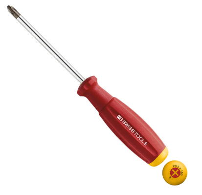

- 전기 판넬 부품
- 커버 조립
- 소형 장치 조립

<!--
발표자 노트 · 원문

**십자 드라이버, PH**

가장 일반적으로 사용하는 드라이버입니다.

주로 다음과 같은 곳에 사용합니다.

- 일반 나사
- 전기 판넬 부품
- 커버 조립
- 소형 장치 조립

장점은 범용성이 높고 쉽게 구할 수 있으며 가격이 저렴하다는 점입니다.

반면 규격이 맞지 않으면 나사 머리가 쉽게 손상될 수 있고, 높은 토크 전달에는 상대적으로 불리합니다.

또한 오래 사용하면 드라이버 끝부분이 마모됩니다.

PH1, PH2, PH3 등의 규격을 구분하여 사용해야 합니다.

작은 나사에 큰 드라이버를 사용하거나 큰 나사에 작은 드라이버를 사용하면 나사 머리가 쉽게 손상될 수 있습니다.
-->

---

# 단자대 체결

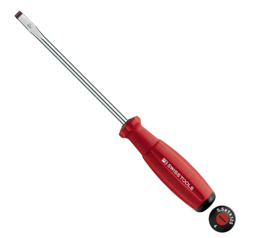

- 소형 조정 나사
- 전기 부품 고정
- 일부 커넥터 단자

<!--
발표자 노트 · 원문

**일자 드라이버, SL**

일자 형태의 홈을 가진 나사에 사용하는 드라이버입니다.

주로 다음과 같은 곳에 사용합니다.

- 단자대 체결
- 소형 조정 나사
- 전기 부품 고정
- 일부 커넥터 단자

단자대와 좁은 홈 작업에 유용합니다.

다만 작업 중 드라이버가 홈에서 미끄러질 수 있기 때문에 나사 머리가 손상되거나 작업자가 다칠 수 있습니다.

일자 드라이버를 간단한 지렛대처럼 사용하는 경우도 있지만 원래 용도가 아니므로 가급적 피하는 것이 좋습니다.
-->

---

# 육각 소켓 볼트

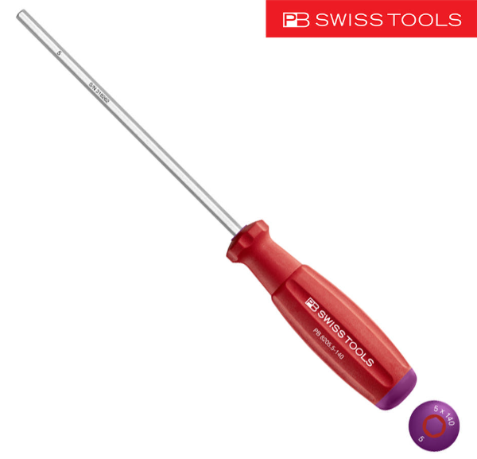

- LM 가이드 체결
- 알루미늄 프로파일 브라켓
- 모터 브라켓

<!--
발표자 노트 · 원문

**육각 비트 / 육각 드라이버, HEX**

자동화 기계 조립에서 매우 많이 사용하는 형태입니다.

주로 다음과 같은 작업에 사용합니다.

- 육각 소켓 볼트
- LM 가이드 체결
- 알루미늄 프로파일 브라켓
- 모터 브라켓
- 풀리 고정용 무두볼트

십자 드라이버보다 토크 전달력이 좋고 나사 머리 손상이 적은 편입니다.

자동화 장비 조립에서는 반드시 익혀 두어야 하는 공구 중 하나입니다.

단, 정확한 규격의 비트를 사용해야 하며 저가 비트는 끝부분이 쉽게 마모될 수 있습니다.

특히 작은 무두볼트는 육각 홈이 작기 때문에 과도한 힘을 가하면 쉽게 손상될 수 있습니다.
-->

---

# 육각 소켓 볼트

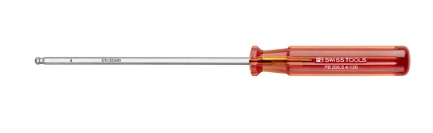

- 좁은 공간의 조립
- 임시 조립
- 높은 토크가 필요하지 않은 체결

<!--
발표자 노트 · 원문

**볼엔드 육각 비트**

볼엔드 육각 비트는 끝부분이 둥근 형태로 되어 있어 공구를 약간 기울인 상태에서도 체결할 수 있습니다.

주로 다음과 같은 작업에 사용합니다.

- 육각 소켓 볼트
- 좁은 공간의 조립
- 임시 조립
- 높은 토크가 필요하지 않은 체결

일반 육각 비트보다 비스듬한 방향에서 작업하기 쉽다는 장점이 있습니다.

반면 접촉 면적이 작기 때문에 일반 육각 비트보다 토크 전달력이 낮고, 강한 힘을 가하면 볼트 홈이 손상될 수 있습니다.

따라서 볼엔드로 빠르게 조립한 후 최종 체결은 일반 육각 부분으로 하는 것이 좋습니다.
-->

---

# 정밀 장비

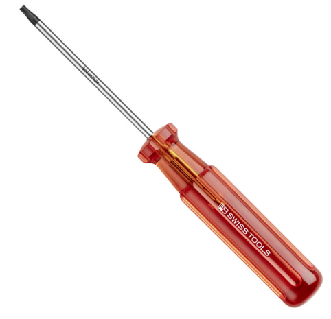

- 자동차 부품
- 로봇 부품
- 모터 부품

<!--
발표자 노트 · 원문

**별렌치, TORX**

별 모양의 홈을 가진 나사에 사용하는 공구입니다.

주로 다음과 같은 분야에서 사용합니다.

- 정밀 장비
- 자동차 부품
- 로봇 부품
- 모터 부품
- 일부 분해 방지 구조

토크 전달력이 우수하고 나사 머리 손상이 적으며 반복 조립에 강한 편입니다.

다만 규격이 다양하기 때문에 T10, T15, T20 등 맞는 규격의 비트를 준비해야 합니다.
-->

---

# 손잡이에 따른 분류

- 주먹 드라이버
- 정밀 드라이버
- L형 육각렌치
- T형 육각렌치

<!--
발표자 노트 · 원문

#### 손잡이에 따른 분류

같은 헤드의 공구라도 손잡이 형태에 따라 작업성과 전달할 수 있는 토크가 달라집니다.

- 주먹 드라이버
- 정밀 드라이버
- L형 육각렌치
- T형 육각렌치
-->

---

# 주먹 드라이버

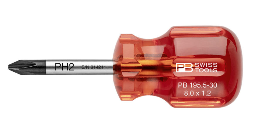

- 전체 길이가 짧은 소형 드라이버입니다.
- 일반 드라이버가 들어가기 어려운 좁은 공간에서 사용합니다.

<!--
발표자 노트 · 원문

**주먹 드라이버**

전체 길이가 짧은 소형 드라이버입니다.

일반 드라이버가 들어가기 어려운 좁은 공간에서 사용합니다.

크기에 비해 비교적 높은 토크를 전달할 수 있다는 장점이 있습니다.

다만 충분한 작업 공간이 있는 경우에는 일반 드라이버보다 사용성이 떨어집니다
-->

---

# 센서

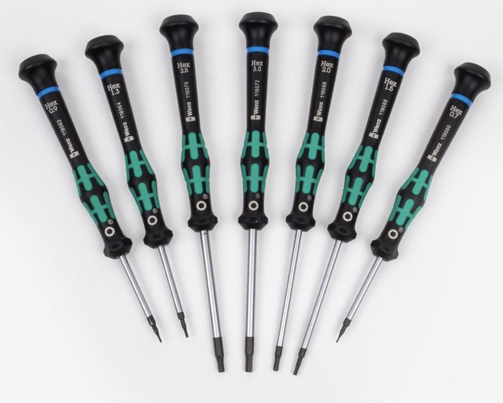

- 커넥터
- 소형 기계 부품
- 전자기기

<!--
발표자 노트 · 원문

**정밀 드라이버**

소형 부품을 조립하거나 분해할 때 사용하는 드라이버입니다.

주로 다음과 같은 곳에 사용합니다.

- 센서
- 커넥터
- 소형 기계 부품
- 전자기기

작은 나사를 정밀하게 조작할 수 있고 휴대성이 좋습니다.

반면 높은 토크 전달에는 적합하지 않고 장시간 사용하면 손이 쉽게 피로할 수 있습니다.
-->

---

# L형 육각렌치

- 일반 L렌치
- 숏타입 L렌치
- 롱암타입 L렌치

<!--
발표자 노트 · 원문

#### L형 육각렌치

L형 육각렌치는 자동화 장비 조립에서 가장 많이 사용하는 공구 중 하나입니다.

- 일반 L렌치
- 숏타입 L렌치
- 롱암타입 L렌치
-->

---

# 일반 L렌치

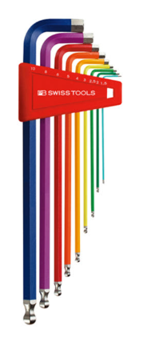

- 가장 일반적인 형태의 육각렌치입니다.
- 제품에 따라 한쪽은 일반 육각, 다른 한쪽은 볼엔드 형태로 구성되어 있습니다.

<!--
발표자 노트 · 원문

**일반 L렌치**

가장 일반적인 형태의 육각렌치입니다.

제품에 따라 한쪽은 일반 육각, 다른 한쪽은 볼엔드 형태로 구성되어 있습니다.

볼엔드를 이용하면 비스듬한 방향에서 빠르게 체결할 수 있고, 일반 육각 부분을 이용하면 높은 토크로 최종 체결할 수 있습니다.

장점은 사용 범위가 넓고 구조가 단순하다는 점입니다.

단점은 여러 규격을 세트로 준비하면 수납 공간을 많이 차지할 수 있다는 점입니다.
-->

---

# L렌치 - Short Type

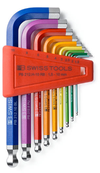

- 일반 L렌치보다 일부 길이가 짧은 형태입니다.
- 일반 L렌치가 들어가기 어려운 좁은 공간에서 사용합니다.

<!--
발표자 노트 · 원문

**L렌치 - Short Type**

일반 L렌치보다 일부 길이가 짧은 형태입니다.

일반 L렌치가 들어가기 어려운 좁은 공간에서 사용합니다.

좁은 공간에서 작업하기 편리하지만 손잡이 길이가 짧아 일반형보다 높은 토크 전달에는 불리할 수 있습니다.
-->

---

# L렌치 - Short Arm Type

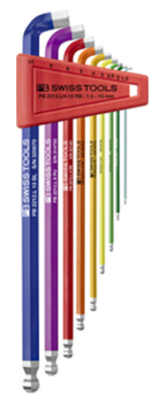

- L렌치의 짧은 쪽을 더 짧게 만든 형태입니다.
- 볼트 위쪽 공간이 매우 좁은 곳에서 유용합니다.

<!--
발표자 노트 · 원문

**L렌치 - Short Arm Type**

L렌치의 짧은 쪽을 더 짧게 만든 형태입니다.

볼트 위쪽 공간이 매우 좁은 곳에서 유용합니다.

짧은 쪽을 볼트에 삽입하고 긴 쪽을 손잡이로 사용하면 좁은 공간에서도 비교적 높은 토크로 체결할 수 있습니다.

다만 일반적인 작업에서는 표준 L렌치보다 활용성이 떨어질 수 있습니다.
-->

---

# T형 육각렌치

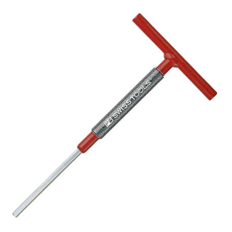

- 손잡이가 T자 형태로 된 육각렌치입니다.
- L렌치와 비슷한 용도로 사용하지만 반복적인 체결 작업에 특히 편리합니다.
- 장점은 손으로 잡기 편하고 비교적 높은 토크를 쉽게 전달할 수 있다는 점입니다.

<!--
발표자 노트 · 원문

#### T형 육각렌치

손잡이가 T자 형태로 된 육각렌치입니다.

L렌치와 비슷한 용도로 사용하지만 반복적인 체결 작업에 특히 편리합니다.

장점은 손으로 잡기 편하고 비교적 높은 토크를 쉽게 전달할 수 있다는 점입니다.

단점은 L렌치보다 부피가 크고 좁은 공간에서는 사용하기 어렵다는 점입니다.
-->

---

# 스패너

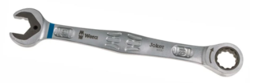

- 육각 머리 볼트
- 너트
- 비교적 높은 토크가 필요한 체결

<!--
발표자 노트 · 원문

#### 스패너

육각 머리 볼트와 너트를 체결하거나 해체할 때 사용합니다.

일반적으로 한쪽은 오픈형, 다른 한쪽은 링 형태로 되어 있습니다.

제품에 따라 링 부분에 라쳇 기능이 적용된 형태도 있습니다.

주로 다음과 같은 곳에 사용합니다.

- 육각 머리 볼트
- 너트
- 비교적 높은 토크가 필요한 체결
- 기계 설비
- 차량 정비

높은 토크 전달이 가능하고 구조가 단순합니다.

반면 볼트 크기별로 여러 개의 공구가 필요하기 때문에 수납 공간을 많이 차지할 수 있습니다.
-->

---

# 몽키 스패너

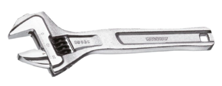

- 헤드의 폭을 조절할 수 있는 가변형 스패너입니다.
- 하나의 공구로 여러 크기의 육각 볼트와 너트에 대응할 수 있습니다.
- 장점은 공구 수를 줄일 수 있다는 점입니다.

<!--
발표자 노트 · 원문

#### 몽키 스패너

헤드의 폭을 조절할 수 있는 가변형 스패너입니다.

하나의 공구로 여러 크기의 육각 볼트와 너트에 대응할 수 있습니다.

장점은 공구 수를 줄일 수 있다는 점입니다.

단점은 여러 크기의 볼트를 반복해서 작업할 때마다 크기를 다시 조절해야 하므로 작업성이 떨어질 수 있습니다.

또한 헤드의 유격을 정확하게 맞추지 않으면 볼트 모서리가 손상될 수 있습니다.
-->

---

# 헤드 교체형 공구

- 라쳇
- 비트 교환식 드라이버
- 전동 공구

<!--
발표자 노트 · 원문

#### 헤드 교체형 공구

하나의 손잡이에 여러 종류의 소켓이나 비트를 교환하여 사용하는 방식입니다.

- 라쳇
- 비트 교환식 드라이버
- 전동 공구
-->

---

# 높은 체결력이 필요한 곳

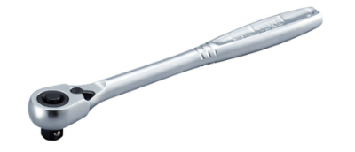

- 큰 설비
- 차량 정비
- 반복적인 볼트 체결

<!--
발표자 노트 · 원문

**라쳇**

헤드 부분에 사각 드라이브가 있는 공구입니다.

소켓을 교체하여 여러 규격의 볼트와 너트를 체결할 수 있습니다.

주로 다음과 같은 곳에 사용합니다.

- 높은 체결력이 필요한 곳
- 큰 설비
- 차량 정비
- 반복적인 볼트 체결

장점은 높은 토크로 체결할 수 있고 회전 방향을 변경하여 체결과 해체를 모두 할 수 있다는 점입니다.

또한 볼트에서 공구를 매번 빼지 않고 반복적으로 회전할 수 있어 작업성이 좋습니다.

단점은 작업 규격이 자주 바뀌면 소켓을 계속 교환해야 한다는 점입니다.
-->

---

# 복스알 소켓

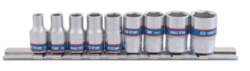

- 라쳇이나 임팩트 렌치에 장착하여 육각 볼트와 너트를 체결할 때 사용합니다.
- 일반 소켓과 임팩트용 소켓은 구조와 강도가 다를 수 있으므로 사용하는 공구에 맞는 제품을 사용해야 합니다.

<!--
발표자 노트 · 원문

**복스알 소켓**

라쳇이나 임팩트 렌치에 장착하여 육각 볼트와 너트를 체결할 때 사용합니다.

일반 소켓과 임팩트용 소켓은 구조와 강도가 다를 수 있으므로 사용하는 공구에 맞는 제품을 사용해야 합니다.
-->

---

# 비트 소켓

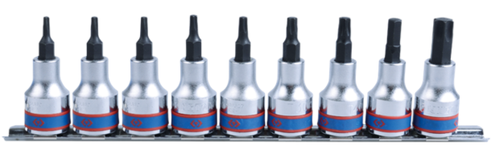

- 라쳇에 HEX, TORX, PH 등의 비트를 사용할 수 있도록 만든 소켓입니다.
- 육각 비트, 별 비트 등 다양한 형태로 사용할 수 있습니다.

<!--
발표자 노트 · 원문

**비트 소켓**

라쳇에 HEX, TORX, PH 등의 비트를 사용할 수 있도록 만든 소켓입니다.

육각 비트, 별 비트 등 다양한 형태로 사용할 수 있습니다.
-->

---

# 소형 라쳇

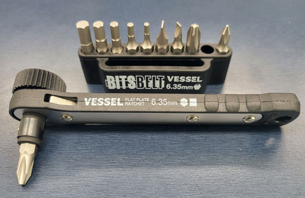

- 일반 라쳇과 동일한 원리지만 크기가 작은 공구입니다.
- 좁은 공간에서 비트나 작은 소켓을 사용할 때 유용합니다.

<!--
발표자 노트 · 원문

**소형 라쳇**

일반 라쳇과 동일한 원리지만 크기가 작은 공구입니다.

좁은 공간에서 비트나 작은 소켓을 사용할 때 유용합니다.

장점은 좁은 공간에서도 비교적 높은 체결력을 얻을 수 있다는 점입니다.

단점은 큰 라쳇에 비해 전달할 수 있는 토크가 낮고 비트 교환이 반복되면 번거로울 수 있습니다.
-->

---

# 비트 교환식 드라이버

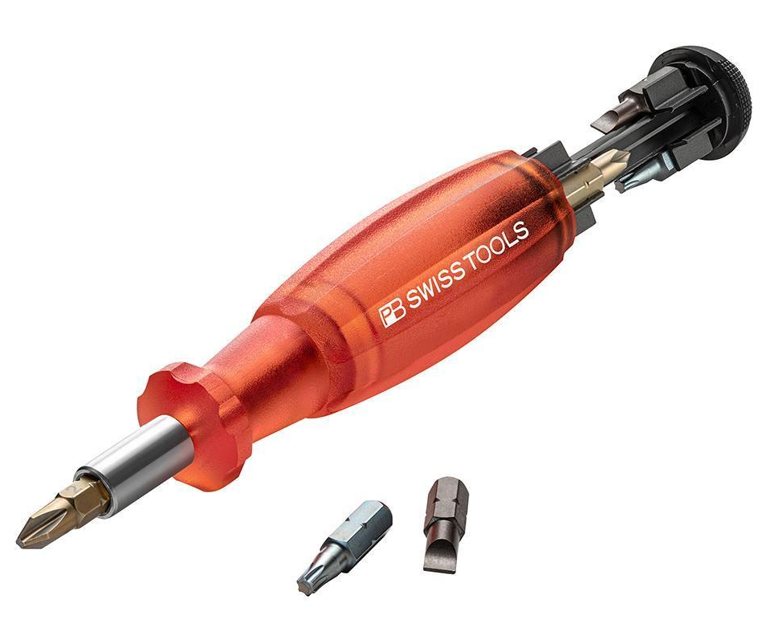

- 하나의 드라이버 손잡이에 여러 종류의 비트를 교환하여 사용하는 방식입니다.
- 장점은 공구 수를 줄일 수 있고 휴대성이 좋으며 다양한 규격에 대응할 수 있다는 점입니다.

<!--
발표자 노트 · 원문

**비트 교환식 드라이버**

하나의 드라이버 손잡이에 여러 종류의 비트를 교환하여 사용하는 방식입니다.

장점은 공구 수를 줄일 수 있고 휴대성이 좋으며 다양한 규격에 대응할 수 있다는 점입니다.

교육용 또는 예비 공구로 활용하기 좋습니다.

반면 높은 토크가 필요한 작업에는 전용 드라이버보다 불리할 수 있으며 작업 중 비트를 자주 교환해야 하면 번거로울 수 있습니다.
-->

---

# 홀 가공과 탭 가공

- 드릴링(Drilling): 구멍을 가공합니다.
- 탭핑(Tapping): 구멍 내부에 암나사를 가공합니다.

<!--
발표자 노트 · 원문

#### 홀 가공과 탭 가공

기계 부품을 제작하거나 수정하다 보면 볼트 체결을 위해 새로운 구멍을 만들어야 하는 경우가 있습니다.

구멍을 만드는 작업과 내부에 나사산을 만드는 작업은 서로 다릅니다.

- 드릴링(Drilling): 구멍을 가공합니다.
- 탭핑(Tapping): 구멍 내부에 암나사를 가공합니다.
-->

---

# 드릴 비트

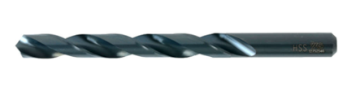

- 금속 구멍 가공
- 플라스틱 구멍 가공
- 탭 가공 전 사전 홀 작업

<!--
발표자 노트 · 원문

#### 드릴 비트

재료에 구멍을 가공하기 위한 공구입니다.

현장에서는 흔히 기리라고 부르기도 합니다.

주로 다음과 같은 용도로 사용합니다.

- 금속 구멍 가공
- 플라스틱 구멍 가공
- 탭 가공 전 사전 홀 작업

드릴 비트는 재료에 맞는 종류를 사용해야 합니다.

금속, 목재, 콘크리트 등 재료에 따라 형상과 재질이 다르며, 적절한 비트를 사용해야 수명과 가공 품질을 높일 수 있습니다.

드릴 비트는 소모품이므로 마모 상태를 확인하면서 사용해야 합니다.
-->

---

# 드릴탭 비트

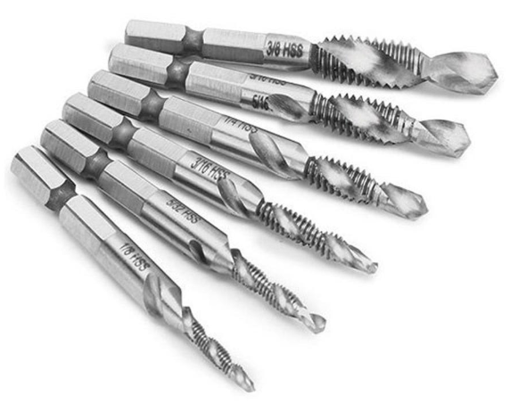

- 드릴링과 탭핑을 연속적으로 수행할 수 있도록 만든 공구입니다.
- 구멍을 만들면서 동시에 내부 나사산까지 가공할 수 있습니다.
- 장점은 작업 시간을 줄일 수 있다는 점입니다.

<!--
발표자 노트 · 원문

#### 드릴탭 비트

드릴링과 탭핑을 연속적으로 수행할 수 있도록 만든 공구입니다.

구멍을 만들면서 동시에 내부 나사산까지 가공할 수 있습니다.

장점은 작업 시간을 줄일 수 있다는 점입니다.

단점은 일반적인 드릴 비트보다 사용 조건이 제한적이고 파손될 가능성이 높다는 점입니다.

두꺼운 재료나 고강도 재료에서는 별도의 사전 홀 작업과 일반 탭을 사용하는 것이 더 적합할 수 있습니다.

금속 가공에서는 탭핑유나 절삭유를 사용하면 공구 수명을 늘리는 데 도움이 됩니다.
-->

---

# 드릴 척

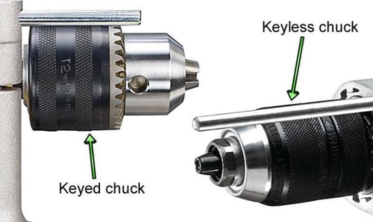

- 드릴 비트와 같은 원형 생크 공구를 고정하기 위한 장치입니다.
- 일반적으로 세 개의 죠(Jaw)가 비트를 잡는 구조로 되어 있습니다.
- 키척

<!--
발표자 노트 · 원문

#### 드릴 척

드릴 비트와 같은 원형 생크 공구를 고정하기 위한 장치입니다.

일반적으로 세 개의 죠(Jaw)가 비트를 잡는 구조로 되어 있습니다.

**키척**

척 키를 사용하여 조이고 푸는 방식입니다.

비트를 강하게 고정할 수 있지만 척 키를 따로 관리해야 하는 불편함이 있습니다.

**키리스척**

손으로 조이고 풀 수 있는 방식입니다.

척 키가 필요 없어 비트 교체가 편리합니다.
-->

---

# 비트 홀더

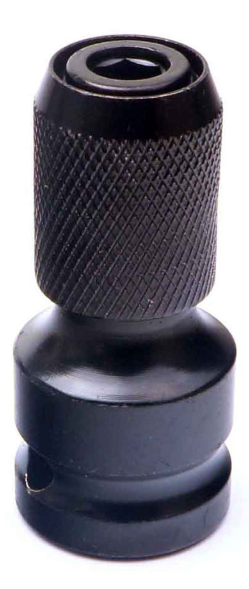

- 십자 비트
- 육각 비트
- TORX 비트

<!--
발표자 노트 · 원문

#### 비트 홀더

주로 1/4인치 육각 생크 형태의 비트를 빠르게 교환할 수 있도록 만든 공구입니다.

주로 다음과 같은 비트를 사용합니다.

- 십자 비트
- 육각 비트
- TORX 비트
- 육각 생크 형태의 드릴 비트

척보다 비트 교환이 빠르고 간편하다는 장점이 있습니다.

반면 원형 생크 드릴 비트는 직접 사용할 수 없고, 강한 충격이나 반복 사용으로 연결 부분이 손상될 수 있습니다.
-->

---

# 센터펀치

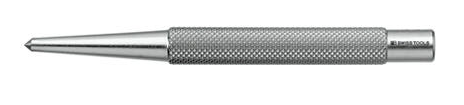

- 망치로 타격하는 일반 센터펀치
- 내부 스프링을 이용하는 자동 센터펀치

<!--
발표자 노트 · 원문

#### 센터펀치

드릴 가공을 시작할 위치에 작은 홈을 만드는 공구입니다.

드릴 비트가 평평한 금속 표면에서 미끄러지는 것을 줄여 줍니다.

대표적으로 다음 두 종류가 있습니다.

- 망치로 타격하는 일반 센터펀치
- 내부 스프링을 이용하는 자동 센터펀치

주로 금속 드릴링 전 위치를 표시하거나 정밀한 홀 위치를 잡을 때 사용합니다.

센터펀치를 사용하면 드릴의 시작 위치를 잡기가 쉬워지지만 수작업으로 위치를 지정하기 때문에 펀칭 자체에도 작은 위치 오차가 발생할 수 있습니다.
-->

---

# 핀바이스

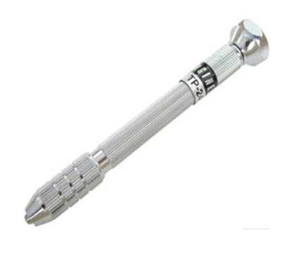

- 작은 구멍 가공
- 플라스틱
- PCB

<!--
발표자 노트 · 원문

#### 핀바이스

작은 드릴 비트를 손으로 회전시키기 위한 정밀 공구입니다.

일반적으로 콜렛 구조를 이용해 작은 직경의 비트를 고정합니다.

주로 다음과 같은 작업에 사용합니다.

- 작은 구멍 가공
- 플라스틱
- PCB
- 얇고 부드러운 재료

작은 드릴 비트를 정밀하게 제어할 수 있고 전동 공구보다 파손 위험을 줄일 수 있다는 장점이 있습니다.

반면 가공 속도가 느리고 큰 구멍이나 두꺼운 금속 가공에는 적합하지 않습니다.

또한 손으로 작업하기 때문에 정확한 수직도를 유지하기 어렵습니다.
-->

---

# 탭 핸들

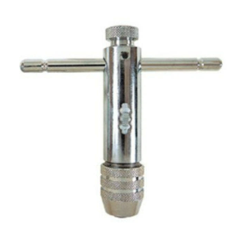

- 탭을 고정하여 손으로 나사산을 가공할 때 사용하는 공구입니다.
- 탭 렌치 또는 탭 핸들이라고 부릅니다.
- 주로 작은 나사산을 정밀하게 가공할 때 사용합니다.

<!--
발표자 노트 · 원문

#### 탭 핸들

탭을 고정하여 손으로 나사산을 가공할 때 사용하는 공구입니다.

탭 렌치 또는 탭 핸들이라고 부릅니다.

주로 작은 나사산을 정밀하게 가공할 때 사용합니다.

손으로 직접 돌리기 때문에 절삭 상태를 느끼면서 작업할 수 있고 작은 탭을 비교적 안전하게 사용할 수 있습니다.

반면 작업 속도가 느리고 탭을 정확하게 수직으로 유지해야 합니다.

탭은 작은 크기일수록 쉽게 파손되므로 천천히 작업해야 합니다.
-->

---

# 탭 작업 순서

- 센터펀치를 이용하여 드릴 시작점을 표시합니다.
- 드릴을 이용하여 탭 가공용 사전 홀을 만듭니다.
- 탭을 이용하여 내부 나사산을 가공합니다.
- 가공이 완료되면 볼트를 체결합니다.

<!--
발표자 노트 · 원문

#### 탭 작업 순서

탭 작업은 볼트를 체결할 수 있도록 구멍 내부에 나사산을 만드는 작업입니다.

일반적인 작업 순서는 다음과 같습니다.

1. 센터펀치를 이용하여 드릴 시작점을 표시합니다.
2. 드릴을 이용하여 탭 가공용 사전 홀을 만듭니다.
3. 탭을 이용하여 내부 나사산을 가공합니다.
4. 가공이 완료되면 볼트를 체결합니다.
-->

---

# 탭 드릴 사이즈

- 탭을 가공하기 전에 사용하는 사전 홀의 크기는 나사 규격에 따라 달라집니다.
- 대표적인 미터 보통나사 기준은 다음과 같습니다.
- 같은 M 규격이라도 피치가 다른 세목나사를 사용하면 필요한 탭 드릴 크기도 달라질 수 있으므로 실제 작업 전에 규…

<!--
발표자 노트 · 원문

#### 탭 드릴 사이즈

탭을 가공하기 전에 사용하는 사전 홀의 크기는 나사 규격에 따라 달라집니다.

대표적인 미터 보통나사 기준은 다음과 같습니다.

| 나사 규격 | 피치 | 대표 탭 드릴 |
| —- | —- | —- |
| M3 | 0.5 mm | 2.5 mm |
| M4 | 0.7 mm | 3.3 mm |
| M5 | 0.8 mm | 4.2 mm |
| M6 | 1.0 mm | 5.0 mm |
| M8 | 1.25 mm | 6.8 mm |
| M10 | 1.5 mm | 8.5 mm |

같은 M 규격이라도 피치가 다른 세목나사를 사용하면 필요한 탭 드릴 크기도 달라질 수 있으므로 실제 작업 전에 규격을 확인해야 합니다.
-->

---

# 탭 작업 시 주의 사항

- 탭을 가공면에 최대한 수직으로 유지합니다.
- 무리하게 힘을 가하지 않습니다.
- 금속 가공에서는 탭핑유 또는 절삭유를 사용합니다.
- 절삭칩이 쌓이지 않도록 관리합니다.

<!--
발표자 노트 · 원문

#### 탭 작업 시 주의 사항

탭 가공에서는 탭 파손을 가장 주의해야 합니다.

특히 작은 탭은 매우 쉽게 부러질 수 있으며 부품 내부에서 파손되면 제거하기가 매우 어렵습니다.

따라서 다음 사항을 확인하면서 작업합니다.

- 탭을 가공면에 최대한 수직으로 유지합니다.
- 무리하게 힘을 가하지 않습니다.
- 금속 가공에서는 탭핑유 또는 절삭유를 사용합니다.
- 절삭칩이 쌓이지 않도록 관리합니다.
- 작은 탭일수록 천천히 작업합니다.
- 탭이 뻑뻑해지면 억지로 계속 돌리지 않습니다.

탭 작업은 속도보다 정확성이 중요합니다.
-->

---

# 공구 선택의 기본 원칙

- PH1, PH2 십자 드라이버
- 소형 일자 드라이버
- 정밀 드라이버 세트
- 1.5~6 mm 정도의 육각렌치 세트

<!--
발표자 노트 · 원문

#### 공구 선택의 기본 원칙

자동화 장비를 제작할 때 모든 종류의 공구를 갖출 필요는 없습니다.

다만 다음과 같은 공구는 자주 사용하기 때문에 기본적으로 준비해 두면 좋습니다.

- PH1, PH2 십자 드라이버
- 소형 일자 드라이버
- 정밀 드라이버 세트
- 1.5~6 mm 정도의 육각렌치 세트
- 볼엔드 육각렌치 세트
- 스패너 세트
- 몽키 스패너
- 비트 교환식 드라이버
- 소형 라쳇과 비트 세트
- 드릴 및 드릴 비트
- M3~M6 정도의 탭
- 탭 핸들
- 센터펀치

특히 자동화 장비에서는 육각 소켓 볼트를 매우 자주 사용합니다.

알루미늄 프로파일, LM 가이드, 모터 브라켓, 풀리 등 다양한 기계 부품에서 육각 볼트를 쉽게 볼 수 있기 때문에 육각렌치 사용에 익숙해지는 것이 좋습니다.
-->
