<!-- _class: title -->

# 05-04. 전동공구

## 핵심 개념과 실무 적용

---

# 전동공구

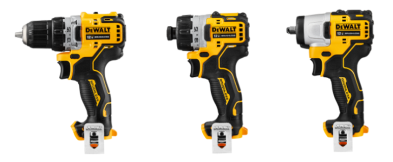

- 드릴 드라이버
- 해머 드릴 드라이버
- 스크류 드라이버

<!--
발표자 노트 · 원문

# 전동공구

기계 조립에서는 수공구만으로도 대부분의 작업이 가능하지만, 반복 작업이 많거나 높은 토크가 필요한 경우에는 전동공구를 사용하면 작업 시간을 크게 줄일 수 있습니다.

전동공구는 비슷하게 생긴 제품이 많지만 내부 구조와 용도가 서로 다릅니다.

대표적으로 다음과 같이 구분할 수 있습니다.

- 드릴 드라이버
- 해머 드릴 드라이버
- 스크류 드라이버
- 임팩 드라이버
- 임팩 렌치
- 전동 라쳇
- 로터리 해머
- 앵글 드릴

자동화 장비 제작에서는 특히 드릴 드라이버와 스크류 드라이버의 활용도가 높습니다.
-->

---

# 드릴 드라이버

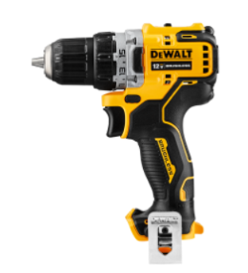

- 작은 구멍 가공
- 일반 볼트 체결
- 목재 및 플라스틱 가공

<!--
발표자 노트 · 원문

#### 드릴 드라이버

가장 일반적으로 사용하는 전동공구입니다.

앞부분에 드릴 척이 장착되어 있어 다양한 형태의 드릴 비트와 공구를 고정할 수 있습니다.

일반적으로 키리스척을 많이 사용합니다.

사용

- 작은 구멍 가공
- 일반 볼트 체결
- 목재 및 플라스틱 가공
- 얇은 금속 드릴링
- 탭 가공 전 사전 홀 작업

장점

- 다양한 직경의 원형 생크 드릴 비트를 사용할 수 있습니다.
- 육각 비트도 사용할 수 있습니다.
- 하나의 공구로 드릴링과 볼트 체결이 가능합니다.
- 토크 클러치를 이용하여 체결 토크를 제한할 수 있습니다.
- 자동화 장비 제작에서 가장 범용적으로 사용할 수 있습니다.

단점

- 비트를 교체할 때 척을 열고 닫아야 하므로 퀵 홀더보다 느립니다.
- 높은 토크 작업에서는 척이 풀릴 수 있습니다.
- 임팩 드라이버보다 강한 체결에는 불리합니다.

드릴 드라이버는 기계 제작용 전동공구를 하나만 준비해야 한다면 가장 먼저 추천할 수 있는 공구입니다.
-->

---

# 토크 클러치

- 작은 볼트 파손
- 나사 머리 손상
- 플라스틱 나사산 손상
- 과도한 체결

<!--
발표자 노트 · 원문

#### 토크 클러치

드릴 드라이버나 일부 스크류 드라이버에는 토크 클러치가 있습니다.

일반적으로 헤드 뒤쪽의 숫자가 표시된 링을 회전하여 설정합니다.

설정한 토크보다 큰 힘이 발생하면 내부 클러치가 미끄러지면서 더 이상 강한 힘을 전달하지 않습니다.

이를 이용하면 다음과 같은 문제를 줄일 수 있습니다.

- 작은 볼트 파손
- 나사 머리 손상
- 플라스틱 나사산 손상
- 과도한 체결
- 부품 변형

특히 M3~M5 볼트를 많이 사용하는 자동화 장비나 3D 프린팅 부품을 조립할 때 유용합니다.
-->

---

# 해머 드릴 드라이버

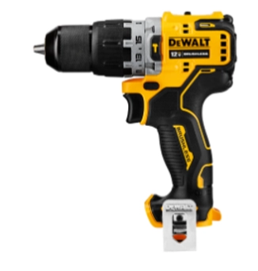

- 일반 드릴링
- 볼트 체결
- 벽돌

<!--
발표자 노트 · 원문

#### 해머 드릴 드라이버

해머 드릴 드라이버는 일반 드릴 드라이버에 타격 기능이 추가된 형태입니다.

일반적인 회전 운동과 함께 축 방향으로 반복적인 타격을 발생시킵니다.

사용

- 일반 드릴링
- 볼트 체결
- 벽돌
- 블록
- 경량 콘크리트 등의 홀 가공

장점

- 일반 드릴 드라이버 기능을 대부분 사용할 수 있습니다.
- 타격 기능을 이용하여 석재 계열 재료의 홀 가공이 더 쉽습니다.
- 하나의 공구로 일반 드릴과 해머 드릴 기능을 함께 사용할 수 있습니다.

단점

- 일반 드릴 드라이버보다 무겁고 가격이 높은 편입니다.
- 타격 모드에서는 진동과 소음이 발생합니다.
- 정밀한 금속 가공에서는 해머 기능을 사용하지 않습니다.

자동화 장비 조립에서는 해머 기능을 사용할 일이 많지 않지만, 장비를 바닥이나 벽에 고정하는 작업에서는 유용할 수 있습니다.
-->

---

# 스크류 드라이버

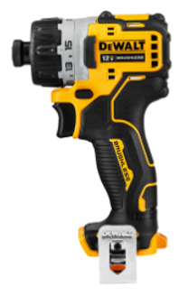

- 작은 볼트 체결
- 나사 체결
- 육각 비트를 이용한 조립

<!--
발표자 노트 · 원문

#### 스크류 드라이버

스크류 드라이버는 볼트와 나사를 빠르게 체결하기 위한 전동공구입니다.

드릴 드라이버와 비슷한 외형을 가지지만 앞부분에 주로 1/4인치 육각 비트 홀더를 사용합니다.

사용

- 작은 볼트 체결
- 나사 체결
- 육각 비트를 이용한 조립
- 육각 생크 형태의 탭 비트 사용

장점

- 비트를 빠르게 교체할 수 있습니다.
- 척을 조이거나 풀 필요가 없어 반복 작업이 편리합니다.
- 토크 클러치가 있는 제품은 체결력을 제한할 수 있습니다.
- 볼트 손상을 줄일 수 있습니다.

단점

- 일반 원형 생크 드릴 비트는 직접 사용할 수 없습니다.
- 높은 토크 작업에는 임팩 드라이버보다 불리합니다.

실제 작업에서는 다음과 같이 두 대를 함께 사용하면 편리합니다.

드릴 드라이버

→ 드릴 비트를 장착하여 홀 가공

스크류 드라이버

→ 비트 또는 탭 비트를 장착하여 체결 작업

이렇게 하면 작업할 때마다 비트를 계속 교체하지 않아도 됩니다.
-->

---

# 임팩 드라이버

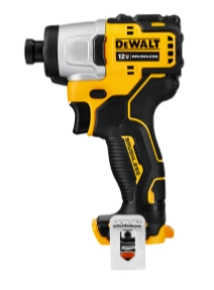

- 강하게 체결된 볼트 해체
- 긴 나사 체결
- 높은 토크가 필요한 조립

<!--
발표자 노트 · 원문

#### 임팩 드라이버

임팩 드라이버는 회전 방향으로 순간적인 충격을 반복해서 발생시키는 전동공구입니다.

앞부분에는 일반적으로 1/4인치 육각 비트 홀더를 사용합니다.

사용

- 강하게 체결된 볼트 해체
- 긴 나사 체결
- 높은 토크가 필요한 조립
- 목재 구조물 조립
- 기계 구조물 체결

장점

- 일반 드릴 드라이버보다 높은 토크를 전달할 수 있습니다.
- 강하게 체결된 나사를 풀기 좋습니다.
- 긴 나사나 큰 나사를 빠르게 체결할 수 있습니다.
- 육각 비트를 빠르게 교환할 수 있습니다.

단점

- 충격이 발생하기 때문에 정밀 체결에는 적합하지 않습니다.
- 일반적인 토크 클러치가 없는 제품이 많습니다.
- 작은 볼트에 사용하면 볼트나 나사산을 손상시킬 수 있습니다.
- 저품질 비트는 강한 충격으로 파손될 수 있습니다.
- 소음이 큽니다.

자동화 장비에서 사용하는 M3~M5 볼트에는 임팩 드라이버의 힘이 지나치게 클 수 있으므로 주의해야 합니다.
-->

---

# 임팩용 비트

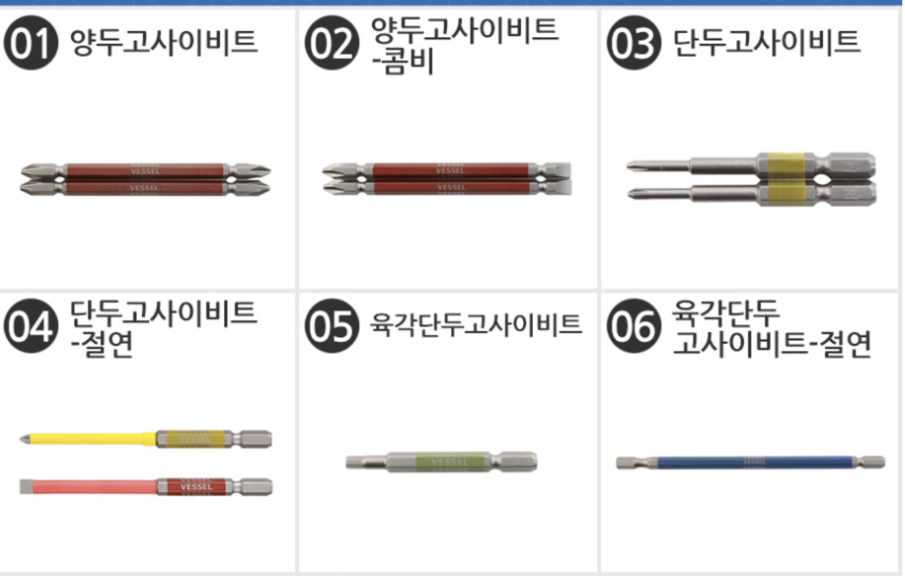

- 비트 끝부분 파손
- 육각 생크 파손
- 나사 머리 손상

<!--
발표자 노트 · 원문

#### 임팩용 비트

임팩 드라이버에는 일반 드라이버 비트보다 임팩용으로 설계된 비트를 사용하는 것이 좋습니다.

임팩용 비트는 반복적인 충격을 견딜 수 있도록 만들어집니다.

일반 비트를 사용하면 다음과 같은 문제가 발생할 수 있습니다.

- 비트 끝부분 파손
- 육각 생크 파손
- 나사 머리 손상

따라서 임팩 드라이버를 사용할 때는 비트에도 `Impact Rated` 또는 임팩용 표시가 있는지 확인하는 것이 좋습니다.
-->

---

# 임팩 렌치

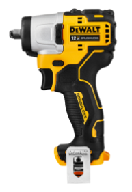

- 자동차 휠 너트
- 대형 설비
- 큰 육각 볼트

<!--
발표자 노트 · 원문

#### 임팩 렌치

임팩 렌치는 임팩 드라이버보다 훨씬 높은 토크를 발생시키는 공구입니다.

앞부분에는 육각 비트 홀더가 아니라 사각 드라이브(Square Drive)가 사용됩니다.

주로 소켓을 장착하여 사용합니다.

사용

- 자동차 휠 너트
- 대형 설비
- 큰 육각 볼트
- 높은 토크가 필요한 체결 및 해체

장점

- 매우 높은 토크를 발생시킬 수 있습니다.
- 강하게 조여진 볼트나 너트를 쉽게 풀 수 있습니다.
- 임팩용 소켓을 사용하기 때문에 큰 볼트 작업에 적합합니다.

단점

- 작은 볼트에는 지나치게 강한 힘이 전달될 수 있습니다.
- 정밀 체결에는 적합하지 않습니다.
- 일반적으로 토크 클러치가 없습니다.
- 공구 자체가 크고 무겁습니다.

자동화 교육용 소형 장비에서는 사용할 일이 많지 않지만 큰 기계 설비나 차량 정비에서는 매우 유용합니다.
-->

---

# 임팩 렌치의 사각 드라이브 규격

- 1/4 inch
- 3/8 inch
- 1/2 inch
- 3/4 inch

<!--
발표자 노트 · 원문

#### 임팩 렌치의 사각 드라이브 규격

임팩 렌치는 사각 드라이브의 크기에 따라 여러 규격으로 구분됩니다.

대표적으로 다음과 같습니다.

- 1/4 inch
- 3/8 inch
- 1/2 inch
- 3/4 inch
- 1 inch

일반적인 사용 경향은 다음과 같습니다.

**1/4 inch**

소형 라쳇이나 작은 소켓 작업에 사용합니다.

**3/8 inch**

중소형 기계 작업과 차량 정비에서 사용하기 좋습니다.

**1/2 inch**

자동차 휠 너트와 대형 볼트 등에서 매우 많이 사용합니다.

**3/4 inch 이상**

대형 설비와 중장비 등 매우 높은 토크가 필요한 작업에 사용합니다.

공구의 크기가 커질수록 일반적으로 사용할 수 있는 소켓과 전달 가능한 토크도 커집니다.
-->

---

# 임팩용 소켓

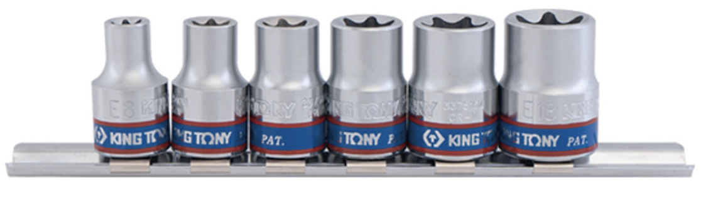

- 임팩 렌치에는 반드시 임팩용 소켓을 사용하는 것이 좋습니다.
- 일반 라쳇용 소켓과 임팩용 소켓은 외형이 비슷하지만 설계 목적이 다릅니다.
- 임팩용 소켓은 반복적인 충격을 견딜 수 있도록 만들어집니다.

<!--
발표자 노트 · 원문

#### 임팩용 소켓

임팩 렌치에는 반드시 임팩용 소켓을 사용하는 것이 좋습니다.

일반 라쳇용 소켓과 임팩용 소켓은 외형이 비슷하지만 설계 목적이 다릅니다.

임팩용 소켓은 반복적인 충격을 견딜 수 있도록 만들어집니다.

따라서 일반 소켓을 임팩 렌치에 사용하면 파손될 위험이 있습니다.
-->

---

# 전동 라쳇

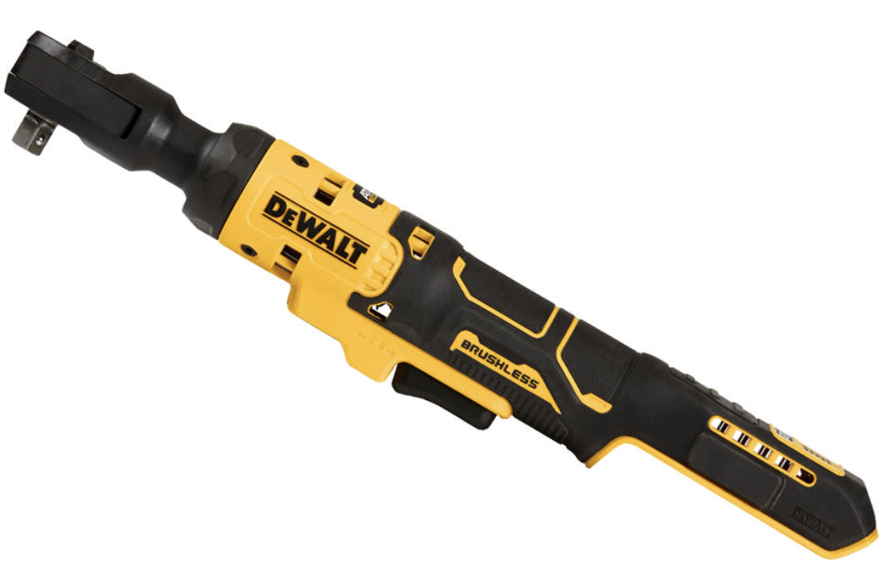

- 1/4 inch
- 3/8 inch
- 반복적인 볼트 체결

<!--
발표자 노트 · 원문

#### 전동 라쳇

전동 라쳇은 수동 라쳇을 전동으로 회전시킬 수 있도록 만든 공구입니다.

앞부분에는 일반 라쳇과 동일하게 사각 드라이브가 사용됩니다.

대표적으로 다음과 같은 규격을 사용합니다.

- 1/4 inch
- 3/8 inch

사용

- 반복적인 볼트 체결
- 장비 조립
- 차량 정비
- 좁은 공간의 볼트 작업

장점

- 일반 라쳇보다 훨씬 빠르게 볼트를 조이거나 풀 수 있습니다.
- 임팩 렌치보다 작아 좁은 공간에 접근하기 쉽습니다.
- 반복적인 볼트 작업에서 피로를 크게 줄일 수 있습니다.
- 일반 소켓을 다양하게 교체하여 사용할 수 있습니다.

단점

- 임팩 렌치만큼 높은 토크를 발생시키지는 못합니다.
- 최종 체결에는 손으로 추가 체결해야 하는 경우가 있습니다.
- 헤드 부분이 일반 드라이버보다 크기 때문에 매우 좁은 공간에는 들어가지 않을 수 있습니다.

전동 라쳇은 자동화 장비를 반복해서 조립할 때 상당히 편리한 공구입니다.
-->

---

# 전동 라쳇과 임팩 렌치의 차이

- 두 공구 모두 소켓을 사용하지만 목적이 다릅니다.
- 자동화 장비에서는 강한 힘보다 빠른 반복 조립이 필요한 경우가 많기 때문에 전동 라쳇의 활용도가 높을 수 있습니다.

<!--
발표자 노트 · 원문

#### 전동 라쳇과 임팩 렌치의 차이

두 공구 모두 소켓을 사용하지만 목적이 다릅니다.

| 구분 | 전동 라쳇 | 임팩 렌치 |
| —- | —- | —- |
| 주목적 | 빠른 반복 체결 | 강한 체결 및 해체 |
| 토크 | 중·저토크 | 고토크 |
| 충격 | 없음 | 있음 |
| 크기 | 비교적 작음 | 비교적 큼 |
| 정밀 조립 | 비교적 유리 | 불리 |
| 차량 휠 | 부적합 | 적합 |
| 자동화 장비 조립 | 유용 | 제한적 |

자동화 장비에서는 강한 힘보다 빠른 반복 조립이 필요한 경우가 많기 때문에 전동 라쳇의 활용도가 높을 수 있습니다.
-->

---

# 로터리 해머

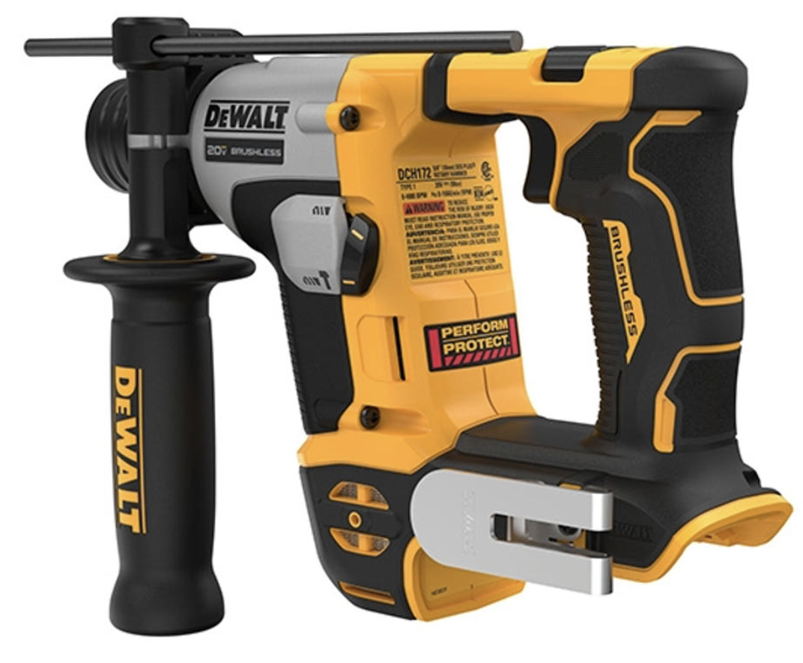

- 콘크리트 홀 가공
- 앵커 설치
- 장비 바닥 고정

<!--
발표자 노트 · 원문

#### 로터리 해머

로터리 해머는 콘크리트나 석재에 큰 구멍을 가공하기 위한 전동공구입니다.

외형은 해머 드릴과 비슷하지만 내부 작동 방식과 타격력이 훨씬 강합니다.

주로 SDS 계열의 전용 비트를 사용합니다.

사용

- 콘크리트 홀 가공
- 앵커 설치
- 장비 바닥 고정
- 벽면 설치 작업

장점

- 콘크리트 가공 능력이 매우 좋습니다.
- 큰 홀을 비교적 쉽게 가공할 수 있습니다.
- 일부 제품은 치즐 작업도 가능합니다.

단점

- 크고 무겁습니다.
- 정밀한 금속 가공에는 사용할 수 없습니다.
- 소음과 진동이 큽니다.

자동화 설비 자체를 제작할 때보다는 장비를 공장 바닥에 앵커로 고정할 때 사용하는 경우가 많습니다.
-->

---

# 해머 드릴과 로터리 해머의 차이

- 일반 드릴 기능 중심
- 필요할 때 가벼운 타격 기능 사용
- 벽돌이나 소규모 콘크리트 작업에 적합
- 강한 타격 가공 중심

<!--
발표자 노트 · 원문

#### 해머 드릴과 로터리 해머의 차이

두 공구는 비슷해 보이지만 목적이 다릅니다.

**해머 드릴**

- 일반 드릴 기능 중심
- 필요할 때 가벼운 타격 기능 사용
- 벽돌이나 소규모 콘크리트 작업에 적합

**로터리 해머**

- 강한 타격 가공 중심
- 콘크리트 가공에 특화
- 앵커 홀과 같은 큰 작업에 적합

따라서 단순한 자동화 장비 조립에서는 해머 드릴 정도면 충분하지만, 공장 바닥에 장비를 고정해야 한다면 로터리 해머가 필요할 수 있습니다.
-->

---

# 앵글 드릴

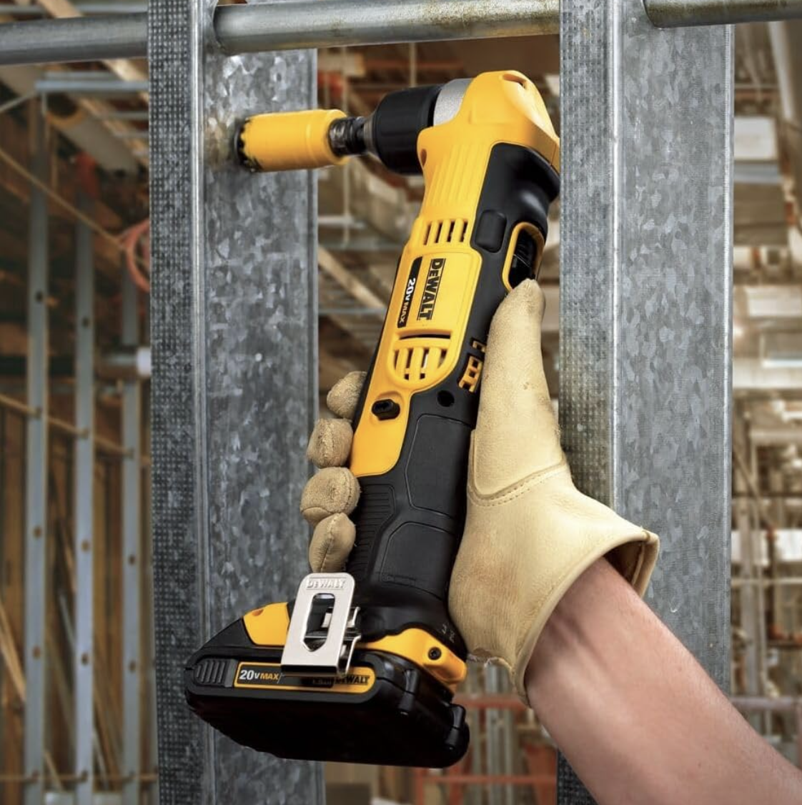

- 장비 내부
- 프레임 안쪽
- 좁은 위치의 홀 가공

<!--
발표자 노트 · 원문

#### 앵글 드릴

앵글 드릴은 드릴 헤드가 몸체와 직각에 가까운 구조로 만들어진 공구입니다.

일반 드릴이 들어가지 않는 좁은 공간에서 사용합니다.

사용

- 장비 내부
- 프레임 안쪽
- 좁은 위치의 홀 가공
- 좁은 공간의 체결 작업

장점

- 일반 드릴이 들어가지 않는 공간에서 작업할 수 있습니다.
- 기계 구조물 내부 작업에 유용합니다.

단점

- 일반 드릴보다 사용 범위가 제한적입니다.
- 높은 토크 작업에는 불리할 수 있습니다.
- 별도 공구를 준비해야 합니다.

자동화 장비를 설계할 때 이런 공구가 필요할 정도로 체결 위치가 지나치게 좁다면 구조 자체를 다시 검토하는 것도 좋은 방법입니다.
-->

---

# 전동 탭핑 작업

- 저속으로 작업합니다.
- 가능한 한 공구를 수직으로 유지합니다.
- 높은 토크를 갑자기 가하지 않습니다.
- 적절한 탭핑유를 사용합니다.

<!--
발표자 노트 · 원문

#### 전동 탭핑 작업

탭 가공은 수동 탭 핸들뿐만 아니라 전동 드릴이나 전동 스크류 드라이버를 이용해서도 수행할 수 있습니다.

특히 반복적으로 많은 탭을 가공해야 하는 경우 작업 시간을 크게 줄일 수 있습니다.

다만 탭은 파손되기 쉬우므로 주의해야 합니다.

전동 탭 작업에서는 다음 사항이 중요합니다.

- 저속으로 작업합니다.
- 가능한 한 공구를 수직으로 유지합니다.
- 높은 토크를 갑자기 가하지 않습니다.
- 적절한 탭핑유를 사용합니다.
- 작은 M3, M4 탭에서는 특히 주의합니다.

초보자라면 작은 탭은 먼저 수동으로 연습한 뒤 전동공구를 사용하는 것이 좋습니다.
-->
