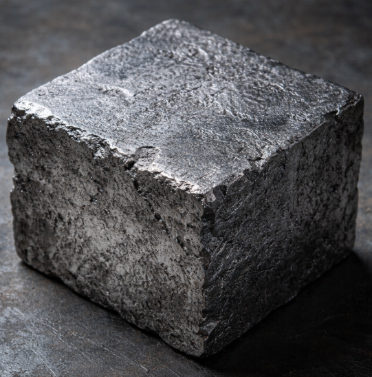
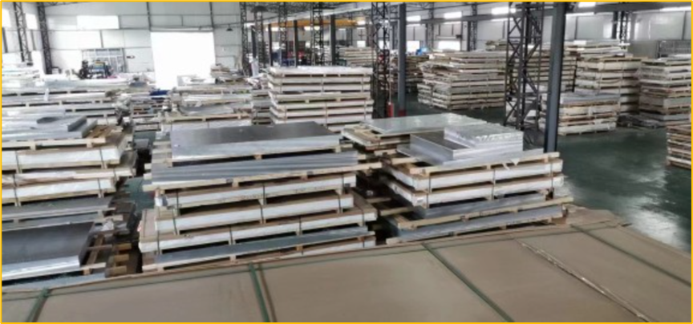
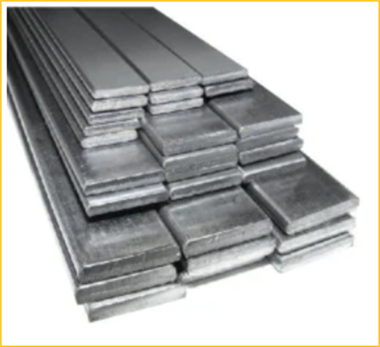
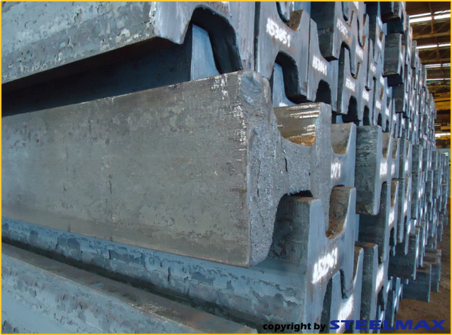
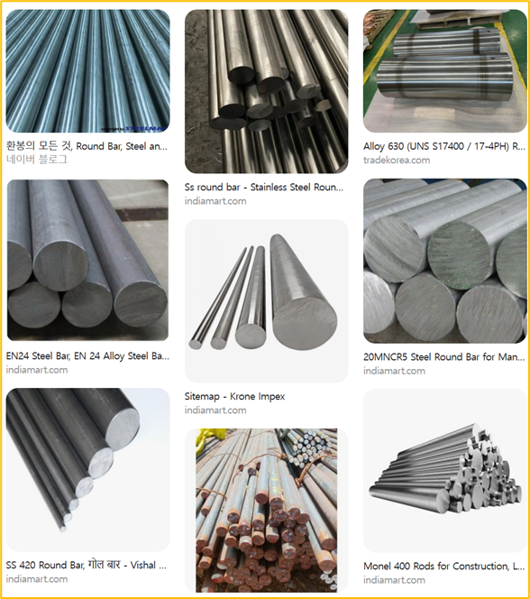
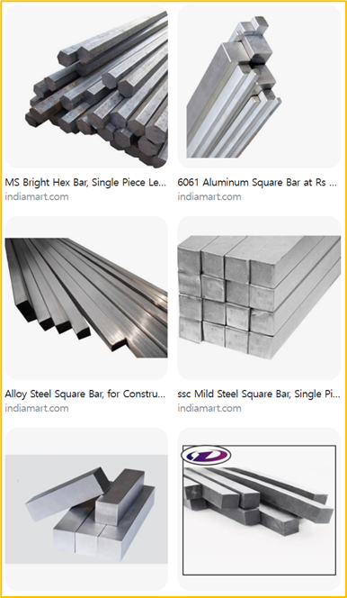
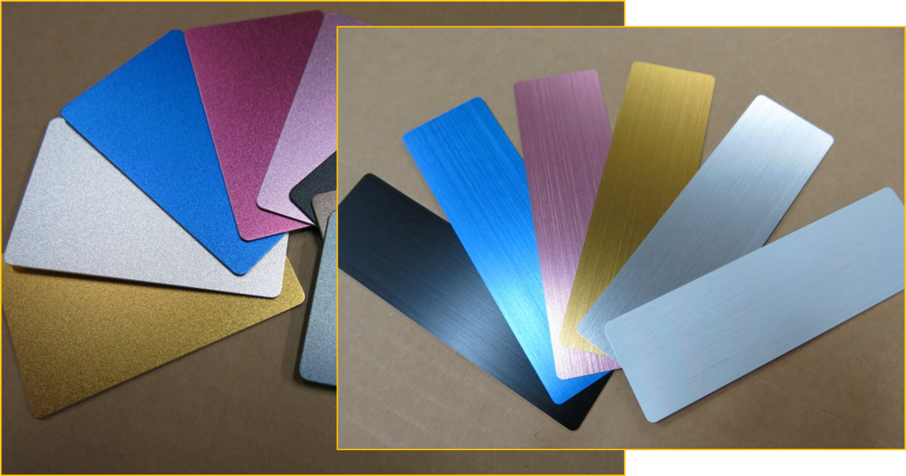
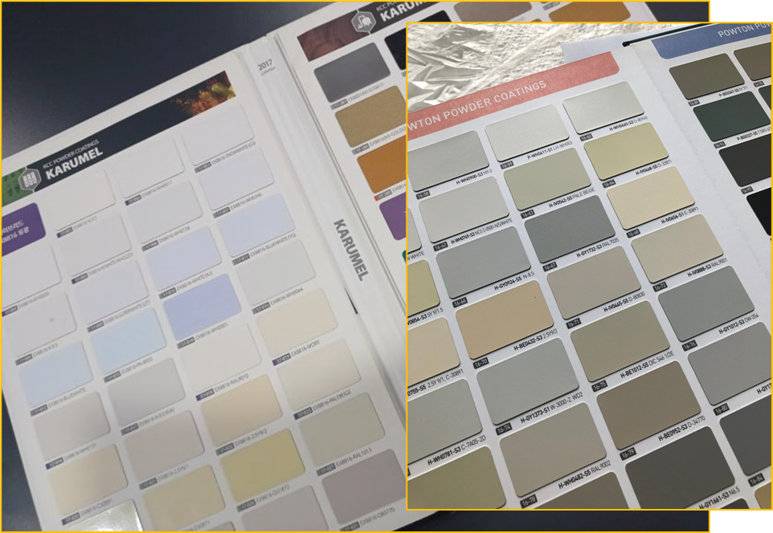
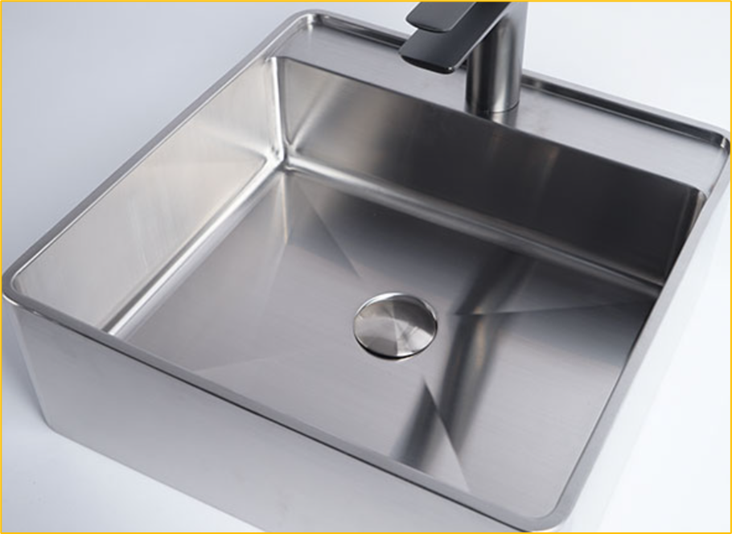

# 기계 재료의 종류와 특성

#### 기계 재료의 종류와 특성

본격적으로 기계 설계에서 사용하는 재료에 대해 알아보겠습니다.

앞에서는 원자와 원소, 화학 결합에 대한 기초적인 내용을 살펴보았습니다.

이 내용은 기계 재료가 왜 서로 다른 특성을 가지는지 이해하기 위한 도입 과정이므로 모든 내용을 완벽하게 기억할 필요는 없습니다.

여기에서는 다음 정도만 기억하면 충분합니다.

- 실제 기계 재료는 하나의 순수한 원소보다는 여러 원소를 조합한 합금 형태로 많이 사용된다.
- 철(Fe)은 기계 구조물과 부품에 가장 널리 사용되는 금속 원소 중 하나이다.
- 알루미늄(Al)은 가볍고 가공성이 좋아 자동화 장비의 프레임과 부품에 널리 사용된다.
- 철은 산소와 수분에 의해 부식되기 쉽다.
- 알루미늄도 산화되지만 표면에 치밀한 산화막이 형성되어 내부의 부식을 억제한다.
- 철에 크롬(Cr), 니켈(Ni) 등의 원소를 첨가하면 내식성이 높은 스테인리스강을 만들 수 있다.

> 전기·전자 분야에서는 구리(Cu)가 중요한 도전 재료로 사용되며, 반도체 분야에서는 실리콘(Si)이 대표적인 재료로 사용됩니다.
> 

일반적인 기계 및 자동화 분야에서는 다음 세 가지 금속 재료를 특히 자주 접하게 됩니다.

- 철강
- 알루미늄
- 스테인리스강

여기에 기어, 가이드, 커버, 3D 프린팅 부품 등에서는 다양한 플라스틱 재료가 함께 사용됩니다.

---

#### 철과 철강

철(Iron)은 화학 원소 Fe를 의미합니다.

하지만 실제 기계 구조물이나 부품에서는 순수한 철을 그대로 사용하는 경우가 많지 않습니다.

철에 탄소(C)를 비롯한 여러 원소를 첨가하여 강도, 경도, 내마모성 등의 특성을 조절한 철강 재료를 주로 사용합니다.

철을 기반으로 하는 재료는 크게 다음과 같이 구분할 수 있습니다.

**순철**

- 탄소와 다른 원소의 함량이 매우 낮은 철
- 비교적 부드럽고 강도가 낮음
- 일반적인 기계 구조용 재료로는 제한적으로 사용

**탄소강**

- 철에 탄소를 포함시킨 강
- 기계와 구조물에서 가장 널리 사용되는 금속 재료
- 탄소 함량과 열처리에 따라 강도와 경도가 달라짐

**합금강**

- 탄소강에 크롬, 니켈, 몰리브덴 등의 합금 원소를 추가한 강
- 필요한 강도, 경도, 내식성, 내열성 등의 특성을 얻기 위해 사용

**주철**

- 강에 비해 탄소 함량이 높은 철계 재료
- 주조성이 우수하여 복잡한 형상을 만들기 좋음
- 압축 하중에는 강하지만 종류에 따라 충격에 취약할 수 있음
- 기계 베드, 하우징, 풀리 등 다양한 부품에 사용

즉, 우리가 일반적으로 기계 설계에서 말하는 “철”은 순수한 철이라기보다는 대부분 철을 기반으로 만들어진 철강 재료를 의미합니다.

---

#### 일반 구조용 압연강재

기계 프레임, 브라켓, 지지대와 같이 일반적인 구조물을 제작할 때 가장 쉽게 접할 수 있는 재료 중 하나가 일반 구조용 압연강재입니다.

대표적으로 SS 계열이 널리 알려져 있습니다.

- SS275
- SS400 등의 명칭이 현장에서 사용됨

과거부터 SS400이라는 명칭이 매우 널리 사용되어 왔기 때문에 현재도 현장에서 흔히 접할 수 있습니다.

SS 계열은 정밀한 기계 부품보다는 다음과 같은 일반 구조물에 적합합니다.

- 장비 프레임
- 베이스
- 브라켓
- 지지 구조물
- 용접 구조물

특별한 기계적 특성이 요구되지 않고 가격과 제작성이 중요한 구조물에 널리 사용됩니다.

---

#### 인장강도

금속 재료의 강도를 비교할 때 자주 사용되는 값 중 하나가 인장강도(Tensile Strength)입니다.

인장강도는 재료의 양쪽을 잡아당겼을 때 파단되기 전까지 견딜 수 있는 최대 인장 응력을 의미합니다.

일반적으로 다음과 같은 단위를 사용합니다.

N/mm² 또는 MPa

1 N/mm²는 1 MPa와 같습니다.

예를 들어 인장강도가 400 MPa인 재료라면 1 mm²의 단면적을 기준으로 약 400 N의 인장 응력에 해당하는 수준에서 최대 강도를 나타낸다는 의미입니다.

단, 실제 부품을 설계할 때는 인장강도만을 기준으로 사용하지 않습니다.

- 항복강도
- 안전율
- 반복 하중
- 충격
- 온도
- 가공 상태

등을 함께 고려해야 합니다.

기초 과정에서는 인장강도를 “재료가 끊어지기 전까지 버틸 수 있는 대표적인 강도 지표” 정도로 이해하면 충분합니다.

---

#### 주요 강재의 형상

철강 재료는 필요한 형상에 따라 다양한 형태로 공급됩니다.

같은 재료라도 어떤 형상으로 구매하는가에 따라 제작 방법이 크게 달라집니다.

---

#### 판재

판재(Plate)는 일정한 두께를 가진 평평한 금속 재료입니다.

- 절단이 용이
- 절곡 가능
- 용접 가능
- 브라켓이나 커버 제작에 적합

자동화 장비에서는 다음과 같은 곳에 많이 사용됩니다.

- 장비 커버
- 센서 브라켓
- 모터 브라켓
- 전기 판넬
- 베이스 플레이트

레이저 커팅이나 워터젯 등을 이용하면 복잡한 외곽 형상과 구멍도 쉽게 가공할 수 있습니다.

---

#### 평철

평철(Flat Bar)은 폭과 두께가 일정한 긴 직사각형 단면의 재료입니다.

판재를 길게 잘라 놓은 것과 비슷한 형태를 가지고 있습니다.

- 절단이 간단함
- 드릴 가공이 쉬움
- 용접이 용이함
- 간단한 지지 구조 제작에 적합

프레임 보강재, 브라켓, 지지대 등에 많이 사용됩니다.

---

#### 형강

형강(Structural Section)은 특정한 단면 형상으로 길게 제작된 구조용 재료입니다.

대표적으로 다음과 같은 형상이 있습니다.

- H형강
- I형강
- ㄱ형강(Angle)
- ㄷ형강(Channel)

단면 형상을 효율적으로 구성하여 적은 재료로도 높은 강성과 구조적 성능을 얻을 수 있습니다.

건축 구조물뿐만 아니라 대형 장비의 프레임과 베이스에도 사용됩니다.

---

#### 원형봉

원형봉(Round Bar)은 원형 단면을 가진 긴 봉재입니다.

주로 선반 가공을 통해 회전체나 축 부품을 제작하는 데 사용됩니다.

- 축
- 핀
- 샤프트
- 롤러
- 부싱 소재

등을 제작하는 데 적합합니다.

---

#### 각재

각재(Square Bar)는 사각형 단면을 가진 봉재입니다.

- 지지대
- 가이드
- 프레임 부품
- 각종 가공 부품

등을 제작하는 데 사용됩니다.

---

#### 기계 구조용 탄소강

일반 구조물이 아니라 축, 기어, 핀과 같은 기계 부품을 제작할 때는 기계 구조용 탄소강을 많이 사용합니다.

대표적으로 현장에서 많이 알려진 재료가 SM45C입니다.

SM45C는 약 0.45% 수준의 탄소를 포함하는 중탄소강으로 다음과 같은 부품에 많이 사용됩니다.

- 축
- 샤프트
- 핀
- 기어
- 기계 가공 부품

일반 구조용 강재보다 기계 부품에 필요한 강도와 열처리 특성을 활용하기 좋습니다.

현재 규격에서는 명칭 체계가 변경된 경우가 있지만 현장에서는 SM45C라는 기존 명칭도 여전히 널리 사용됩니다.

---

#### 침탄과 표면 경화

기계 부품에서는 표면과 내부에 서로 다른 특성이 필요한 경우가 있습니다.

예를 들어 기어를 생각해 보겠습니다.

기어의 표면은 다른 기어와 계속 접촉하기 때문에 마모에 강해야 합니다.

하지만 부품 전체가 지나치게 단단하면 충격에 의해 깨질 위험이 높아질 수 있습니다.

따라서 다음과 같은 특성이 유리합니다.

- 표면 : 단단함
- 내부 : 충격을 견딜 수 있는 인성 유지

이를 구현하는 방법 중 하나가 침탄(Carburizing)입니다.

침탄은 저탄소강 부품의 표면에 탄소를 확산시킨 뒤 열처리하여 표면을 단단하게 만드는 방법입니다.

대표적인 침탄용 강에는 S15CK, S20CK 등의 재료가 있습니다.

즉, 침탄은 부품 전체의 특성을 동일하게 만드는 것이 아니라 필요한 표면에 높은 경도를 부여하기 위한 방법입니다.

---

#### 합금강

합금강(Alloy Steel)은 탄소강에 다른 합금 원소를 첨가하여 필요한 성질을 얻은 강재입니다.

첨가되는 원소에 따라 다음과 같은 특성을 변화시킬 수 있습니다.

- 강도
- 경도
- 인성
- 내마모성
- 내식성
- 내열성

대표적인 합금 원소로는 다음과 같은 것들이 있습니다.

- Cr : 크롬
- Ni : 니켈
- Mo : 몰리브덴
- Mn : 망간
- V : 바나듐

합금강은 사용 목적에 따라 매우 다양한 종류로 만들어집니다.

예를 들어 다음과 같습니다.

- 구조용 합금강 : 강도와 내구성을 중요하게 하는 부품
- 공구강 : 절삭성과 경도, 내마모성을 중요하게 하는 공구
- 스프링강 : 반복적인 탄성 변형에 적합한 재료
- 스테인리스강 : 내식성을 중요하게 하는 재료
- 내열강 : 고온 환경에서 사용하는 재료
- 베어링강 : 높은 경도와 내마모성이 필요한 베어링 재료

기초적으로는 합금 원소를 추가함으로써 철의 성질을 목적에 맞게 변화시킬 수 있다고 이해하면 충분합니다.

---

#### 알루미늄

알루미늄(Al)은 자동화 장비에서 철과 함께 매우 자주 사용되는 금속 재료입니다.

> 가볍고 가공하기 쉬우며 외관이 우수하여 자동화 장비와 정밀 기계에서 활용도가 매우 높은 재료입니다.
> 

알루미늄의 가장 큰 특징은 무게입니다.

밀도는 약 2.7 g/cm³ 정도로 철강의 약 1/3 수준입니다.

따라서 동일한 체적이라면 철강보다 훨씬 가벼운 구조를 만들 수 있습니다.

주요 특징은 다음과 같습니다.

- 가벼움
- 비교적 우수한 내식성
- 좋은 가공성
- 열전도성이 우수함
- 전기 전도성이 있음
- 압출 가공에 유리함
- 표면 처리를 통해 우수한 외관 구현 가능

특히 자동화 장비에서는 알루미늄 프로파일이 매우 널리 사용됩니다.

프로파일을 이용하면 용접 없이 볼트와 브라켓을 사용하여 장비의 프레임을 조립할 수 있습니다.

---

#### 알루미늄은 녹슬지 않는가

알루미늄도 산소와 반응하여 산화됩니다.

하지만 철과는 큰 차이가 있습니다.

철에서 발생하는 녹은 내부로 부식이 계속 진행될 수 있지만 알루미늄 표면에는 얇고 치밀한 산화 알루미늄층이 형성됩니다.

이 산화막이 내부의 알루미늄을 보호하는 역할을 합니다.

따라서 알루미늄은 일반적인 환경에서 철보다 내식성이 우수합니다.

이러한 특성을 인위적으로 더욱 강화하는 대표적인 표면 처리 방법이 아노다이징입니다.

---

#### 알루미늄 합금의 종류

순수한 알루미늄은 가볍고 전도성이 좋지만 구조용으로 사용하기에는 강도가 부족할 수 있습니다.

따라서 실제 산업에서는 다른 원소를 첨가한 알루미늄 합금을 많이 사용합니다.

알루미늄 합금은 주요 첨가 원소에 따라 여러 계열로 구분됩니다.

- 1xxx : 순알루미늄 계열
- 2xxx : 구리 계열, 고강도
- 3xxx : 망간 계열, 내식성과 가공성 우수
- 4xxx : 실리콘 계열, 용접재와 브레이징재 등에 활용
- 5xxx : 마그네슘 계열, 내식성이 우수하여 차량과 해양 분야에 활용
- 6xxx : 마그네슘·실리콘 계열, 구조재와 압출 프로파일에 널리 사용
- 7xxx : 아연 계열, 매우 높은 강도를 얻을 수 있음
- 8xxx : 기타 합금 원소를 사용하는 특수 용도

자동화 장비에서는 특히 6xxx 계열의 알루미늄을 자주 접하게 됩니다.

알루미늄 프로파일과 다양한 가공 부품에 널리 사용되는 계열입니다.

---

#### 알루미늄 표면 처리

알루미늄은 자체적으로도 비교적 우수한 내식성을 가지고 있지만 표면의 내구성, 내마모성, 내식성, 외관 등을 개선하기 위해 추가적인 표면 처리를 적용합니다.

대표적인 방법은 다음과 같습니다.

- 아노다이징
- 도장
- 도금

---

#### 아노다이징

아노다이징(Anodizing)은 전기화학적인 방법을 이용하여 알루미늄 표면의 산화막을 인위적으로 두껍게 형성하는 표면 처리 방법입니다.

알루미늄 표면에는 원래도 자연적인 산화막이 존재합니다.

아노다이징은 이 산화막을 보다 두껍고 균일하게 형성하여 표면 특성을 개선합니다.

일반적인 공정에서는 알루미늄을 양극(Anode)으로 사용하고 전해질 속에서 전류를 인가합니다.

그 결과 표면에 산화 알루미늄층이 형성됩니다.

주요 특징은 다음과 같습니다.

- 내식성 향상
- 표면 경도 향상
- 내마모성 개선
- 다양한 색상 구현 가능
- 외관 품질 향상

자동화 장비에서 사용되는 알루미늄 프로파일의 은색 또는 검은색 표면 역시 아노다이징 처리된 제품을 쉽게 볼 수 있습니다.

---

#### 도장

도장은 알루미늄 표면에 별도의 도료를 입혀 표면을 보호하고 원하는 색상을 구현하는 방법입니다.

대표적인 방식으로 다음과 같은 것들이 있습니다.

**분체 도장**

분말 형태의 도료를 정전기를 이용하여 표면에 부착한 뒤 열을 가하여 경화시키는 방법입니다.

- 내구성이 우수함
- 비교적 두꺼운 도막 형성 가능
- 다양한 색상 구현 가능
- 산업 장비와 프레임에 널리 사용

**불소 수지 도장**

내후성이 뛰어난 불소계 수지를 이용하는 방식입니다.

- 자외선과 기후 변화에 강함
- 장기간 색상과 광택 유지
- 건축 외장재 등에 많이 사용

**기능성 코팅**

사용 목적에 따라 내마모성, 내열성, 절연성 등의 특성을 부여하기 위한 다양한 기능성 코팅을 적용하기도 합니다.

도장의 종류는 매우 다양하므로 실제 설계에서는 사용 환경에 따라 적합한 표면 처리 방법을 선정해야 합니다.

---

#### 도금

도금은 금속 표면에 다른 금속층을 형성하는 방법입니다.

알루미늄은 표면의 안정적인 산화막 때문에 철이나 구리보다 도금 공정이 까다로우며 적절한 전처리가 필요합니다.

대표적으로 다음과 같은 금속층을 형성할 수 있습니다.

- 니켈
- 크롬
- 구리

목적에 따라 다음과 같은 특성을 개선할 수 있습니다.

- 내마모성
- 내식성
- 표면 경도
- 전기 전도성
- 외관

알루미늄에서는 일반적인 기계 부품의 표면 처리로 아노다이징이 매우 널리 사용되며, 도금은 특별한 기능이 필요한 경우 선택적으로 적용됩니다.

---

#### 구리

구리(Cu)는 기계 구조재보다는 전기·전자 분야에서 매우 중요한 금속입니다.

대표적인 특징은 다음과 같습니다.

- 매우 우수한 전기 전도성
- 매우 우수한 열전도성
- 가공성이 좋음
- 다양한 합금을 만들 수 있음
- 항균 특성을 가짐

이러한 특성으로 인해 구리는 전기·전자 분야에서 대체하기 어려운 핵심 재료 중 하나입니다.

대표적인 사용 분야는 다음과 같습니다.

- 전선과 케이블
- PCB 배선
- 모터 권선
- 변압기 권선
- 전기 접점
- 단자
- 버스바

구리는 기계 구조물의 주요 재료는 아니지만 자동화 장비의 전기 시스템에서는 매우 중요한 재료이므로 함께 알아두는 것이 좋습니다.

---

#### 스테인리스강

스테인리스강(Stainless Steel)은 철을 기반으로 크롬(Cr) 등의 합금 원소를 첨가하여 내식성을 크게 향상시킨 합금강입니다.

일반적으로 크롬 함량이 약 10.5% 이상인 철계 합금을 스테인리스강으로 분류합니다.

크롬이 산소와 반응하면 표면에 매우 얇고 안정적인 보호막이 형성됩니다.

이를 부동태 피막(Passive Film)이라고 합니다.

이 피막이 내부 금속과 외부 환경의 반응을 억제하기 때문에 일반적인 철강보다 부식에 매우 강합니다.

그러나 스테인리스강이라고 해서 어떤 환경에서도 절대 녹이 발생하지 않는 것은 아닙니다.

염분, 산, 고온, 표면 오염 등의 환경에 따라 부식이 발생할 수 있으므로 사용 환경에 적합한 종류를 선정해야 합니다.

---

#### 대표적인 스테인리스강

**STS430**

일본 JIS에서는 SUS430이라는 명칭을 사용합니다.

- 비교적 가격이 저렴함
- 자성을 나타냄
- 일반적인 내식성을 가짐
- 가전제품, 주방용품 등에 많이 사용

**STS304**

일본 JIS에서는 SUS304로 표기합니다.

가장 널리 사용되는 스테인리스강 중 하나입니다.

- 내식성 우수
- 가공성 우수
- 용접성 우수
- 일반적인 상태에서는 자성이 매우 약하거나 거의 없음
- 식품 설비, 자동화 장비, 배관, 기계 부품 등에 널리 사용

**STS316**

일본 JIS에서는 SUS316으로 표기합니다.

304에 몰리브덴(Mo)을 추가하여 특정 부식 환경에 대한 저항성을 더욱 향상시킨 재료입니다.

- 304보다 우수한 내식성
- 특히 염화물 환경에 대한 내식성 향상
- 화학 설비
- 해양 환경
- 식품 및 제약 설비 등에 활용

스테인리스강을 선택할 때는 단순히 “304보다 316이 더 좋다”고 판단하기보다는 사용 환경과 비용을 함께 고려해야 합니다.

---

#### 철, 알루미늄, 스테인리스강의 비교

세 가지 재료는 자동화 장비에서 매우 자주 사용되지만 각각의 장단점이 명확합니다.

**철강**

- 가격이 비교적 저렴함
- 강도와 강성이 우수함
- 용접과 가공이 용이함
- 무거움
- 일반적인 탄소강은 부식 방지를 위한 표면 처리가 필요함

**알루미늄**

- 가벼움
- 가공성이 좋음
- 내식성이 비교적 우수함
- 아노다이징 등을 통해 외관 품질 향상 가능
- 철강보다 강성과 강도가 낮은 경우가 많음
- 자동화 장비의 프레임에 매우 적합

**스테인리스강**

- 내식성이 매우 우수함
- 강도와 강성이 우수함
- 위생적인 환경에 적합함
- 무거움
- 가격과 가공 비용이 상대적으로 높음

---

#### 재료 특성의 상대 비교

재료의 가격이나 강도는 정확한 재질과 규격에 따라 크게 달라지므로 절대적인 순서를 정하기는 어렵습니다.

다만 일반적인 자동화 장비에서 사용하는 대표 재질을 기준으로 생각하면 다음과 같은 경향을 이해할 수 있습니다.

| 특성 | 철강 | 알루미늄 | 스테인리스강 | 구리 |
| --- | --- | --- | --- | --- |
| 무게 | 무거움 | 가벼움 | 무거움 | 무거움 |
| 강성 | 높음 | 낮음 | 높음 | 중간 |
| 내식성 | 낮음 | 높음 | 매우 높음 | 비교적 높음 |
| 가공성 | 좋음 | 매우 좋음 | 상대적으로 어려움 | 좋음 |
| 전기 전도성 | 낮음 | 높음 | 낮음 | 매우 높음 |
| 구조재 활용 | 매우 높음 | 매우 높음 | 높음 | 낮음 |
| 일반적인 비용 | 낮음 | 중간 | 높음 | 높음 |

이 표는 절대적인 수치 비교가 아니라 재료를 선택할 때의 기본적인 경향을 이해하기 위한 것입니다.

실제 설계에서는 반드시 정확한 재질의 물성표를 확인해야 합니다.

---

#### 플라스틱 재료

기계 설계에서는 금속뿐만 아니라 다양한 플라스틱 재료도 사용됩니다.

특히 자동화 장비에서는 다음과 같은 곳에서 쉽게 볼 수 있습니다.

- 기어
- 가이드
- 슬라이더
- 커버
- 보호창
- 하우징
- 패킹
- 절연 부품
- 3D 프린팅 부품

플라스틱은 종류가 매우 다양하며 같은 플라스틱이라도 강도, 마찰, 내열성, 투명성, 탄성 등의 특성이 크게 다릅니다.

따라서 금속보다 재료의 이름만으로 특성을 직관적으로 판단하기 어려운 경우가 많습니다.

이 과정에서는 자동화와 제작 실습에서 자주 접할 수 있는 주요 플라스틱 재료를 중심으로 살펴보겠습니다.

---

#### 아크릴

아크릴은 PMMA(Polymethyl Methacrylate)라고도 부릅니다.

높은 투명도가 가장 큰 특징입니다.

- 투명성이 매우 우수함
- 외관이 좋음
- 레이저 커팅이 용이함
- 비교적 단단함
- 충격에는 취약하고 깨지기 쉬움

대표적인 사용 분야는 다음과 같습니다.

- 표시창
- 장비 커버
- 전시용 부품
- 교육용 판재

투명성이 필요한 부품에는 매우 유용하지만 안전 커버처럼 강한 충격을 견뎌야 하는 용도에서는 PC와 비교하여 선택해야 합니다.

---

#### ABS

ABS는 강도, 충격 저항, 가공성이 비교적 균형 잡힌 범용 플라스틱입니다.

- 충격에 비교적 강함
- 가공성이 좋음
- 사출 성형에 적합함
- 전기·전자 제품의 하우징에 많이 사용
- 3D 프린팅 소재로도 사용

대표적인 사용 분야는 다음과 같습니다.

- 하우징
- 커버
- 브라켓
- 가전제품 외장

PLA보다 높은 내열성과 기계적 특성을 기대할 수 있지만 실제 특성은 제품 등급에 따라 달라집니다.

---

#### Acetal

Acetal은 일반적으로 POM(Polyoxymethylene)이라고 부르는 엔지니어링 플라스틱입니다.

기계 부품에서 매우 유용한 재료입니다.

- 마찰계수가 낮음
- 내마모성이 우수함
- 치수 안정성이 좋음
- 절삭 가공성이 좋음
- 비교적 높은 강성과 강도를 가짐

대표적인 사용 분야는 다음과 같습니다.

- 기어
- 슬라이더
- 부싱
- 롤러
- 정밀 기계 부품

금속과 접촉하면서 움직이는 부품이나 마찰을 줄여야 하는 부품에서 자주 사용됩니다.

---

#### PA

PA(Polyamide)는 일반적으로 나일론(Nylon)이라고 부릅니다.

- 강하고 질김
- 내마모성이 우수함
- 충격에 강함
- 마찰 특성이 우수함
- 수분을 흡수하는 특성이 있음

수분 흡수에 따라 치수가 변할 수 있으므로 정밀한 치수 관리가 필요한 설계에서는 이를 고려해야 합니다.

대표적인 사용 분야는 다음과 같습니다.

- 기어
- 롤러
- 케이블 체인
- 부싱
- 각종 기계 부품

---

#### PC

PC(Polycarbonate)는 투명하면서도 충격 강도가 매우 높은 플라스틱입니다.

- 높은 충격 강도
- 투명성 우수
- 아크릴보다 충격에 강함
- 비교적 높은 내열성
- 표면 스크래치에는 주의가 필요함

대표적인 사용 분야는 다음과 같습니다.

- 안전 커버
- 장비 보호창
- 기계 가드
- 투명 구조물

자동화 장비의 안전 커버에는 아크릴보다 PC가 적합한 경우가 많습니다.

---

#### PP

PP(Polypropylene)는 가볍고 내화학성이 우수한 플라스틱입니다.

- 밀도가 낮아 가벼움
- 내화학성이 우수함
- 수분에 강함
- 반복적인 굽힘에 강함
- 구조적인 강성은 비교적 낮음

대표적인 사용 분야는 다음과 같습니다.

- 화학 용기
- 탱크
- 힌지 구조
- 각종 생활 및 산업 제품

---

#### PLA

PLA는 주로 FDM 방식의 3D 프린팅에서 널리 사용되는 재료입니다.

엄밀하게 말하면 일반적인 산업용 엔지니어링 플라스틱으로 분류하기보다는 3D 프린팅 교육과 시제품 제작용 소재로 이해하는 것이 좋습니다.

- 출력이 쉬움
- 뒤틀림이 적음
- 치수 정밀도를 얻기 쉬움
- 가격이 저렴함
- 열에 약함
- 장기간 사용하는 구조 부품에는 주의가 필요함

따라서 교육용 부품, 시제품, 형상 확인용 부품을 제작하는 데 매우 적합합니다.

---

#### TPU

TPU(Thermoplastic Polyurethane)는 고무와 비슷한 탄성을 가진 열가소성 재료입니다.

- 높은 탄성
- 충격 흡수
- 마찰력이 높음
- 유연함
- 일반적인 구조재에는 적합하지 않음

대표적인 사용 분야는 다음과 같습니다.

- 완충 부품
- 패킹
- 범퍼
- 그립
- 보호 부품
- 유연한 3D 프린팅 부품

---

#### 플라스틱 재료 선택

플라스틱은 단순히 “금속보다 약한 재료”라고 생각해서는 안 됩니다.

적절한 위치에 사용하면 금속보다 훨씬 유리할 수 있습니다.

예를 들어 슬라이딩 부품에 철을 사용하면 윤활과 마모 문제를 고려해야 하지만 POM을 이용하면 낮은 마찰 특성을 활용할 수 있습니다.

투명한 안전 커버가 필요하다면 PC를 선택할 수 있고, 단순히 내부를 보여 주기 위한 투명 커버라면 아크릴이 경제적일 수 있습니다.

3D 프린터로 빠르게 형상을 검증하고 싶다면 PLA가 매우 편리합니다.

따라서 재료에는 무조건 좋은 재료와 나쁜 재료가 있는 것이 아니라 목적에 적합한 재료와 적합하지 않은 재료가 있다고 이해하는 것이 좋습니다.

---

#### 기계 재료를 선택하는 기준

실제 설계에서 재료를 선택할 때는 한 가지 특성만으로 판단하지 않습니다.

다음과 같은 조건을 종합적으로 고려해야 합니다.

- 필요한 강도는 어느 정도인가?
- 얼마나 휘어져도 되는가?
- 무게가 중요한가?
- 마찰이 발생하는가?
- 충격을 받는가?
- 물이나 습기에 노출되는가?
- 화학 물질과 접촉하는가?
- 높은 온도에서 사용하는가?
- 절삭, 절곡, 용접 등의 가공이 가능한가?
- 표면 처리가 필요한가?
- 가격은 적절한가?
- 쉽게 구매할 수 있는 재료인가?

예를 들어 자동화 장비의 프레임이라면 알루미늄 프로파일이 조립성과 유지보수 면에서 매우 유리할 수 있습니다.

반면 큰 하중을 지지하는 베이스라면 철강의 높은 강성과 낮은 가격이 더 유리할 수 있습니다.

식품이나 화학 설비처럼 부식과 위생이 중요하다면 스테인리스강을 선택할 수 있습니다.

기어와 슬라이더처럼 마찰이 발생하는 곳에서는 POM이나 PA가 적합할 수 있습니다.

이처럼 재료 선택은 설계의 목적과 사용 환경에 따라 달라집니다.

---

#### 이 단원에서 기억해야 할 핵심

기계 설계에서는 단순히 원하는 형상을 그리는 것보다 어떤 재료로 그 형상을 만들 것인지 먼저 생각해야 합니다.

같은 형상이라도 철, 알루미늄, 스테인리스강, 플라스틱 중 무엇을 사용하는지에 따라 무게, 강도, 가공 방법, 조립 방법, 가격이 완전히 달라집니다.

기초 단계에서는 다음 정도의 특징을 구분할 수 있으면 충분합니다.

- 철강 : 저렴하고 강하며 구조물 제작에 유리
- 알루미늄 : 가볍고 가공과 조립이 편리
- 스테인리스강 : 내식성이 뛰어나지만 가격과 가공 비용이 높음
- 구리 : 전기와 열을 전달하는 용도에 매우 유리
- POM : 마찰이 적어 기계 운동 부품에 유리
- PA : 강하고 질겨 기계 부품에 활용
- PC : 투명하면서 충격에 강해 안전 커버에 유리
- 아크릴 : 투명성과 외관이 우수하지만 충격에 약함
- PLA : 3D 프린팅 시제품 제작에 유리
- TPU : 유연성과 충격 흡수가 필요한 부품에 유리

> 좋은 설계는 복잡한 형상을 만드는 것에서 시작하지 않습니다.
> 
> 
> 무엇으로 만들 것인지 결정하는 순간부터 설계가 시작됩니다.
> 

재료를 결정했다면 다음으로는 부품을 어느 정도의 정확도로 만들어야 하는지 생각해야 합니다.

모든 부품을 설계 치수와 완전히 동일하게 제작하는 것은 현실적으로 불가능하기 때문입니다.

다음 단원에서는 이러한 제작 오차를 설계 단계에서 어떻게 관리하는지 알아보기 위해 기계 공차의 개념과 적용 방법을 살펴보겠습니다.

[기계 공차의 개념과 적용](01-04-mechanical-tolerances.md)