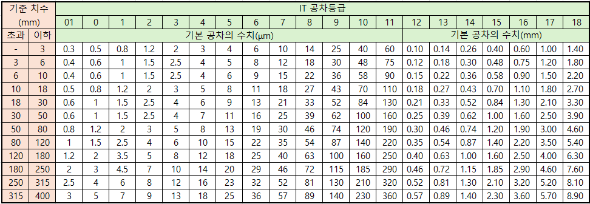
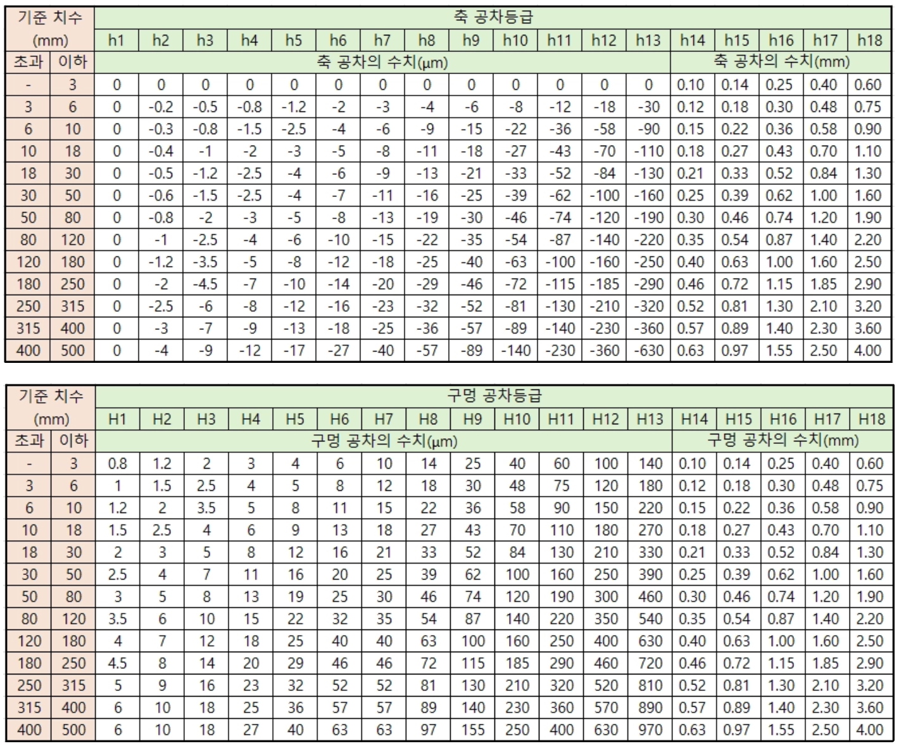
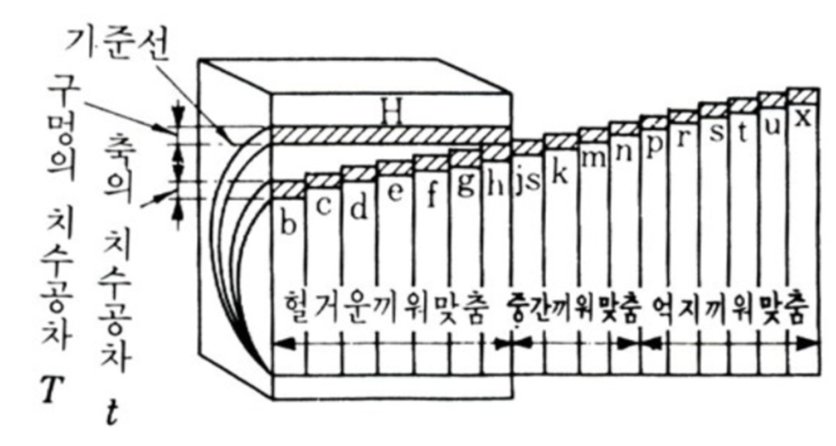

# 기계 공차의 개념과 적용

앞에서는 기계 설계에서 사용하는 주요 재료에 대해 살펴보았습니다.

설계의 최종 목적은 컴퓨터 화면에 3D 형상을 만드는 것이 아니라 실제로 사용할 수 있는 제품과 부품을 제작하는 것입니다.

따라서 재료의 특성을 이해했다면 다음으로는 설계한 형상을 실제 부품으로 만드는 방법을 이해해야 합니다.

기계와 자동화 분야에서는 주로 금속과 플라스틱 재료를 사용합니다.

**주요 금속 재료**

- 철강 : 가격이 비교적 저렴하고 강도와 강성이 우수하여 구조물과 기계 부품에 널리 사용
- 알루미늄 : 가볍고 가공성이 좋으며 외관이 우수하여 자동화 장비의 프레임과 부품에 널리 사용
- 스테인리스강 : 내식성이 뛰어나 습기나 부식이 문제가 되는 환경에서 사용

스테인리스강은 일반적인 철강보다 부식에 매우 강하지만 어떤 환경에서도 절대 녹이 발생하지 않는 재료는 아닙니다.

**주요 플라스틱 재료**

기계 분야에서는 다음과 같은 다양한 플라스틱 재료가 사용됩니다.

- Acrylic(PMMA)
- PLA
- TPU
- ABS
- Acetal(POM)
- PA(Nylon)
- PC
- PP

플라스틱은 종류에 따라 강도, 탄성, 내마모성, 내열성 등의 특성이 크게 달라 처음 접하면 재료를 구분하기 쉽지 않습니다.

본 과정에서는 모든 플라스틱을 직접 사용하는 대신 제작 실습에 적합한 다음 두 가지 재료를 중심으로 사용합니다.

- 아크릴 판재
- 3D 프린팅용 PLA

---

#### 제작이란 무엇인가

원재료에 가공을 가하여 원하는 형상의 제품이나 부품을 만드는 과정을 제작 또는 제조(Manufacturing)라고 합니다.

예를 들어 알루미늄 덩어리를 깎아 모터 브라켓을 만들 수도 있고, 아크릴 판을 레이저로 절단하여 보호 커버를 만들 수도 있습니다.

또한 PLA 필라멘트를 3D 프린터로 적층하여 센서 브라켓이나 하우징을 제작할 수도 있습니다.

같은 부품이라도 어떤 재료를 사용하는지, 몇 개를 제작하는지, 어느 정도의 정밀도가 필요한지에 따라 적합한 제작 방법은 달라집니다.

본 과정에서는 제작 방법을 크게 다음과 같이 구분하여 살펴보겠습니다.

1. 절삭 가공
2. 적층 가공
3. 판재 절단 가공

---

#### 절삭 가공

절삭 가공(Machining)은 원재료에서 불필요한 부분을 제거하여 원하는 형상을 만드는 방법입니다.

대표적인 장비로 다음과 같은 것들이 있습니다.

- 선반
- 밀링 머신
- CNC 선반
- 머시닝센터(Machining Center)

예를 들어 원형봉의 외경을 깎아 축을 만들거나, 알루미늄 블록을 밀링하여 정밀한 기계 부품을 제작할 수 있습니다.

주로 다음과 같은 재료를 가공합니다.

- 철강
- 알루미늄
- 스테인리스강
- 구리
- POM
- PA 등의 플라스틱

절삭 가공은 비교적 높은 치수 정확도를 얻을 수 있기 때문에 정밀한 축, 구멍, 베어링 장착부 등을 제작할 때 많이 사용됩니다.

하지만 정밀도를 높일수록 가공 시간과 비용이 증가하므로 필요한 수준의 공차를 적절하게 지정하는 것이 중요합니다.

---

#### 3D 프린팅

3D 프린팅은 재료를 한 층씩 쌓아 형상을 만드는 적층 가공(Additive Manufacturing) 방식입니다.

일반적인 FDM 방식에서는 필라멘트 형태의 플라스틱을 녹여 얇은 층으로 적층합니다.

대표적인 재료는 다음과 같습니다.

- PLA
- ABS
- PETG
- TPU

산업용 장비에서는 금속이나 세라믹 등을 이용한 3D 프린팅 기술도 사용됩니다.

3D 프린팅의 가장 큰 장점은 절삭 가공으로 만들기 어려운 복잡한 형상을 비교적 쉽게 제작할 수 있다는 것입니다.

또한 별도의 금형 없이 바로 제작할 수 있기 때문에 다음과 같은 용도에 적합합니다.

- 시제품
- 교육용 부품
- 센서 브라켓
- 간단한 지그
- 하우징
- 소량 생산 부품

하지만 3D 프린팅에서도 설계 치수와 실제 출력 치수가 완전히 일치하지는 않습니다.

노즐, 적층 방향, 수축, 출력 온도, 장비의 정밀도 등에 따라 치수 오차가 발생할 수 있으므로 조립 부품을 설계할 때는 적절한 간극을 고려해야 합니다.

---

#### 레이저 커팅

레이저 커팅(Laser Cutting)은 고출력 레이저를 이용하여 판재를 절단하는 방법입니다.

주로 다음과 같은 재료에 사용됩니다.

- 철판
- 스테인리스강 판재
- 알루미늄 판재
- 아크릴 판재

사용하는 레이저의 종류와 출력에 따라 가공 가능한 재료가 달라집니다.

레이저 커팅은 판재를 기반으로 한 2D 형상 제작에 매우 적합합니다.

예를 들어 다음과 같은 부품을 빠르게 제작할 수 있습니다.

- 판넬
- 브라켓
- 커버
- 베이스 플레이트
- 아크릴 구조물

복잡한 외곽 형상이나 여러 개의 구멍도 CAD 데이터를 이용하여 빠르게 절단할 수 있기 때문에 자동화 장비와 시제품 제작에서 매우 많이 사용됩니다.

---

#### 제작 방법의 비교

각 제작 방법은 서로 다른 특징을 가지고 있습니다.

| 제작 방법 | 주요 특징 | 대표 재료 | 주요 용도 |
| --- | --- | --- | --- |
| 절삭 가공 | 높은 정밀도 | 금속, POM 등 | 축, 정밀 부품 |
| 3D 프린팅 | 형상 자유도가 높음 | PLA, ABS, TPU 등 | 시제품, 브라켓 |
| 레이저 커팅 | 빠른 판재 가공 | 금속판, 아크릴 | 판넬, 커버, 브라켓 |

어떤 방식이 가장 좋은지를 단순하게 결정할 수는 없습니다.

부품의 형상, 재료, 제작 수량, 요구 정밀도, 비용을 고려하여 적합한 제작 방법을 선택해야 합니다.

---

#### 제품 제작의 흐름

제품을 제작하는 기본적인 흐름은 다음과 같이 생각할 수 있습니다.

1. 제품의 목적과 요구사항을 결정한다.
2. 사용할 재료를 선택한다.
3. 필요한 형상을 설계한다.
4. 적절한 제작 방법을 선택한다.
5. 제작에 필요한 도면이나 데이터를 작성한다.
6. 실제 부품을 제작한다.
7. 제작된 부품을 측정하고 확인한다.
8. 여러 부품을 조립한다.

따라서 3D 모델링은 제품 제작 과정의 한 단계일 뿐입니다.

좋은 설계를 위해서는 재료, 제작 방법, 공차, 조립 방법까지 함께 고려해야 합니다.

---

#### 왜 공차가 필요한가

제품을 제작하기 위해서는 설계자가 의도한 치수와 형상을 제작자에게 정확하게 전달해야 합니다.

이때 중요한 개념이 공차(Tolerance)입니다.

가공 장비가 아무리 정밀하더라도 설계한 치수를 현실에서 완벽하게 동일하게 만들 수는 없습니다.

예를 들어 설계자가 직경 10 mm의 축을 설계했다고 가정해 보겠습니다.

실제로 제작한 여러 개의 축을 측정하면 다음과 같이 조금씩 다른 값이 나타날 수 있습니다.

- 9.998 mm
- 10.001 mm
- 10.004 mm
- 9.997 mm

모든 제품을 정확히 10.000 mm로 제작하는 것은 현실적으로 어렵습니다.

따라서 설계자는 어느 정도까지의 오차를 허용할 것인지 결정해야 합니다.

---

#### 공차란 무엇인가

공차는 버블티 브랜드와는 관련이 없습니다.

공차(Tolerance)는 제작 과정에서 허용할 수 있는 치수 또는 형상의 변동 범위를 의미합니다.

예를 들어 다음과 같이 지정했다고 가정해 보겠습니다.

10 ± 0.1 mm

이 경우 허용되는 치수는 다음과 같습니다.

- 최소 치수 : 9.9 mm
- 최대 치수 : 10.1 mm

따라서 실제 제작된 부품의 치수가 이 범위 안에 있다면 설계자가 허용한 범위에 들어온 것으로 판단할 수 있습니다.

공차의 목적은 모든 부품을 완벽하게 동일하게 만드는 것이 아닙니다.

필요한 기능을 만족할 수 있는 범위를 정하는 것입니다.

---

#### 공차가 필요한 이유

공차가 필요한 가장 큰 이유는 현실에서 완벽한 치수로 가공하는 것이 불가능하기 때문입니다.

오차가 발생하는 원인은 매우 다양합니다.

- 가공 장비의 정밀도
- 공구의 마모
- 작업자의 차이
- 재료의 변형
- 가공 중 발생하는 열
- 측정 장비의 오차
- 주변 온도
- 제작 방법

정밀도를 높이는 것은 가능하지만 일반적으로 정밀도가 높아질수록 제작 비용도 크게 증가합니다.

따라서 설계자는 무조건 작은 공차를 사용하는 것이 아니라 필요한 만큼의 공차를 사용해야 합니다.

---

#### 공차가 너무 작으면 좋은가

공차가 작을수록 정밀한 부품을 만들 수 있습니다.

하지만 정밀하다는 것이 항상 좋은 설계를 의미하지는 않습니다.

예를 들어 단순한 커버를 고정하기 위한 구멍에 ±0.005 mm 수준의 정밀도를 요구한다고 생각해 보겠습니다.

실제 기능에는 필요하지 않은 수준의 정밀도를 요구하면 다음과 같은 문제가 발생할 수 있습니다.

- 제작 비용 증가
- 가공 시간 증가
- 검사 비용 증가
- 불량률 증가

따라서 좋은 설계자는 필요한 곳에는 높은 정밀도를 적용하고 중요하지 않은 곳에는 충분한 허용 범위를 부여합니다.

> 공차는 작을수록 좋은 것이 아니라 필요한 만큼 작아야 합니다.
> 

---

#### 공차의 종류

기계 도면에서는 여러 종류의 공차를 사용합니다.

기초적으로 다음과 같이 구분할 수 있습니다.

**치수 공차**

길이, 폭, 두께, 직경 등의 크기에 허용되는 오차입니다.

예:

10 ± 0.1 mm

**형상 공차**

부품의 형상이 얼마나 정확해야 하는지를 지정합니다.

대표적으로 다음과 같은 항목이 있습니다.

- 진직도
- 평면도
- 진원도
- 원통도

**자세 및 위치 공차**

부품과 부품 사이의 방향이나 위치 관계를 규정합니다.

예를 들어 다음과 같은 항목이 있습니다.

- 평행도
- 직각도
- 위치도
- 동심도와 관련된 요구사항

**끼워맞춤 공차**

축과 구멍처럼 서로 조립되는 두 부품 사이의 치수 관계를 규정합니다.

이 과정에서는 우선 치수 공차와 끼워맞춤을 중심으로 살펴보고, 형상 및 위치와 관련된 기하공차는 실제 도면을 작성하면서 학습합니다.

---

#### 조립과 공차

공차가 특히 중요한 곳이 두 부품을 서로 조립하는 부분입니다.

원형 축을 구멍에 삽입한다고 생각해 보겠습니다.

축의 직경을 a, 구멍의 직경을 b라고 하겠습니다.

축과 구멍 사이에 여유 공간을 만들어 쉽게 조립하려면 다음과 같은 관계가 필요합니다.

a < b

예를 들어 다음과 같습니다.

- 축 : 9.9 mm
- 구멍 : 10.1 mm

이 경우 직경 기준으로 0.2 mm의 차이가 발생합니다.

이를 지름 간극(Diametral Clearance) 관점에서 보면 0.2 mm이며, 축 중심이 정확히 일치한다고 가정하면 한쪽 방향의 반경 간극은 0.1 mm입니다.

이처럼 축과 구멍의 크기 차이가 조립 상태를 결정합니다.

---

#### 간극과 간섭

축과 구멍의 관계는 크게 간극과 간섭으로 생각할 수 있습니다.

**간극**

구멍이 축보다 큰 상태입니다.

구멍 직경 > 축 직경

쉽게 삽입할 수 있으며 두 부품 사이에 움직일 수 있는 여유가 존재합니다.

**간섭**

축이 구멍보다 큰 상태입니다.

축 직경 > 구멍 직경

단순히 손으로는 조립하기 어려울 수 있으며 압입이나 온도 차이를 이용한 조립 등이 필요할 수 있습니다.

따라서 두 부품을 단순히 끼울 것인지, 정밀하게 위치시킬 것인지, 강하게 고정할 것인지에 따라 서로 다른 끼워맞춤을 사용합니다.

---

#### 끼워맞춤의 종류

축과 구멍의 조립 관계는 크게 세 가지로 구분할 수 있습니다.

**간극 끼워맞춤**

조립 후 항상 축과 구멍 사이에 간극이 존재하도록 설계합니다.

- 쉽게 조립 가능
- 회전이나 미끄럼 운동에 사용
- 분해와 조립이 필요한 부품에 적합

**중간 끼워맞춤**

공차 조합에 따라 작은 간극이 발생할 수도 있고 작은 간섭이 발생할 수도 있습니다.

- 비교적 정확한 위치 결정
- 큰 힘을 사용하지 않고 조립 가능한 경우가 많음
- 정밀한 위치 결정 부품 등에 사용

**억지 끼워맞춤**

조립 후 축과 구멍 사이에 간섭이 발생하도록 설계합니다.

- 강하게 고정할 수 있음
- 압입 등에 사용
- 분해가 어려울 수 있음

어떤 끼워맞춤을 사용할지는 재료의 강성만으로 결정하지 않습니다.

부품의 기능, 하중, 회전 여부, 분해 가능성, 조립 방법 등을 종합적으로 고려해야 합니다.

---

#### IT 공차 등급

기계 부품의 공차를 체계적으로 관리하기 위해 ISO 286 계열에서는 IT(International Tolerance) 등급을 사용합니다.

IT 등급은 공차의 크기, 즉 치수의 정밀 수준을 나타냅니다.

대표적으로 다음과 같은 등급이 있습니다.

- IT01
- IT0
- IT1
- IT2
- …
- IT18

기본적인 관계는 간단합니다.

> IT 숫자가 작을수록 공차 폭이 작고 정밀도가 높습니다.
> 

반대로 숫자가 커질수록 허용되는 공차 폭이 커집니다.

대략적인 용도를 기준으로 이해하면 다음과 같습니다.

| IT 등급 | 정밀도 | 일반적인 적용 예 |
| --- | --- | --- |
| IT01 ~ IT4 | 매우 높은 정밀도 | 게이지, 정밀 측정 부품 |
| IT5 ~ IT7 | 높은 정밀도 | 정밀 축, 베어링 관련 부품 |
| IT8 ~ IT11 | 일반 기계 가공 | 일반적인 기계 부품 |
| IT12 ~ IT18 | 비교적 낮은 정밀도 | 거친 가공, 주조·단조 등의 치수 |

실제 적용 범위는 제조 방식과 제품의 기능에 따라 달라지므로 위 표는 개념을 이해하기 위한 일반적인 기준입니다.

---

#### IT 등급과 기준 치수

같은 IT 등급이라도 부품의 기준 치수가 달라지면 허용되는 공차의 크기도 달라집니다.

예를 들어 작은 부품과 매우 큰 부품에 동일한 절대 오차를 요구하는 것은 현실적이지 않을 수 있습니다.

따라서 ISO 공차 체계에서는 기준 치수 구간에 따라 IT 공차 폭을 다르게 규정합니다.

예를 들어 IT7을 적용하면 다음과 같이 달라질 수 있습니다.

**기준 치수가 100 mm인 경우**

100 mm는 `80 mm 초과 ~ 120 mm 이하` 구간에 포함됩니다.

IT7의 공차 폭은 약 35 μm입니다.

35 μm = 0.035 mm

여기에서 중요한 것은 0.035 mm가 `±0.035 mm`를 의미하는 것이 아니라 전체 공차 폭이라는 점입니다.

실제 최대·최소 치수는 H7, h7 등의 공차대 위치와 조합하여 결정됩니다.

**기준 치수가 10 mm인 경우**

10 mm는 `6 mm 초과 ~ 10 mm 이하` 구간에 포함됩니다.

IT7의 공차 폭은 약 15 μm입니다.

15 μm = 0.015 mm

따라서 같은 IT7이라도 기준 치수에 따라 실제 공차 폭은 달라집니다.

이 단계에서는 정확한 수치를 외우기보다 다음 관계만 이해하면 충분합니다.

> IT 등급은 정밀도의 수준을 나타내고, 실제 공차의 크기는 기준 치수에 따라 달라집니다.
> 

---

#### IT 등급과 공차대는 다르다

IT7이라는 표기만으로는 축이나 구멍의 실제 최대·최소 치수를 완전히 결정할 수 없습니다.

IT7은 공차의 폭을 결정합니다.

하지만 이 공차가 기준 치수의 위쪽에 위치할지 아래쪽에 위치할지는 별도로 결정해야 합니다.

이를 공차대(Tolerance Zone)의 위치라고 합니다.

예를 들어 다음과 같은 표기가 있습니다.

- H7
- G7
- h6
- g6
- p6

여기에서 숫자는 IT 등급을 나타내고 문자는 기준선에 대한 공차대의 위치를 나타냅니다.

---

#### 구멍과 축의 표기

ISO 끼워맞춤에서는 일반적으로 다음과 같이 표기합니다.

- 구멍 : 대문자
- 축 : 소문자

예를 들어 다음과 같습니다.

H7

- H : 구멍의 공차대 위치
- 7 : IT7 등급

h6

- h : 축의 공차대 위치
- 6 : IT6 등급

따라서 `H7/h6`은 구멍과 축의 공차를 각각 지정한 끼워맞춤 표기입니다.

---

#### 기준선과 공차대

설계 치수를 기준 치수 또는 기본 치수라고 생각해 보겠습니다.

예를 들어 기준 치수가 10 mm라면 10 mm를 기준선인 0선으로 생각할 수 있습니다.

공차대는 이 기준선보다 위쪽에 있을 수도 있고 아래쪽에 있을 수도 있습니다.

또는 한쪽 경계가 기준선과 일치할 수도 있습니다.

따라서 같은 IT6이라도 `h6`, `g6`, `p6`은 서로 다른 실제 허용 치수를 가지게 됩니다.

이 위치를 결정하는 문자를 기본 편차(Fundamental Deviation)라고 합니다.

기초 과정에서는 모든 문자와 수치를 외울 필요가 없습니다.

다음 정도만 이해하면 충분합니다.

> 숫자 → 공차의 폭
> 
> 
> 문자 → 공차대의 위치
> 

---

#### 구멍 기준 끼워맞춤

실무에서는 구멍 기준 방식(Hole Basis System)이 많이 사용됩니다.

대표적으로 H 공차의 구멍을 기준으로 축의 공차를 변경하여 원하는 끼워맞춤을 만듭니다.

예를 들어 다음과 같은 조합을 사용할 수 있습니다.

- H7/g6
- H7/h6
- H7/k6
- H7/p6

축 공차대가 어느 위치에 있는지에 따라 간극, 중간 또는 억지 끼워맞춤을 만들 수 있습니다.

대표적인 경향을 단순화하면 다음과 같습니다.

| 조합 예 | 일반적인 관계 |
| --- | --- |
| H7/g6 | 간극 끼워맞춤 |
| H7/h6 | 작은 간극을 갖는 끼워맞춤 |
| H7/k6 | 중간 끼워맞춤 영역 |
| H7/p6 | 억지 끼워맞춤 |

단, 실제 적용 여부는 기준 치수와 요구 기능을 확인하고 표준 공차표를 이용하여 결정해야 합니다.

---

#### 재료와 끼워맞춤

같은 치수의 간섭이라도 재료에 따라 실제 조립 결과가 달라질 수 있습니다.

예를 들어 고무와 같이 쉽게 변형되는 재료는 어느 정도의 치수 간섭이 있어도 탄성 변형을 이용하여 조립할 수 있습니다.

반면 강철과 같이 강성이 높은 재료는 같은 양의 간섭이라도 훨씬 큰 조립력이 필요할 수 있습니다.

하지만 이것이 다음과 같은 의미는 아닙니다.

`강철 = 간극 끼워맞춤`

`플라스틱 = 억지 끼워맞춤`

끼워맞춤은 무엇보다 부품의 기능에 따라 결정합니다.

예를 들어 강철 부품이라도 베어링을 축에 고정하거나 핀을 압입해야 한다면 억지 끼워맞춤을 사용할 수 있습니다.

따라서 끼워맞춤을 설계할 때는 다음을 함께 고려합니다.

- 재료
- 하중
- 회전 여부
- 위치 정밀도
- 조립 방법
- 분해 필요성
- 온도 변화

---

#### 일반 공차

모든 치수에 개별적으로 공차를 입력하면 도면이 지나치게 복잡해집니다.

또한 일반적인 기계 부품에서는 모든 치수에 높은 정밀도가 필요한 것도 아닙니다.

따라서 도면에는 일반 공차(General Tolerance)를 지정하고 특별한 정밀도가 필요한 치수에만 별도의 공차를 적용하는 방법을 많이 사용합니다.

예를 들어 다음과 같이 설계할 수 있습니다.

일반적인 외형 치수

→ 일반 공차 적용

베어링이 삽입되는 구멍

→ 별도의 끼워맞춤 공차 지정

정밀한 축

→ 별도의 치수 공차 지정

이러한 방법을 사용하면 제작에 필요한 정밀도를 명확하게 전달하면서 불필요한 가공 비용을 줄일 수 있습니다.

---

#### 공차와 제작 비용

공차는 제작 비용과 직접적으로 연결됩니다.

예를 들어 같은 10 mm 축이라도 다음 두 가지 요구사항은 제작 난이도가 다릅니다.

10 ± 0.5 mm

10 ± 0.005 mm

두 부품의 기준 치수는 모두 10 mm이지만 두 번째 부품은 훨씬 높은 정밀도가 필요합니다.

높은 정밀도를 얻으려면 다음과 같은 작업이 추가될 수 있습니다.

- 정밀한 가공 장비
- 정밀 공구
- 추가적인 가공 공정
- 온도 관리
- 정밀 측정
- 반복 검사

결국 제작 비용이 증가합니다.

따라서 설계자는 필요한 기능을 만족하는 범위에서 가능한 한 합리적인 공차를 선택해야 합니다.

---

#### 형상과 위치에 대한 공차

지금까지는 주로 길이나 직경과 같은 치수의 오차를 살펴보았습니다.

하지만 실제 기계 부품에서는 치수만 정확하다고 해서 좋은 부품이 되는 것은 아닙니다.

예를 들어 판의 두께가 정확하더라도 표면 자체가 휘어 있다면 문제가 발생할 수 있습니다.

축의 직경이 정확하더라도 축이 휘어 있다면 정상적으로 회전하지 않을 수 있습니다.

구멍의 크기가 정확하더라도 위치가 잘못되어 있다면 다른 부품과 조립할 수 없습니다.

따라서 실제 기계 도면에서는 다음과 같은 형상 및 위치 관계도 관리합니다.

- 진직도
- 평면도
- 진원도
- 원통도
- 평행도
- 직각도
- 위치도
- 흔들림

이러한 기하공차는 실제 2D 도면을 작성하는 과정에서 하나씩 살펴보겠습니다.

---

#### 3D 프린팅 공차 실습

공차를 이해하는 가장 좋은 방법 중 하나는 직접 서로 다른 치수의 부품을 만들어 조립해 보는 것입니다.

본 과정에서는 3D 프린터를 이용하여 간단한 축과 구멍 또는 서로 끼워지는 부품을 제작합니다.

예를 들어 동일한 축에 대해 구멍의 치수를 조금씩 다르게 설계할 수 있습니다.

- 간극 0.1 mm
- 간극 0.2 mm
- 간극 0.3 mm
- 간극 0.5 mm

실제 출력 후 부품을 조립해 보면 설계한 치수와 실제 조립감의 차이를 직접 확인할 수 있습니다.

이 과정에서 다음 내용을 확인합니다.

- 설계 치수와 실제 제작 치수의 차이
- 간극이 조립성에 미치는 영향
- 너무 작은 간극에서 발생하는 문제
- 너무 큰 간극에서 발생하는 흔들림
- 출력 방향에 따른 치수 차이
- 3D 프린터 자체의 제작 오차

중요한 점은 ISO의 H7/h6와 같은 정밀 끼워맞춤 공차를 일반적인 FDM 3D 프린터에 그대로 적용하는 것이 아니라는 것입니다.

3D 프린팅은 출력 방식과 장비에 따라 오차가 상대적으로 크기 때문에 실제 장비로 시험 출력하여 적절한 설계 간극을 찾아야 합니다.

---

#### 설계할 때 기억해야 할 공차의 원칙

공차를 처음 배우면 여러 숫자와 기호 때문에 어렵게 느껴질 수 있습니다.

하지만 기초 단계에서는 다음 원칙을 기억하면 충분합니다.

1. 실제 제품은 설계 치수와 완전히 동일하게 제작할 수 없다.
2. 따라서 설계자는 허용 가능한 오차를 지정해야 한다.
3. 공차가 너무 크면 조립과 기능에 문제가 생길 수 있다.
4. 공차가 지나치게 작으면 제작 비용이 증가한다.
5. 서로 조립되는 부품은 축과 구멍의 관계를 함께 고려해야 한다.
6. 필요한 기능에 따라 간극, 중간, 억지 끼워맞춤을 선택한다.
7. 중요하지 않은 치수에는 일반 공차를 사용한다.
8. 정밀도가 필요한 부분에만 개별 공차를 지정한다.

> 좋은 공차 설계란 가장 정밀하게 만드는 것이 아니라, 필요한 기능을 만족하는 범위에서 가장 합리적인 정밀도를 선택하는 것입니다.
> 

---

#### 이 단원에서 기억해야 할 핵심

기계 설계는 3D 모델링만으로 끝나지 않습니다.

설계한 부품은 실제 재료를 이용하여 제작할 수 있어야 하며 제작 방법에 따라 서로 다른 오차가 발생합니다.

따라서 설계자는 다음의 흐름을 함께 생각해야 합니다.

재료 선택

↓

3D 모델링

↓

제작 방법 결정

↓

공차 설정

↓

도면 작성

↓

제작

↓

측정

↓

조립

특히 여러 부품을 조립하는 기계 설계에서는 공차가 매우 중요합니다.

공차가 너무 크면 부품이 흔들리고, 너무 작으면 조립되지 않거나 제작 비용이 지나치게 높아질 수 있습니다.

따라서 설계자가 해야 할 일은 무조건 정밀한 부품을 만드는 것이 아니라 실제 사용 목적에 적합한 정밀도를 결정하는 것입니다.

이제 공차의 기본 개념을 이해했으므로 이후 2D 도면 작성 과정에서는 실제 치수 공차와 기하공차를 적용하고, 제작 과정에서는 설계한 공차가 실제 부품에 어떻게 나타나는지 확인해 보겠습니다.

[볼트 및 너트의 규격과 상세 표준 이해](01-05-bolt-and-nut-standards.md)