# 볼트 및 너트의 규격과 상세 표준 이해

오늘은 기계 설계 기초 과정의 마지막 시간이다.

이번 과정은 다소 의뢰로 화학적인 내용부터 시작하였다.

하지만 이는 불필요한 내용이 아니라, 우리가 사용하는 재료를 정확히 이해하기 위한 기초 단계였다.

## 재료를 이해해야 하는 이유

우리가 사용하는 대부분의 금속 재료는 순수 철, 순수 알루미늄이 아니다.

예를 들어:

- 알루미늄
    - 일반적으로 가볍고 강도가 낮은 금속
    - 그러나 합금이 되면 항공기 소재로 사용될 만큼 높은 강도를 갖는다.
- 철
    - 산화(녹 발생)라는 단점이 있음
    - 크롬과 결합하면 녹이 잘 생기지 않는 스테인리스 스틸이 됨
    - 크롬 함량에 따라 강도와 내식성이 달라짐

이러한 특성을 이해하기 위해 우리는 화학 원소와 금속 결합을 간단히 살펴보았다.

또한, 금속 재료는 형태에 따라 다음과 같이 분류된다는 것도 학습했다.

- 판재 (Plate)
- 봉재 (Barm Shaft)
- 각재, 형강 등

이제 우리는 이 기초 지식을 바탕으로 실제 부품 설계 단계로 넘어가게 된다.

## 직접 제작하는 부품 vs 기성품

앞으로 우리는 Fusion360과 같은 3D 모델링 도구를 사용하여 부품을 설계하고 제작할 예정이다.

하지만 모든 부품을 직접 설계하고 제작할 필요는 없다.

### 기성품(Standard Parts)

이미 제조되어 판매되는 부품을 의미한다.

예를 들어 집을 설계한다고 가정해 보자.

- 문
- 문 손잡이
- 변기
- 세면대

이 모든 것을 직접 제작하지는 않는다.

전문 업체에서 제작한 제품을 구매하여 설치한다.

기계 설계도 마찬가지다.

- 볼트
- 너트
- 와셔
- 모터
- 기어
- 센서
- 컨트롤러

이들은 모두 기성품이다.

### 설계자의 능력

- 적절한 기성품을 찾는 능력
- 비용을 낮추는 선택 능력
- 불필요한 맞춤 제작을 피하는 판단력

기성품을 활용하지 못하고 모든 것을 직접 제작하면 비용은 급격히 상승한다.

따라서 표준품을 이해하는 것은 설계자의 매우 중요한 역량이다.

## 볼트 (Bolt)

볼트는 부품과 부품을 연결하기 위한 외나사(수나사)가 있는 체결 부품이다.

### 머리 형태에 따른 분류

- 유듀 렌치 볼트 (Hex Socket Head Cap Bolt)
    
    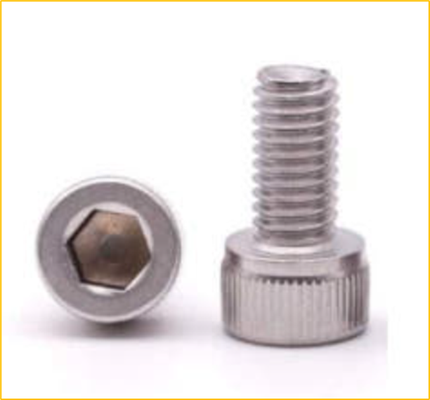
    
    - 특징
        - 머리가 돌출된 형태
        - 육각 렌치 사용
    - 장점
        - 강한 체결력
        - 토크 전달 효율 우수
    - 단점
        - 머리가 돌출됨
    - 사용
        - 자동화 설비 프레임
        - 구조체 조립
        - 가장 일반적으로 사용됨
- 무두 렌치 볼트 (Set Screw)
    
    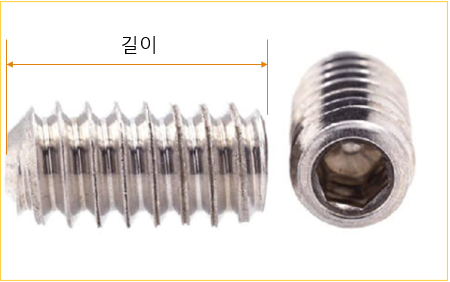
    
    - 특징
        - 머리가 없음
        - 내부 육각 렌치 사용
    - 장점
        - 돌출 없음
        - 협소 공간 사용 가능
    - 사용
        - 축 고정
        - 모터, 감속기 체결
- 접시 머리 렌치 볼트 (Countersunk Screw)
    
    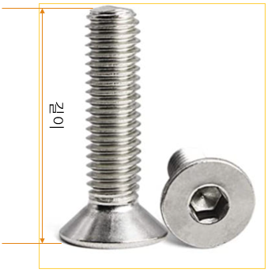
    
    - 특징
        - 체결 후 표면과 동일 높이
        - 볼트 길이 측정이 머리를 포함
    - 장점
        - 외관이 매끄러움
        - 간섭 없음
    - 단점
        - 카운터싱크 가공 필요
    - 사용
        - 커버류
        - LM 가이드 주변
- 둥근머리 볼트 (Button Bead)
    
    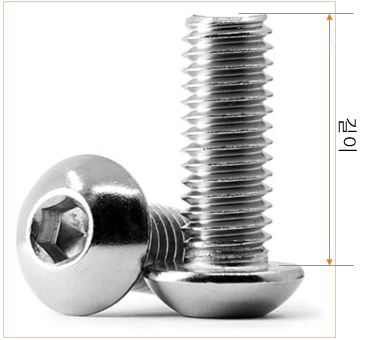
    
    - 특징
        - 둥근 외형
    - 장점
        - 부드러운 외관
        - 손이나 다른 부품과 닿아도 덜 위험함
    - 단점
        - 강한 체결이 필요한 곳에는 부적합
    - 사용
        - 외장 커버
        - 인체 접촉 부위
- 트러스 볼트 (Truss Head)
    
    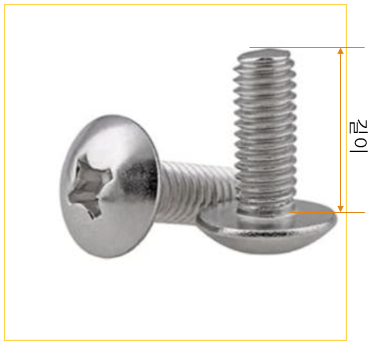
    
    - 특징
        - 넓은 얖은 머리
    - 장점
        - 넓은 면적을 고르게 누름 (판재 고정)
    - 단점
        - 강한 체결이 필요한 곳에는 부적합
    - 사용
        - 판재 고정
        - 가벼운 플라스틱 커버 (덕트, DIN-RAIL)

### 공구 종류에 따른 분류

- 렌치 볼트 (Hex Socket)
    - 강한 체결력, 미려한 외과느 기계 설계에서 가장 많이 사용 됨
    
    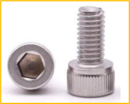
    
- 십자 머리 볼트 (Phillips)
    - 일반적으로 가장 많이 사용되는 방식이나 강한 힘을 전달하기 어려워 자동화에서는 잘 사용되지 않음
    
    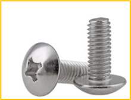
    
- 일자 드라이버 볼트 (Slotted)
    - 구조가 단순하고 제작이 쉽다는 장점이 있으나 충격에 약하고 정밀한 토크제어가 어려움
    - 특수용이나 디자인 목적 외에는 잘 사용되지 않음
    
    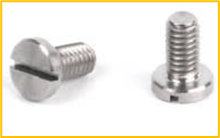
    
- 그 외 별렌치 (별핀렌치) 형태 (Torx)
    - 유럽에서 많이 사용 되는 타입
    
    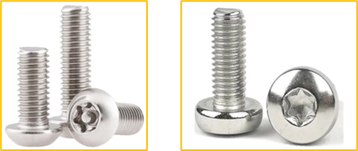
    
- 너트 (Nut)
    
    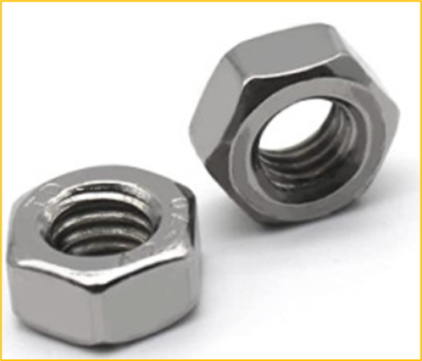
    
    - 내부 사사산이 있음
    - 볼트와 결합하여 체결
- 서포트 볼트 (Support)
    
    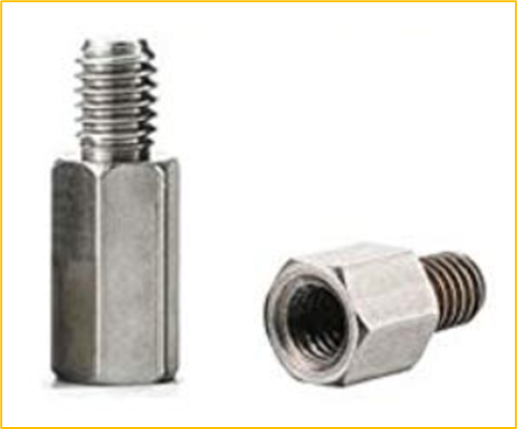
    
    - 양쪽 모두 암 나사산이면 서포트 너트로 분류
- 와셔 (Washer)
    - 스프링 와셔 (Spring Washer)
        
        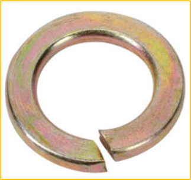
        
        - 진동 풀림 방지
        - 반발력 제공
    - 평 와셔 (Plat Washer)
        
        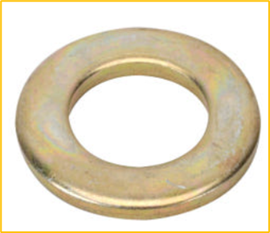
        
        - 접촉 면적 증가
        - 표면 손상 방지
    - 체결
    
    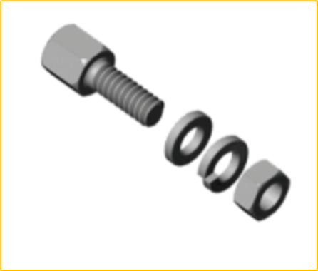
    
- 샘스 볼트
    - 볼트 + 스프링 와셔, 평 와셔
    
    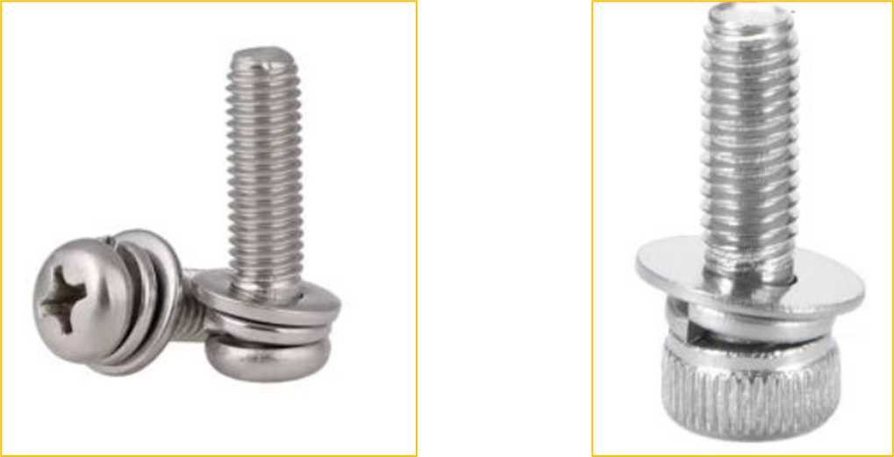
    

## 정리

이번 시간에는:

- 기성품의 중요성
- 볼트, 너트, 와셔의 기본 종류
- 설계에서 표준품 선택의 중요성

을 학습했다.

실제로는 훨씬 더 많은 종류의 표준 부품이 존재한다.

앞으로 실습과 남은 과정에서 다양한 기성품들을 알아본다.

이제 다음 단계에서는

실제 재료와 표준품을 활용하여 Fusion360 기반 3D 모델링 설계를 진행하게 된다.

기계 설계의 기초 이론은 여기서 마무리하고,

이제 실질적인 설계와 제작 단계로 엄어가 보겠다.